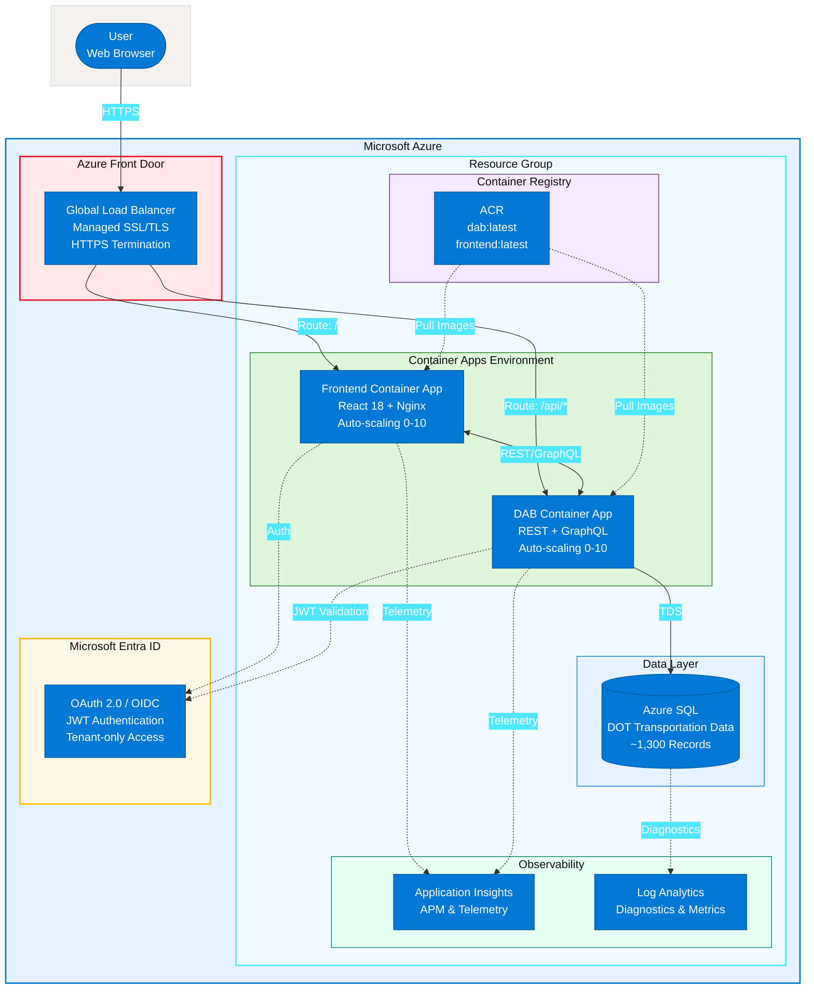

# U.S. Department of Transportation - Data API Builder Demo

A comprehensive demonstration of Azure Data API Builder (DAB) showcasing real-world DOT transportation data patterns. Features a React + TypeScript frontend with DOT branding, Azure SQL Database with transportation datasets, and Entra ID authentication.

---

## Architecture Overview



<details>
<summary>Static Architecture Diagram (SVG)</summary>

For platforms that don't render Mermaid, view the [architecture.svg](assets/architecture.svg) file, or open [architecture.excalidraw](assets/architecture.excalidraw) in [Excalidraw](https://excalidraw.com) for editing.

</details>

| Component | Azure Service | Purpose |
|-----------|--------------|---------|
| **Front Door** | Azure Front Door | Global HTTPS load balancer with managed SSL certificates |
| **Frontend** | Container Apps | React 18 + TypeScript DOT-themed portal with auto-scaling |
| **API** | Container Apps | Data API Builder with REST + GraphQL, scale-to-zero |
| **Database** | Azure SQL Database | Transportation data with ~1,300 sample records |
| **Registry** | Container Registry | Private container image storage |
| **App Insights** | Application Insights | Application performance monitoring and telemetry |
| **Monitoring** | Log Analytics | Centralized diagnostics and metrics |
| **Identity** | Microsoft Entra ID | OAuth 2.0 authentication with tenant restriction |

For detailed architecture documentation, see [docs/architecture.md](docs/architecture.md).

---

## DOT Data Categories

| Category | Icon | Data Source | Description |
|----------|------|-------------|-------------|
| **Railroads** | Train | FRA Form 54 | Federal Railroad Administration accident data |
| **Bridges** | Bridge | NBI | National Bridge Inventory structural conditions |
| **Public Transit** | Bus | NTD | National Transit Database agency metrics |
| **Automobiles** | Car | FARS | NHTSA Fatality Analysis Reporting System |

## Features

- **DOT-Themed Interface**: Professional UI with DOT branding and styling
- **Data API Builder**: Auto-generated REST and GraphQL APIs from Azure SQL
- **Transportation Data Model**: Realistic DOT data patterns with 1,300+ sample records
- **Category-Based Navigation**: Browse data by Railroads, Bridges, Transit, or Automobiles
- **State-Level Analysis**: All data linked to US states with regional groupings
- **Azure Container Apps**: Auto-scaling container hosting with scale-to-zero
- **HTTP-Based Auto-Scaling**: 0-10 replicas based on concurrent requests
- **Azure Front Door**: Global HTTPS load balancer with managed SSL certificates
- **Application Insights**: Full APM telemetry and distributed tracing
- **Entra ID Authentication**: Secure tenant-only access control
- **Infrastructure as Code**: Complete Bicep deployment scripts
- **GitHub Actions CI/CD**: Automated build and deployment pipeline
- **Comprehensive Monitoring**: Diagnostic logs and metrics sent to Log Analytics

## Prerequisites

- [Azure CLI](https://docs.microsoft.com/cli/azure/install-azure-cli) (v2.50+)
- [Node.js](https://nodejs.org/) (v18+ LTS)
- [Docker Desktop](https://www.docker.com/products/docker-desktop) - **Optional!** See [Cloud Shell Deployment](docs/cloud-shell-deployment-guide.md) for Docker-free deployment
- Azure subscription with resource creation permissions
- Azure AD tenant membership
- SQL Server tools (sqlcmd or SSMS)

> **No Docker Desktop?** You can deploy this entire solution using [Azure Cloud Shell](docs/cloud-shell-deployment-guide.md) with ACR Tasks to build container images directly in Azure.

## Quick Start

### 1. Clone and Configure

```bash
git clone https://github.com/fgarofalo56/azure-dab-fullstack-demo.git
cd azure-dab-fullstack-demo
```

### 2. Deploy Infrastructure

```powershell
# Login to Azure
az login

# Deploy infrastructure (ACR, SQL, Storage - skip Container Apps until images exist)
./infrastructure/scripts/deploy.ps1 -ResourceGroupName "rg-dab-demo" -Location "eastus2" -SkipContainers
```

The script will prompt for SQL password and Azure AD app registration IDs.

### 3. Initialize Database

```powershell
cd src/database

# Run initialization (creates schema + seeds ~1,300 records)
./Initialize-Database.ps1 -ServerName "<your-sql-server>.database.windows.net" `
                          -DatabaseName "<your-database>" `
                          -Username "sqladmin" `
                          -Password "<password>"
```

### 4. Build and Push Container Images

```powershell
cd infrastructure/scripts

# Build and push DAB container
./build-push-dab.ps1 -AcrName "<your-acr-name>"

# Build and push Frontend container
./build-push-frontend.ps1 -AcrName "<your-acr-name>"
```

### 5. Deploy Container Apps

```powershell
# Deploy Container Apps with auto-scaling (0-10 replicas)
./deploy.ps1 -ResourceGroupName "rg-dab-demo" -Location "eastus2"
```

### 6. Access the Application

After deployment completes, use the **Azure Front Door URL (HTTPS)** for production access:
- **Frontend Portal**: `https://<front-door-hostname>/`
- **DAB REST API**: `https://<front-door-hostname>/api/`
- **DAB GraphQL**: `https://<front-door-hostname>/graphql`

> **Note**: MSAL authentication requires HTTPS. The Container Apps also provide native HTTPS URLs if Front Door is not deployed.

**Important**: After deployment, update your Azure AD App Registration to add the Front Door URL as a redirect URI.

## Auto-Scaling

Container Apps automatically scale based on HTTP traffic:

| Configuration | Default | Description |
|--------------|---------|-------------|
| **Min Replicas** | 0 | Scale to zero when idle (cost savings) |
| **Max Replicas** | 10 | Maximum concurrent instances |
| **Scale Threshold** | 100 | Concurrent requests per instance to trigger scale-out |

Customize scaling with deployment parameters:

```powershell
./deploy.ps1 -ResourceGroupName "rg-dab-demo" `
             -MinReplicas 1 `
             -MaxReplicas 5 `
             -HttpScaleThreshold 50
```

For more details, see [docs/auto-scaling-guide.md](docs/auto-scaling-guide.md).

## API Endpoints

### REST API

| Endpoint | Description |
|----------|-------------|
| `GET /api/Category` | DOT data categories |
| `GET /api/State` | US states reference |
| `GET /api/RailroadAccident` | Railroad incident data |
| `GET /api/Bridge` | Bridge inventory data |
| `GET /api/TransitAgency` | Transit agency metrics |
| `GET /api/VehicleFatality` | Vehicle crash fatalities |
| `GET /api/CategorySummary` | Dashboard summary view |

All endpoints support OData query parameters:
```
GET /api/Bridge?$filter=overallCondition eq 'Poor'&$top=10&$orderby=yearBuilt
```

### GraphQL

```graphql
{
  bridges(filter: { overallCondition: { eq: "Poor" } }, first: 10) {
    items {
      structureNumber
      yearBuilt
      overallCondition
      state {
        name
        code
      }
    }
  }
}
```

## Project Structure

```
azure-dab-fullstack-demo/
├── .github/workflows/         # CI/CD pipelines
│   └── deploy.yml             # GitHub Actions workflow
├── assets/
│   ├── architecture.svg       # Architecture diagram
│   └── architecture.excalidraw # Editable source
├── docs/
│   ├── architecture.md        # System architecture (Mermaid)
│   ├── auto-scaling-guide.md  # Auto-scaling configuration
│   ├── ci-cd-guide.md         # GitHub Actions documentation
│   ├── container-apps-portal-guide.md  # Portal deployment guide
│   ├── dab-configuration-guide.md  # DAB setup & extension guide
│   ├── deployment-guide-portal.md  # Manual Azure Portal deployment
│   └── deployment-guide-scripts.md # PowerShell deployment guide
├── infrastructure/
│   ├── bicep/
│   │   └── main.bicep         # Azure infrastructure (Bicep)
│   └── scripts/
│       ├── deploy.ps1         # Infrastructure deployment
│       ├── build-push-dab.ps1 # DAB container build
│       └── build-push-frontend.ps1 # Frontend container build
├── src/
│   ├── database/
│   │   ├── 001-schema.sql     # DOT database schema
│   │   ├── 002-seed-data.sql  # Sample transportation data (~1,300 records)
│   │   ├── Initialize-Database.ps1 # DB setup script
│   │   └── README.md          # Database documentation
│   ├── dab-config/
│   │   ├── dab-config.json    # DAB entity configuration (11 entities)
│   │   └── Dockerfile         # DAB container image
│   └── frontend/
│       ├── src/
│       │   ├── App.tsx        # DOT-themed React app
│       │   ├── components/    # Reusable UI components
│       │   ├── utils/         # API utilities & helpers
│       │   ├── types/         # TypeScript interfaces
│       │   └── __tests__/     # Vitest test suite
│       ├── Dockerfile         # Frontend container image
│       └── vitest.config.ts   # Test configuration
├── .env.example               # Environment template
├── CLAUDE.md                  # Project configuration
└── README.md
```

## Database Schema

```
Categories ──┬── RailroadAccidents
             ├── Bridges
             ├── TransitAgencies
             └── VehicleFatalities
                      │
States ──────────────┘ (all tables link to States)
```

See [src/database/README.md](src/database/README.md) for complete schema documentation.

## Local Development

### Frontend Development

```bash
cd src/frontend
npm install
npm run dev   # Starts Vite dev server on port 3000
```

### DAB Local Development

```bash
cd src/dab-config

# Set connection string
export DATABASE_CONNECTION_STRING="Server=localhost;Database=DOTDemo;..."

# Start DAB
dab start
```

## Monitoring & Diagnostics

All Azure resources are configured to send diagnostic logs and metrics to Log Analytics:

| Resource | Logs Enabled |
|----------|-------------|
| **Container Apps** | Console logs, system logs via Log Analytics |
| **Application Insights** | Request telemetry, dependencies, exceptions |
| **Azure Container Registry** | All logs, metrics |
| **Azure SQL Database** | Query insights, errors, deadlocks, timeouts |

To view logs, query the Log Analytics workspace in the Azure Portal or use KQL:

```kusto
// Container Apps logs
ContainerAppConsoleLogs_CL
| where ContainerAppName_s contains "dab"
| order by TimeGenerated desc
| take 100

// Application Insights requests
requests
| where success == false
| order by timestamp desc

// SQL Database errors
AzureDiagnostics
| where Category == "Errors"
| order by TimeGenerated desc
```

## Security

- All traffic encrypted via HTTPS (Container Apps native + Front Door)
- Entra ID authentication required for all API endpoints
- Role-based permissions (authenticated: read-only, admin: full CRUD)
- Container Registry is private
- SQL credentials stored as deployment parameters (Key Vault recommended for production)
- Comprehensive audit logging to Log Analytics

---

## Documentation

**Start here:** [Documentation Hub](docs/index.md) - Complete guide index with learning paths for beginners

### For Beginners

| Document | Description |
|----------|-------------|
| [Documentation Hub](docs/index.md) | Main entry point with quick start guides and learning paths |
| [Azure Fundamentals](docs/azure-fundamentals-beginners.md) | Learn Azure basics - subscriptions, resources, containers |
| [Portal Deployment Guide](docs/beginners-guide-portal.md) | Step-by-step deployment using only Azure Portal |
| [Cloud Shell Deployment](docs/cloud-shell-deployment-guide.md) | Deploy without Docker Desktop using Azure Cloud Shell |
| [ACR Setup Guide](docs/acr-setup-guide.md) | Azure Container Registry setup and image management |
| [Troubleshooting Guide](docs/troubleshooting-guide.md) | Solutions for common issues and debugging tips |
| [Best Practices Guide](docs/best-practices-guide.md) | Security, performance, and cost optimization |

### Technical Reference

| Document | Description |
|----------|-------------|
| [Architecture](docs/architecture.md) | System architecture with component details and Mermaid diagrams |
| [Auto-Scaling Guide](docs/auto-scaling-guide.md) | HTTP-based auto-scaling configuration |
| [CI/CD Guide](docs/ci-cd-guide.md) | GitHub Actions workflow documentation |
| [Container Apps Portal Guide](docs/container-apps-portal-guide.md) | Step-by-step portal deployment for Container Apps |
| [DAB Configuration Guide](docs/dab-configuration-guide.md) | How to configure, extend, and add entities to Data API Builder |
| [Deployment Guide (Scripts)](docs/deployment-guide-scripts.md) | Automated deployment using PowerShell and Azure CLI |
| [Deployment Guide (Portal)](docs/deployment-guide-portal.md) | Step-by-step manual deployment via Azure Portal |
| [Database README](src/database/README.md) | Database schema, ERD, and data dictionary |

---

## Data Sources Reference

Sample data patterns based on real DOT datasets:

| Dataset | Agency | Official Source |
|---------|--------|-----------------|
| Rail Equipment Accidents | FRA | [railroads.dot.gov](https://railroads.dot.gov/safety-data) |
| National Bridge Inventory | FHWA | [fhwa.dot.gov/bridge/nbi](https://www.fhwa.dot.gov/bridge/nbi.cfm) |
| National Transit Database | FTA | [transit.dot.gov/ntd](https://www.transit.dot.gov/ntd) |
| FARS | NHTSA | [nhtsa.gov/fars](https://www.nhtsa.gov/research-data/fatality-analysis-reporting-system-fars) |

**Disclaimer**: This demo uses synthetic sample data that follows the structure of real DOT datasets. For official transportation data, please refer to the sources above.

## License

MIT License - See [LICENSE](LICENSE) for details.

## Acknowledgments

- [U.S. Department of Transportation](https://www.transportation.gov/)
- [Azure Data API Builder](https://github.com/Azure/data-api-builder)
- [Microsoft Learn - DAB Documentation](https://learn.microsoft.com/azure/data-api-builder/)
- [data.transportation.gov](https://data.transportation.gov/) - DOT Open Data Portal
