# U.S. Department of Transportation - Data API Builder Demo

A comprehensive demonstration of Azure Data API Builder (DAB) showcasing real-world DOT transportation data patterns. Features a React + TypeScript frontend with DOT branding, Azure SQL Database with transportation datasets, and Entra ID authentication.

---

## Architecture Overview

```mermaid
%%{init: {'theme': 'base', 'themeVariables': { 'primaryColor': '#0078D4', 'primaryTextColor': '#fff', 'primaryBorderColor': '#005A9E', 'lineColor': '#333', 'secondaryColor': '#50E6FF', 'tertiaryColor': '#F3F2F1'}}}%%
flowchart TB
    subgraph Internet[" "]
        User(["👤 User<br/>Web Browser"])
    end

    subgraph Azure["☁️ Microsoft Azure"]
        subgraph FrontDoor["🌐 Azure Front Door"]
            AFD["Global Load Balancer<br/>Managed SSL/TLS<br/>HTTPS Termination"]
        end

        subgraph RG["📦 Resource Group"]
            subgraph Compute["Container Instances"]
                Frontend["🖥️ React Frontend<br/>Nginx + React 18<br/>TypeScript + Tailwind"]
                DAB["⚡ Data API Builder<br/>REST + GraphQL<br/>Auto-generated APIs"]
            end

            subgraph Data["Data Layer"]
                SQL[("💾 Azure SQL<br/>DOT Transportation Data<br/>~1,300 Records")]
                Storage["📁 Storage Account<br/>File Share<br/>DAB Configuration"]
            end

            subgraph Registry["Container Registry"]
                ACR["📦 ACR<br/>dab:latest<br/>frontend:latest"]
            end

            subgraph Monitoring["Observability"]
                LAW["📊 Log Analytics<br/>Diagnostics & Metrics<br/>KQL Queries"]
            end
        end

        subgraph Identity["🔐 Microsoft Entra ID"]
            EntraID["OAuth 2.0 / OIDC<br/>JWT Authentication<br/>Tenant-only Access"]
        end
    end

    User -->|"HTTPS"| AFD
    AFD -->|"Route: /"| Frontend
    AFD -->|"Route: /api/*"| DAB
    Frontend <-->|"REST/GraphQL"| DAB
    DAB -->|"TDS"| SQL
    DAB -.->|"Config Mount"| Storage
    Frontend -.->|"Auth"| EntraID
    DAB -.->|"JWT Validation"| EntraID
    ACR -.->|"Pull Images"| Frontend
    ACR -.->|"Pull Images"| DAB
    Frontend -.->|"Logs"| LAW
    DAB -.->|"Logs"| LAW
    SQL -.->|"Diagnostics"| LAW

    style Azure fill:#E6F2FF,stroke:#0078D4,stroke-width:2px
    style RG fill:#F0FAFF,stroke:#50E6FF,stroke-width:2px
    style FrontDoor fill:#FFE6E8,stroke:#E81123,stroke-width:2px
    style Identity fill:#FFF8E6,stroke:#FFB900,stroke-width:2px
    style Compute fill:#DFF6DD,stroke:#107C10,stroke-width:1px
    style Data fill:#E6F2FF,stroke:#0078D4,stroke-width:1px
    style Monitoring fill:#E6FFF5,stroke:#008272,stroke-width:1px
    style Registry fill:#F3E8FF,stroke:#5C2D91,stroke-width:1px
```



<details>
<summary>📷 Static Architecture Diagram (SVG)</summary>

For platforms that don't render Mermaid, view the [architecture.svg](assets/architecture.svg) file, or open [architecture.excalidraw](assets/architecture.excalidraw) in [Excalidraw](https://excalidraw.com) for editing.

</details>

| Component | Azure Service | Purpose |
|-----------|--------------|---------|
| 🌐 **Front Door** | Azure Front Door | Global HTTPS load balancer with managed SSL certificates |
| 🖥️ **Frontend** | Container Instance | React 18 + TypeScript DOT-themed portal |
| ⚡ **API** | Container Instance | Data API Builder with REST + GraphQL endpoints |
| 💾 **Database** | Azure SQL Database | Transportation data with ~1,300 sample records |
| 📦 **Registry** | Container Registry | Private container image storage |
| 📁 **Storage** | Storage Account | Persistent DAB configuration file share |
| 📊 **Monitoring** | Log Analytics | Centralized diagnostics and metrics |
| 🔐 **Identity** | Microsoft Entra ID | OAuth 2.0 authentication with tenant restriction |

For detailed architecture documentation, see [docs/architecture.md](docs/architecture.md).

---

## DOT Data Categories

| Category | Icon | Data Source | Description |
|----------|------|-------------|-------------|
| **Railroads** | 🚂 | FRA Form 54 | Federal Railroad Administration accident data |
| **Bridges** | 🌉 | NBI | National Bridge Inventory structural conditions |
| **Public Transit** | 🚌 | NTD | National Transit Database agency metrics |
| **Automobiles** | 🚗 | FARS | NHTSA Fatality Analysis Reporting System |

## Features

- **DOT-Themed Interface**: Professional UI with DOT branding and styling
- **Data API Builder**: Auto-generated REST and GraphQL APIs from Azure SQL
- **Transportation Data Model**: Realistic DOT data patterns with 1,300+ sample records
- **Category-Based Navigation**: Browse data by Railroads, Bridges, Transit, or Automobiles
- **State-Level Analysis**: All data linked to US states with regional groupings
- **Azure Container Instances**: Serverless container hosting
- **Azure Front Door**: Global HTTPS load balancer with managed SSL certificates
- **Entra ID Authentication**: Secure tenant-only access control
- **Infrastructure as Code**: Complete Bicep deployment scripts
- **Comprehensive Monitoring**: Diagnostic logs and metrics sent to Log Analytics

## Prerequisites

- [Azure CLI](https://docs.microsoft.com/cli/azure/install-azure-cli) (v2.50+)
- [Node.js](https://nodejs.org/) (v18+ LTS)
- [Docker Desktop](https://www.docker.com/products/docker-desktop)
- Azure subscription with resource creation permissions
- Azure AD tenant membership
- SQL Server tools (sqlcmd or SSMS)

## Quick Start

### 1. Clone and Configure

```bash
git clone https://github.com/<your-username>/azure-dab-fullstack-demo.git
cd azure-dab-fullstack-demo
```

### 2. Deploy Infrastructure (Phase 1)

```powershell
# Login to Azure
az login

# Deploy infrastructure only (ACR, SQL, Storage - no containers yet)
./infrastructure/scripts/deploy.ps1 -ResourceGroupName "rg-dlz-dab-dev-eastus2" -Location "eastus2" -SkipContainers
```

The script will prompt for SQL password and Azure AD app registration IDs.

### 3. Initialize Database

```powershell
cd src/database

# Run initialization (creates schema + seeds ~1,300 records)
./Initialize-Database.ps1 -ServerName "<your-sql-server>.database.windows.net" `
                          -DatabaseName "<your-database>" `
                          -Username "sqladmin" `
                          -Password "<password>"
```

### 4. Build and Push Container Images

```powershell
cd infrastructure/scripts

# Build and push DAB container
./build-push-dab.ps1 -AcrName "<your-acr-name>"

# Build and push Frontend container
./build-push-frontend.ps1 -AcrName "<your-acr-name>"
```

### 5. Deploy Containers (Phase 2)

```powershell
# Deploy container instances (after images are in ACR)
./deploy.ps1 -ResourceGroupName "rg-dot-demo" -Location "eastus" -ContainersOnly
```

### 6. Access the Application

After deployment completes, use the **Azure Front Door URL (HTTPS)** for production access:
- **Frontend Portal**: `https://<front-door-hostname>/`
- **DAB REST API**: `https://<front-door-hostname>/api/`
- **DAB GraphQL**: `https://<front-door-hostname>/graphql`

> **Note**: MSAL authentication requires HTTPS. Direct HTTP access to ACI containers is for development/debugging only.

**Important**: After Front Door is deployed, update your Azure AD App Registration to add the Front Door URL as a redirect URI.

## API Endpoints

### REST API

| Endpoint | Description |
|----------|-------------|
| `GET /api/Category` | DOT data categories |
| `GET /api/State` | US states reference |
| `GET /api/RailroadAccident` | Railroad incident data |
| `GET /api/Bridge` | Bridge inventory data |
| `GET /api/TransitAgency` | Transit agency metrics |
| `GET /api/VehicleFatality` | Vehicle crash fatalities |
| `GET /api/CategorySummary` | Dashboard summary view |

All endpoints support OData query parameters:
```
GET /api/Bridge?$filter=overallCondition eq 'Poor'&$top=10&$orderby=yearBuilt
```

### GraphQL

```graphql
{
  bridges(filter: { overallCondition: { eq: "Poor" } }, first: 10) {
    items {
      structureNumber
      yearBuilt
      overallCondition
      state {
        name
        code
      }
    }
  }
}
```

## Project Structure

```
azure-dab-fullstack-demo/
├── .github/workflows/         # CI/CD pipelines
├── assets/
│   ├── architecture.svg       # Architecture diagram
│   └── architecture.excalidraw # Editable source
├── docs/
│   ├── architecture.md        # System architecture (Mermaid)
│   ├── dab-configuration-guide.md  # DAB setup & extension guide
│   ├── deployment-guide-portal.md  # Manual Azure Portal deployment
│   └── deployment-guide-scripts.md # PowerShell deployment guide
├── infrastructure/
│   ├── bicep/
│   │   └── main.bicep         # Azure infrastructure (Bicep)
│   └── scripts/
│       ├── deploy.ps1         # Infrastructure deployment
│       ├── build-push-dab.ps1 # DAB container build
│       └── build-push-frontend.ps1 # Frontend container build
├── src/
│   ├── database/
│   │   ├── 001-schema.sql     # DOT database schema
│   │   ├── 002-seed-data.sql  # Sample transportation data (~1,300 records)
│   │   ├── Initialize-Database.ps1 # DB setup script
│   │   └── README.md          # Database documentation
│   ├── dab-config/
│   │   ├── dab-config.json    # DAB entity configuration (11 entities)
│   │   └── Dockerfile         # DAB container image
│   └── frontend/
│       ├── src/
│       │   ├── App.tsx        # DOT-themed React app
│       │   ├── components/    # Reusable UI components
│       │   ├── utils/         # API utilities & helpers
│       │   ├── types/         # TypeScript interfaces
│       │   └── __tests__/     # Vitest test suite
│       ├── Dockerfile         # Frontend container image
│       └── vitest.config.ts   # Test configuration
├── .env.example               # Environment template
├── CLAUDE.md                  # Project configuration
└── README.md
```

## Database Schema

```
Categories ──┬── RailroadAccidents
             ├── Bridges
             ├── TransitAgencies
             └── VehicleFatalities
                      │
States ──────────────┘ (all tables link to States)
```

See [src/database/README.md](src/database/README.md) for complete schema documentation.

## Local Development

### Frontend Development

```bash
cd src/frontend
npm install
npm run dev   # Starts Vite dev server on port 3000
```

### DAB Local Development

```bash
cd src/dab-config

# Set connection string
export DATABASE_CONNECTION_STRING="Server=localhost;Database=DOTDemo;..."

# Start DAB
dab start
```

## Monitoring & Diagnostics

All Azure resources are configured to send diagnostic logs and metrics to Log Analytics:

| Resource | Logs Enabled |
|----------|-------------|
| **Azure Container Registry** | All logs, metrics |
| **Storage Account** | Blob/File service logs, transaction metrics |
| **Azure SQL Database** | Query insights, errors, deadlocks, timeouts |
| **Container Instances** | Container logs via Log Analytics integration |

To view logs, query the Log Analytics workspace in the Azure Portal or use KQL:

```kusto
// Container Instance logs
ContainerInstanceLog_CL
| where ContainerGroup_s contains "dab"
| order by TimeGenerated desc
| take 100

// SQL Database errors
AzureDiagnostics
| where Category == "Errors"
| order by TimeGenerated desc
```

## Security

- All traffic encrypted via HTTPS
- Entra ID authentication required for all API endpoints
- Role-based permissions (authenticated: read-only, admin: full CRUD)
- Container Registry is private
- SQL credentials stored as deployment parameters (Key Vault recommended for production)
- Comprehensive audit logging to Log Analytics

---

## Documentation

| Document | Description |
|----------|-------------|
| [Architecture](docs/architecture.md) | System architecture with component details and Mermaid diagrams |
| [DAB Configuration Guide](docs/dab-configuration-guide.md) | How to configure, extend, and add entities to Data API Builder |
| [Deployment Guide (Scripts)](docs/deployment-guide-scripts.md) | Automated deployment using PowerShell and Azure CLI |
| [Deployment Guide (Portal)](docs/deployment-guide-portal.md) | Step-by-step manual deployment via Azure Portal |
| [Database README](src/database/README.md) | Database schema, ERD, and data dictionary |

---

## Data Sources Reference

Sample data patterns based on real DOT datasets:

| Dataset | Agency | Official Source |
|---------|--------|-----------------|
| Rail Equipment Accidents | FRA | [railroads.dot.gov](https://railroads.dot.gov/safety-data) |
| National Bridge Inventory | FHWA | [fhwa.dot.gov/bridge/nbi](https://www.fhwa.dot.gov/bridge/nbi.cfm) |
| National Transit Database | FTA | [transit.dot.gov/ntd](https://www.transit.dot.gov/ntd) |
| FARS | NHTSA | [nhtsa.gov/fars](https://www.nhtsa.gov/research-data/fatality-analysis-reporting-system-fars) |

**Disclaimer**: This demo uses synthetic sample data that follows the structure of real DOT datasets. For official transportation data, please refer to the sources above.

## License

MIT License - See [LICENSE](LICENSE) for details.

## Acknowledgments

- [U.S. Department of Transportation](https://www.transportation.gov/)
- [Azure Data API Builder](https://github.com/Azure/data-api-builder)
- [Microsoft Learn - DAB Documentation](https://learn.microsoft.com/azure/data-api-builder/)
- [data.transportation.gov](https://data.transportation.gov/) - DOT Open Data Portal
