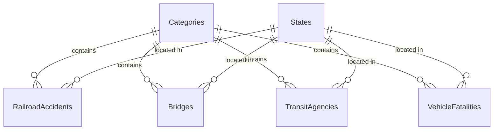

# 🚗 U.S. Department of Transportation - Data API Builder Demo

<div align="center">


### A comprehensive demonstration of Azure Data API Builder showcasing real-world DOT transportation data patterns

[](docs/index.md)
[](LICENSE)
[](https://github.com/fgarofalo56/azure-dab-fullstack-demo/pulls)

[🚀 Quick Start](#-quick-start) • [📖 Documentation](#-documentation) • [🏗️ Architecture](#-architecture-overview) • [✨ Features](#-features)

</div>

---

## 🏗️ Architecture Overview

```mermaid
%%{init: {'theme': 'base', 'themeVariables': { 'primaryColor': '#0078D4', 'primaryTextColor': '#fff', 'primaryBorderColor': '#005A9E', 'lineColor': '#333', 'secondaryColor': '#50E6FF', 'tertiaryColor': '#F3F2F1'}}}%%
flowchart TB
    subgraph Internet[" "]
        User(["👤 User<br/>Web Browser"])
    end

    subgraph Azure["☁️ Microsoft Azure"]
        subgraph FrontDoor["🚪 Azure Front Door"]
            AFD["Global Load Balancer<br/>Managed SSL/TLS<br/>HTTPS Termination"]
        end

        subgraph RG["📦 Resource Group"]
            subgraph CAE["🐳 Container Apps Environment"]
                Frontend["⚛️ Frontend Container App<br/>React 18 + Nginx<br/>Auto-scaling 0-10"]
                DAB["🔌 DAB Container App<br/>REST + GraphQL<br/>Auto-scaling 0-10"]
            end

            subgraph Data["💾 Data Layer"]
                SQL[("🗄️ Azure SQL<br/>DOT Transportation Data<br/>~1,300 Records")]
            end

            subgraph Registry["📦 Container Registry"]
                ACR["ACR<br/>dab:latest<br/>frontend:latest"]
            end

            subgraph Monitoring["📊 Observability"]
                AppInsights["📈 Application Insights<br/>APM & Telemetry"]
                LAW["📋 Log Analytics<br/>Diagnostics & Metrics"]
            end
        end

        subgraph Identity["🔐 Microsoft Entra ID"]
            EntraID["OAuth 2.0 / OIDC<br/>JWT Authentication<br/>Tenant-only Access"]
        end
    end

    User -->|"HTTPS"| AFD
    AFD -->|"Route: /"| Frontend
    AFD -->|"Route: /api/*"| DAB
    Frontend <-->|"REST/GraphQL"| DAB
    DAB -->|"TDS"| SQL
    Frontend -.->|"Auth"| EntraID
    DAB -.->|"JWT Validation"| EntraID
    ACR -.->|"Pull Images"| Frontend
    ACR -.->|"Pull Images"| DAB
    Frontend -.->|"Telemetry"| AppInsights
    DAB -.->|"Telemetry"| AppInsights
    SQL -.->|"Diagnostics"| LAW

    style Azure fill:#E6F2FF,stroke:#0078D4,stroke-width:2px
    style RG fill:#F0FAFF,stroke:#50E6FF,stroke-width:2px
    style FrontDoor fill:#FFE6E8,stroke:#E81123,stroke-width:2px
    style Identity fill:#FFF8E6,stroke:#FFB900,stroke-width:2px
    style CAE fill:#DFF6DD,stroke:#107C10,stroke-width:1px
    style Data fill:#E6F2FF,stroke:#0078D4,stroke-width:1px
    style Monitoring fill:#E6FFF5,stroke:#008272,stroke-width:1px
    style Registry fill:#F3E8FF,stroke:#5C2D91,stroke-width:1px
```



<details>
<summary>📄 Static Architecture Diagram (SVG)</summary>

For platforms that don't render Mermaid, view the [architecture.svg](assets/architecture.svg) file, or open [architecture.excalidraw](assets/architecture.excalidraw) in [Excalidraw](https://excalidraw.com) for editing.

</details>

### 🧩 Component Summary

| Component | Azure Service | Purpose |
|:----------|:-------------|:--------|
| 🚪 **Front Door** | Azure Front Door | Global HTTPS load balancer with managed SSL certificates |
| ⚛️ **Frontend** | Container Apps | React 18 + TypeScript DOT-themed portal with auto-scaling |
| 🔌 **API** | Container Apps | Data API Builder with REST + GraphQL, scale-to-zero |
| 🗄️ **Database** | Azure SQL Database | Transportation data with ~1,300 sample records |
| 📦 **Registry** | Container Registry | Private container image storage |
| 📈 **App Insights** | Application Insights | Application performance monitoring and telemetry |
| 📋 **Monitoring** | Log Analytics | Centralized diagnostics and metrics |
| 🔐 **Identity** | Microsoft Entra ID | OAuth 2.0 authentication with tenant restriction |

> 📖 For detailed architecture documentation, see [docs/architecture.md](docs/architecture.md).

---

## 🚂 DOT Data Categories

| Category | Icon | Data Source | Description |
|:---------|:----:|:------------|:------------|
| 🚂 **Railroads** | 🚆 | FRA Form 54 | Federal Railroad Administration accident data |
| 🌉 **Bridges** | 🏗️ | NBI | National Bridge Inventory structural conditions |
| 🚌 **Public Transit** | 🚍 | NTD | National Transit Database agency metrics |
| 🚗 **Automobiles** | 🚙 | FARS | NHTSA Fatality Analysis Reporting System |

---

## ✨ Features

<table>
<tr>
<td width="50%" valign="top">

### 🎨 Frontend Features
- 🏛️ **DOT-Themed Interface** - Professional UI with DOT branding
- 📊 **Category-Based Navigation** - Browse by transportation type
- 🗺️ **State-Level Analysis** - Regional data groupings
- ⚡ **Fast & Responsive** - React 18 with optimized rendering

</td>
<td width="50%" valign="top">

### 🔧 Backend Features
- 🔌 **Data API Builder** - Auto-generated REST & GraphQL APIs
- 📈 **Auto-Scaling** - 0-10 replicas based on traffic
- 🔐 **Entra ID Auth** - Secure tenant-only access
- 📝 **OData Support** - Rich query capabilities

</td>
</tr>
<tr>
<td width="50%" valign="top">

### 🚀 Infrastructure
- ☁️ **Azure Container Apps** - Scale-to-zero hosting
- 🚪 **Azure Front Door** - Global load balancing
- 📊 **Application Insights** - Full APM telemetry
- 🔄 **GitHub Actions CI/CD** - Automated deployments

</td>
<td width="50%" valign="top">

### 📋 Operations
- 📝 **Infrastructure as Code** - Complete Bicep templates
- 📈 **Comprehensive Monitoring** - Log Analytics integration
- 🛡️ **Security Best Practices** - Role-based permissions
- 📚 **Extensive Documentation** - Beginner-friendly guides

</td>
</tr>
</table>

---

## 📋 Prerequisites

| Requirement | Version | Notes |
|:------------|:--------|:------|
| 🔧 [Azure CLI](https://docs.microsoft.com/cli/azure/install-azure-cli) | v2.50+ | Required |
| 📦 [Node.js](https://nodejs.org/) | v18+ LTS | For frontend development |
| 🐳 [Docker Desktop](https://www.docker.com/products/docker-desktop) | Latest | **Optional** - see note below |
| ☁️ Azure Subscription | - | With resource creation permissions |
| 🔐 Azure AD Tenant | - | Membership required |
| 🗄️ SQL Server Tools | - | sqlcmd or SSMS |

> 💡 **No Docker Desktop?** You can deploy this entire solution using [Azure Cloud Shell](docs/cloud-shell-deployment-guide.md) with ACR Tasks to build container images directly in Azure!

---

## 🚀 Quick Start

### 1️⃣ Clone and Configure

```bash
git clone https://github.com/fgarofalo56/azure-dab-fullstack-demo.git
cd azure-dab-fullstack-demo
```

### 2️⃣ Deploy Infrastructure

```powershell
# Login to Azure
az login

# Deploy infrastructure (ACR, SQL, Storage - skip Container Apps until images exist)
./infrastructure/scripts/deploy.ps1 -ResourceGroupName "rg-dab-demo" -Location "eastus2" -SkipContainers
```

> 📝 The script will prompt for SQL password and Azure AD app registration IDs.

### 3️⃣ Initialize Database

```powershell
cd src/database

# Run initialization (creates schema + seeds ~1,300 records)
./Initialize-Database.ps1 -ServerName "<your-sql-server>.database.windows.net" `
                          -DatabaseName "<your-database>" `
                          -Username "sqladmin" `
                          -Password "<password>"
```

### 4️⃣ Build and Push Container Images

```powershell
cd infrastructure/scripts

# Build and push DAB container
./build-push-dab.ps1 -AcrName "<your-acr-name>"

# Build and push Frontend container
./build-push-frontend.ps1 -AcrName "<your-acr-name>"
```

### 5️⃣ Deploy Container Apps

```powershell
# Deploy Container Apps with auto-scaling (0-10 replicas)
./deploy.ps1 -ResourceGroupName "rg-dab-demo" -Location "eastus2"
```

### 6️⃣ Access the Application

After deployment completes, use the **Azure Front Door URL (HTTPS)** for production access:

| 🌐 Endpoint | 🔗 URL |
|:------------|:-------|
| 🖥️ Frontend Portal | `https://<front-door-hostname>/` |
| 🔌 DAB REST API | `https://<front-door-hostname>/api/` |
| 📊 DAB GraphQL | `https://<front-door-hostname>/graphql` |

> ⚠️ **Important**: After deployment, update your Azure AD App Registration to add the Front Door URL as a redirect URI.

---

## 📈 Auto-Scaling

Container Apps automatically scale based on HTTP traffic:

| ⚙️ Configuration | 📊 Default | 📝 Description |
|:-----------------|:-----------|:---------------|
| 📉 **Min Replicas** | 0 | Scale to zero when idle (cost savings) |
| 📈 **Max Replicas** | 10 | Maximum concurrent instances |
| 🎯 **Scale Threshold** | 100 | Concurrent requests per instance to trigger scale-out |

```powershell
# Customize scaling parameters
./deploy.ps1 -ResourceGroupName "rg-dab-demo" `
             -MinReplicas 1 `
             -MaxReplicas 5 `
             -HttpScaleThreshold 50
```

> 📖 For more details, see [docs/auto-scaling-guide.md](docs/auto-scaling-guide.md).

---

## 🔌 API Endpoints

### 📡 REST API

| 🔗 Endpoint | 📝 Description |
|:------------|:---------------|
| `GET /api/Category` | 📁 DOT data categories |
| `GET /api/State` | 🗺️ US states reference |
| `GET /api/RailroadAccident` | 🚂 Railroad incident data |
| `GET /api/Bridge` | 🌉 Bridge inventory data |
| `GET /api/TransitAgency` | 🚌 Transit agency metrics |
| `GET /api/VehicleFatality` | 🚗 Vehicle crash fatalities |
| `GET /api/CategorySummary` | 📊 Dashboard summary view |

All endpoints support OData query parameters:

```http
GET /api/Bridge?$filter=overallCondition eq 'Poor'&$top=10&$orderby=yearBuilt
```

### 📊 GraphQL

```graphql
{
  bridges(filter: { overallCondition: { eq: "Poor" } }, first: 10) {
    items {
      structureNumber
      yearBuilt
      overallCondition
      state {
        name
        code
      }
    }
  }
}
```

---

## 📁 Project Structure

```
azure-dab-fullstack-demo/
├── 📂 .github/workflows/         # CI/CD pipelines
│   └── 📄 deploy.yml             # GitHub Actions workflow
├── 📂 assets/
│   ├── 🖼️ architecture.svg       # Architecture diagram
│   └── 📝 architecture.excalidraw # Editable source
├── 📂 docs/
│   ├── 📄 architecture.md        # System architecture (Mermaid)
│   ├── 📄 auto-scaling-guide.md  # Auto-scaling configuration
│   ├── 📄 ci-cd-guide.md         # GitHub Actions documentation
│   └── 📄 ...                    # Additional guides
├── 📂 infrastructure/
│   ├── 📂 bicep/
│   │   └── 📄 main.bicep         # Azure infrastructure (Bicep)
│   └── 📂 scripts/
│       ├── 📄 deploy.ps1         # Infrastructure deployment
│       ├── 📄 build-push-dab.ps1 # DAB container build
│       └── 📄 build-push-frontend.ps1 # Frontend container build
├── 📂 src/
│   ├── 📂 database/
│   │   ├── 📄 001-schema.sql     # DOT database schema
│   │   ├── 📄 002-seed-data.sql  # Sample data (~1,300 records)
│   │   └── 📄 README.md          # Database documentation
│   ├── 📂 dab-config/
│   │   ├── 📄 dab-config.json    # DAB entity configuration
│   │   └── 🐳 Dockerfile         # DAB container image
│   └── 📂 frontend/
│       ├── 📂 src/
│       │   ├── 📄 App.tsx        # DOT-themed React app
│       │   ├── 📂 components/    # Reusable UI components
│       │   └── 📂 __tests__/     # Vitest test suite
│       └── 🐳 Dockerfile         # Frontend container image
├── 📄 .env.example               # Environment template
├── 📄 CLAUDE.md                  # Project configuration
└── 📄 README.md
```

---

## 🗄️ Database Schema



> 📖 See [src/database/README.md](src/database/README.md) for complete schema documentation.

---

## 💻 Local Development

### ⚛️ Frontend Development

```bash
cd src/frontend
npm install
npm run dev   # Starts Vite dev server on port 3000
```

### 🔌 DAB Local Development

```bash
cd src/dab-config

# Set connection string
export DATABASE_CONNECTION_STRING="Server=localhost;Database=DOTDemo;..."

# Start DAB
dab start
```

---

## 📊 Monitoring & Diagnostics

All Azure resources are configured to send diagnostic logs and metrics to Log Analytics:

| 📦 Resource | 📋 Logs Enabled |
|:------------|:----------------|
| 🐳 **Container Apps** | Console logs, system logs via Log Analytics |
| 📈 **Application Insights** | Request telemetry, dependencies, exceptions |
| 📦 **Azure Container Registry** | All logs, metrics |
| 🗄️ **Azure SQL Database** | Query insights, errors, deadlocks, timeouts |

<details>
<summary>📊 Sample KQL Queries</summary>

```kusto
// Container Apps logs
ContainerAppConsoleLogs_CL
| where ContainerAppName_s contains "dab"
| order by TimeGenerated desc
| take 100

// Application Insights requests
requests
| where success == false
| order by timestamp desc

// SQL Database errors
AzureDiagnostics
| where Category == "Errors"
| order by TimeGenerated desc
```

</details>

---

## 🔒 Security

| 🛡️ Feature | 📝 Description |
|:-----------|:---------------|
| 🔐 **HTTPS Everywhere** | All traffic encrypted via Container Apps + Front Door |
| 🎫 **Entra ID Auth** | Authentication required for all API endpoints |
| 👥 **Role-Based Access** | Authenticated: read-only, Admin: full CRUD |
| 📦 **Private Registry** | Container Registry is private |
| 🗝️ **Secret Management** | SQL credentials as deployment parameters (Key Vault recommended) |
| 📝 **Audit Logging** | Comprehensive logging to Log Analytics |

---

## 📖 Documentation

<div align="center">

[](docs/index.md)

</div>

### 🌟 For Beginners

| 📚 Document | 📝 Description |
|:------------|:---------------|
| [📚 Documentation Hub](docs/index.md) | Main entry point with quick start guides and learning paths |
| [☁️ Azure Fundamentals](docs/azure-fundamentals-beginners.md) | Learn Azure basics - subscriptions, resources, containers |
| [🖱️ Portal Deployment Guide](docs/beginners-guide-portal.md) | Step-by-step deployment using only Azure Portal |
| [☁️ Cloud Shell Deployment](docs/cloud-shell-deployment-guide.md) | Deploy without Docker Desktop using Azure Cloud Shell |
| [📦 ACR Setup Guide](docs/acr-setup-guide.md) | Azure Container Registry setup and image management |
| [🔧 Troubleshooting Guide](docs/troubleshooting-guide.md) | Solutions for common issues and debugging tips |
| [✨ Best Practices Guide](docs/best-practices-guide.md) | Security, performance, and cost optimization |

### 📋 Technical Reference

| 📚 Document | 📝 Description |
|:------------|:---------------|
| [🏗️ Architecture](docs/architecture.md) | System architecture with component details and Mermaid diagrams |
| [📈 Auto-Scaling Guide](docs/auto-scaling-guide.md) | HTTP-based auto-scaling configuration |
| [⚡ CI/CD Guide](docs/ci-cd-guide.md) | GitHub Actions workflow documentation |
| [🐳 Container Apps Portal Guide](docs/container-apps-portal-guide.md) | Step-by-step portal deployment |
| [⚙️ DAB Configuration Guide](docs/dab-configuration-guide.md) | Configure, extend, and add entities to DAB |
| [📜 Deployment Guide (Scripts)](docs/deployment-guide-scripts.md) | Automated deployment using PowerShell |
| [🖱️ Deployment Guide (Portal)](docs/deployment-guide-portal.md) | Manual deployment via Azure Portal |
| [🗄️ Database README](src/database/README.md) | Database schema, ERD, and data dictionary |

---

## 📊 Data Sources Reference

Sample data patterns based on real DOT datasets:

| 📊 Dataset | 🏛️ Agency | 🔗 Official Source |
|:-----------|:----------|:-------------------|
| 🚂 Rail Equipment Accidents | FRA | [railroads.dot.gov](https://railroads.dot.gov/safety-data) |
| 🌉 National Bridge Inventory | FHWA | [fhwa.dot.gov/bridge/nbi](https://www.fhwa.dot.gov/bridge/nbi.cfm) |
| 🚌 National Transit Database | FTA | [transit.dot.gov/ntd](https://www.transit.dot.gov/ntd) |
| 🚗 FARS | NHTSA | [nhtsa.gov/fars](https://www.nhtsa.gov/research-data/fatality-analysis-reporting-system-fars) |

> ⚠️ **Disclaimer**: This demo uses synthetic sample data that follows the structure of real DOT datasets. For official transportation data, please refer to the sources above.

---

## 📄 License

MIT License - See [LICENSE](LICENSE) for details.

---

## 🙏 Acknowledgments

| 🏛️ Organization | 🔗 Link |
|:----------------|:--------|
| 🏛️ U.S. Department of Transportation | [transportation.gov](https://www.transportation.gov/) |
| 📦 Azure Data API Builder | [GitHub](https://github.com/Azure/data-api-builder) |
| 📖 Microsoft Learn - DAB Documentation | [learn.microsoft.com](https://learn.microsoft.com/azure/data-api-builder/) |
| 📊 DOT Open Data Portal | [data.transportation.gov](https://data.transportation.gov/) |

---

<div align="center">

### ⭐ Star this repo if you find it helpful!

[](https://github.com/fgarofalo56/azure-dab-fullstack-demo)
[](https://github.com/fgarofalo56/azure-dab-fullstack-demo/fork)

---

**Made with ❤️ for the Azure community**

</div>
