# Architecture Documentation

<div align="center">


**System Architecture & Design Documentation**

</div>

This document provides a comprehensive overview of the DOT Transportation Data Portal architecture, including system components, data flow, and design decisions.

> **Visual Diagrams**: Interactive Excalidraw diagrams with official Azure icons are available in the [`assets/`](../assets/) folder. Open `.excalidraw` files in VS Code (with Excalidraw extension) or at [excalidraw.com](https://excalidraw.com) for detailed visual representations.

---

## Table of Contents

- [System Overview](#system-overview)
- [High-Level Architecture](#high-level-architecture)
- [Component Details](#component-details)
- [Data Flow](#data-flow)
- [Security Architecture](#security-architecture)
- [Database Schema](#database-schema)
- [API Architecture](#api-architecture)
- [Deployment Architecture](#deployment-architecture)
- [Auto-Scaling Architecture](#auto-scaling-architecture)
- [Design Decisions](#design-decisions)

---

## System Overview

The DOT Transportation Data Portal is a full-stack web application that demonstrates Azure Data API Builder capabilities using realistic Department of Transportation data patterns.

### Key Technologies

| Layer | Technology | Purpose |
|-------|------------|---------|
| **Edge** | Azure Front Door | Global HTTPS load balancer with managed SSL |
| **Frontend** | React 18, TypeScript, Tailwind CSS | User interface |
| **API** | Azure Data API Builder | REST & GraphQL APIs |
| **Database** | Azure SQL Database | Data persistence |
| **Authentication** | Microsoft Entra ID | Identity management |
| **Hosting** | Azure Container Apps | Auto-scaling container runtime |
| **Registry** | Azure Container Registry | Container images |
| **Telemetry** | Application Insights | APM and distributed tracing |
| **Monitoring** | Log Analytics Workspace | Centralized logging & diagnostics |
| **IaC** | Bicep | Infrastructure as Code |
| **CI/CD** | GitHub Actions | Automated deployment pipeline |

---

## High-Level Architecture

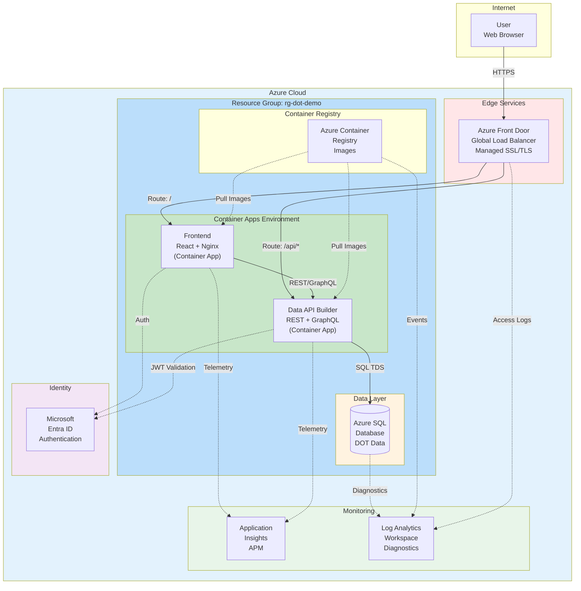

---

## Component Details

### Frontend Application

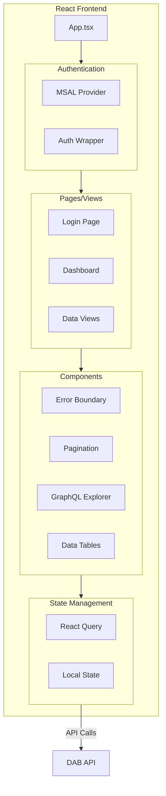

#### Key Features

| Feature | Implementation | Description |
|---------|----------------|-------------|
| **Authentication** | MSAL.js | Azure AD integration |
| **Data Fetching** | React Query | Caching, refetching, pagination |
| **Error Handling** | Error Boundaries | Graceful error recovery |
| **Styling** | Tailwind CSS | Utility-first CSS |
| **Routing** | React Router | SPA navigation |

### Data API Builder

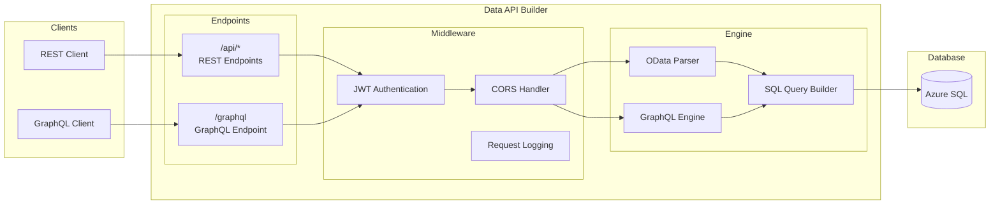

#### API Capabilities

| Capability | REST | GraphQL |
|------------|------|---------|
| **Read** | GET | Query |
| **Create** | POST | Mutation |
| **Update** | PUT/PATCH | Mutation |
| **Delete** | DELETE | Mutation |
| **Filter** | OData $filter | Filter argument |
| **Sort** | OData $orderby | OrderBy argument |
| **Paginate** | $top/$skip | first/after |
| **Relationships** | $expand | Nested queries |

---

## Data Flow

### Authentication Flow

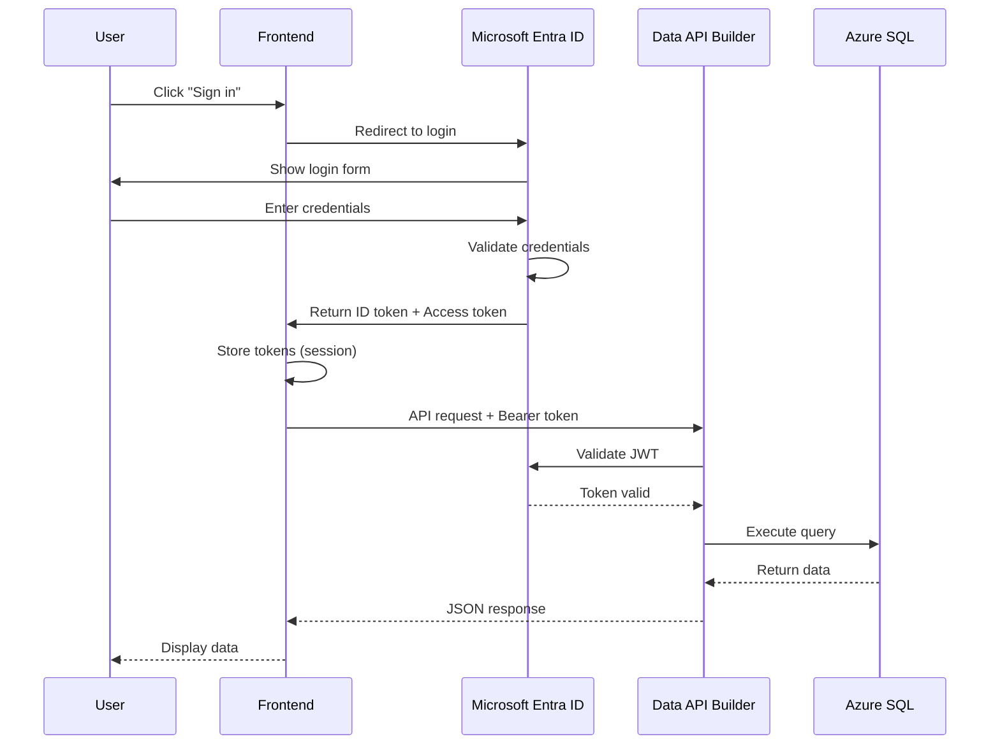

### Data Request Flow

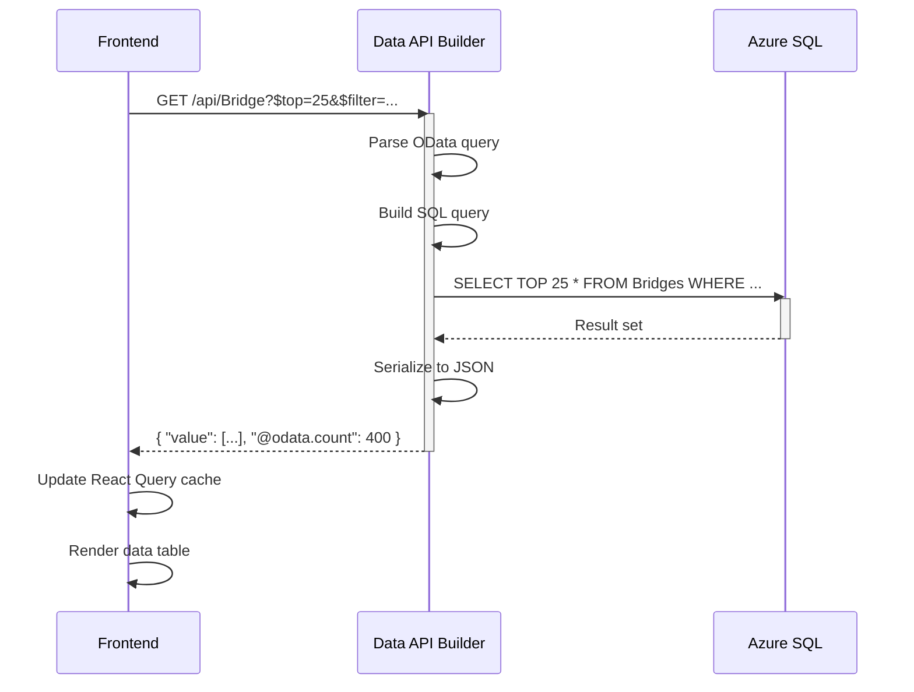

---

## Security Architecture

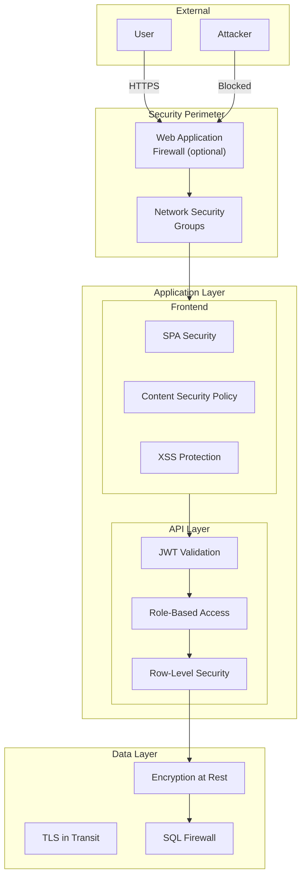

### Security Layers

| Layer | Protection | Implementation |
|-------|------------|----------------|
| **Network** | DDoS, Firewall | Azure DDoS, NSG, SQL Firewall |
| **Transport** | Encryption | TLS 1.2+ everywhere (Container Apps native HTTPS) |
| **Authentication** | Identity | Microsoft Entra ID + JWT |
| **Authorization** | Access Control | DAB permissions, database RLS |
| **Application** | Input Validation | Strict request parsing |
| **Data** | Encryption | Azure SQL TDE |

---

## Database Schema

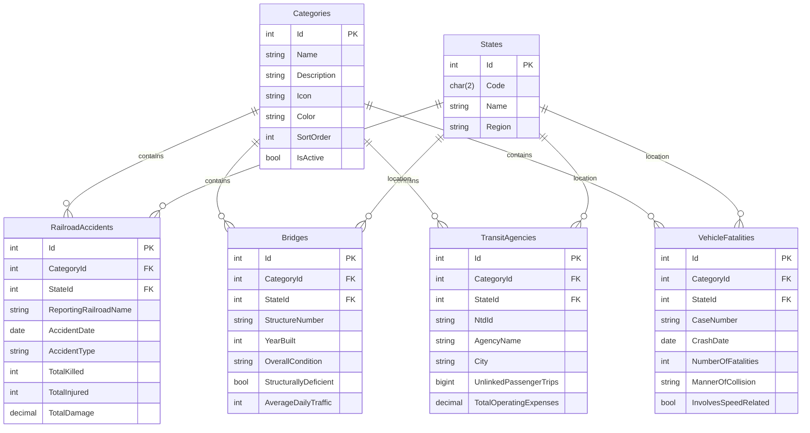

---

## API Architecture

### REST Endpoints

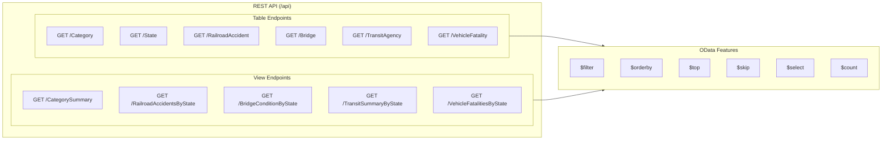

### GraphQL Schema

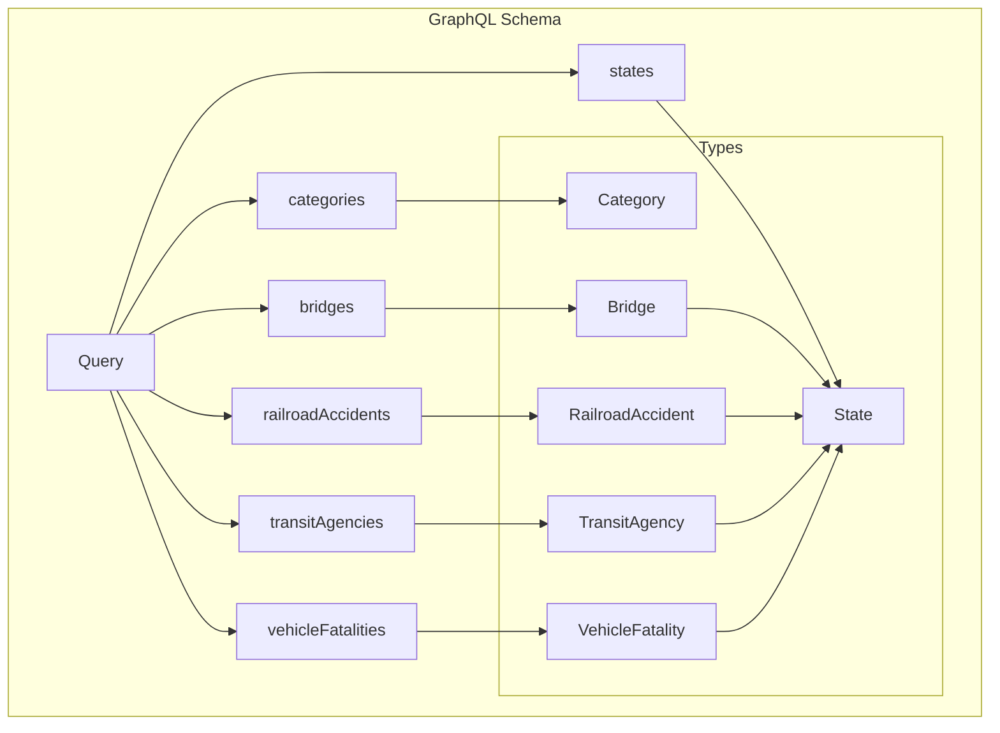

---

## Deployment Architecture

### Azure Resources

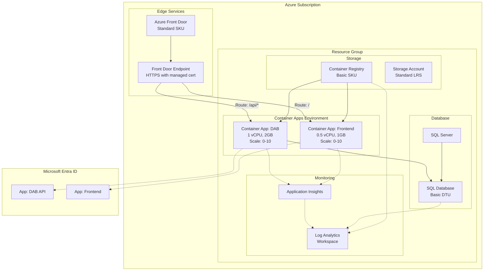

### Container Architecture

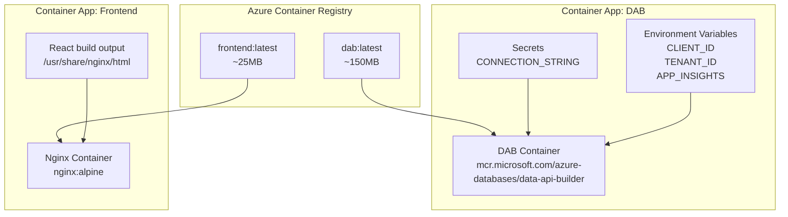

---

## Auto-Scaling Architecture

Container Apps provide HTTP-based auto-scaling with scale-to-zero capability.

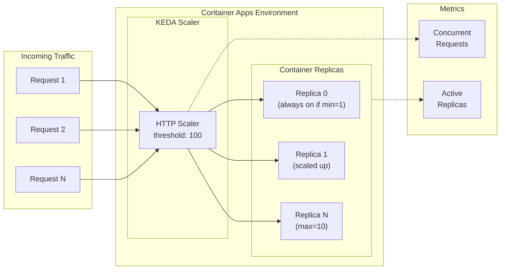

### Scaling Configuration

| Parameter | Default | Description |
|-----------|---------|-------------|
| `minReplicas` | 0 | Minimum replicas (0 = scale to zero) |
| `maxReplicas` | 10 | Maximum replicas |
| `httpScaleThreshold` | 100 | Concurrent requests to trigger scale |

### Scale-to-Zero Behavior

1. **Idle Detection**: No requests for ~5 minutes
2. **Scale Down**: Replicas reduced to 0
3. **Cold Start**: First request triggers container start (~2-5 seconds)
4. **Warm Up**: Subsequent requests served immediately

For production workloads requiring instant response, set `minReplicas=1`.

---

## Monitoring Architecture

All resources are configured with diagnostic settings that send logs and metrics to a centralized Log Analytics workspace, plus Application Insights for APM.

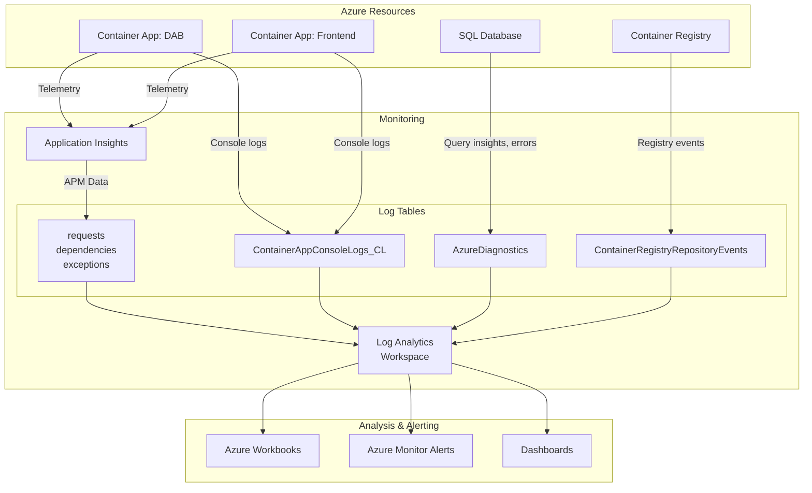

### Diagnostic Settings by Resource

| Resource | Log Categories | Metrics |
|----------|---------------|---------|
| **Container Registry** | ContainerRegistryRepositoryEvents, ContainerRegistryLoginEvents | AllMetrics |
| **SQL Database** | SQLInsights, AutomaticTuning, QueryStoreRuntimeStatistics, Errors, Deadlocks, Timeouts, Blocks | Basic, InstanceAndAppAdvanced |
| **Container Apps** | Console logs via environment configuration | Via App Insights |
| **Application Insights** | requests, dependencies, exceptions, traces | Performance counters |

### Key Queries

```kusto
// Application Insights - Failed requests
requests
| where success == false
| summarize count() by name, resultCode
| order by count_ desc

// Container App console logs
ContainerAppConsoleLogs_CL
| where ContainerAppName_s contains "dab"
| where Log_s contains "error" or Log_s contains "fail"
| project TimeGenerated, Log_s

// SQL slow queries
AzureDiagnostics
| where Category == "QueryStoreRuntimeStatistics"
| where duration_d > 1000  // queries > 1 second
| project TimeGenerated, query_hash_s, duration_d

// Container App replica count over time
ContainerAppSystemLogs_CL
| where Reason_s == "ScaledUp" or Reason_s == "ScaledDown"
| project TimeGenerated, ContainerAppName_s, Reason_s, Count_d
```

---

## Design Decisions

### Why Azure Container Apps?

| Option | Pros | Cons | Decision |
|--------|------|------|----------|
| **Container Apps** | Auto-scaling, scale-to-zero, native HTTPS, simple | Regional availability | Best for this use case |
| **ACI** | Simple, serverless | No auto-scaling, no scale-to-zero | Previous implementation |
| **AKS** | Full control, enterprise features | Complex, higher cost | For advanced scenarios |
| **App Service** | Managed, easy | Less container flexibility | Alternative |

**Decision:** Container Apps provides the best balance of simplicity and features for containerized workloads with auto-scaling requirements.

### Why Data API Builder?

| Approach | Development Time | Flexibility | Maintenance |
|----------|------------------|-------------|-------------|
| **Custom API** | Weeks | High | High |
| **DAB** | Hours | Medium | Low |
| **Direct SQL** | N/A | Low | N/A |

**Decision:** DAB provides the best balance for rapid development with sufficient flexibility.

### Why Bicep over Terraform?

| Tool | Azure Native | Learning Curve | State Management |
|------|--------------|----------------|------------------|
| **Bicep** | Yes | Low | Built-in |
| **Terraform** | Provider | Medium | External |
| **ARM** | Yes | High | Built-in |

**Decision:** Bicep offers native Azure support with simpler syntax than ARM templates.

---

## Scalability Summary

### Current Implementation

| Feature | Status | Notes |
|---------|--------|-------|
| **Auto-Scaling** | Implemented | HTTP-based, 0-10 replicas |
| **Scale-to-Zero** | Implemented | Cost savings when idle |
| **Load Balancing** | Implemented | Azure Front Door |
| **APM** | Implemented | Application Insights |
| **Monitoring** | Implemented | Log Analytics |
| **Native HTTPS** | Implemented | Container Apps built-in |
| **Database** | Basic SQL tier | 5 DTUs (sufficient for demo) |

### Production Recommendations

For production workloads:

| Enhancement | Purpose | When to Consider |
|-------------|---------|------------------|
| **minReplicas=1** | Avoid cold starts | Always-on requirement |
| **Azure CDN** | Cache static assets | High traffic, global users |
| **Redis Cache** | Reduce database load | Frequent repeated queries |
| **SQL Premium** | Higher DTUs, geo-replication | Production SLAs required |
| **Private Endpoints** | Network isolation | Security requirements |

---

## References

- [Azure Container Apps Documentation](https://learn.microsoft.com/azure/container-apps/)
- [Azure Data API Builder Documentation](https://learn.microsoft.com/azure/data-api-builder/)
- [Azure SQL Database Documentation](https://learn.microsoft.com/azure/azure-sql/)
- [Microsoft Entra ID Documentation](https://learn.microsoft.com/azure/active-directory/)
- [Application Insights Documentation](https://learn.microsoft.com/azure/azure-monitor/app/app-insights-overview)
