# Architecture Documentation

This document provides a comprehensive overview of the DOT Transportation Data Portal architecture, including system components, data flow, and design decisions.

---

## Table of Contents

- [System Overview](#system-overview)
- [High-Level Architecture](#high-level-architecture)
- [Component Details](#component-details)
- [Data Flow](#data-flow)
- [Security Architecture](#security-architecture)
- [Database Schema](#database-schema)
- [API Architecture](#api-architecture)
- [Deployment Architecture](#deployment-architecture)
- [Design Decisions](#design-decisions)

---

## System Overview

The DOT Transportation Data Portal is a full-stack web application that demonstrates Azure Data API Builder capabilities using realistic Department of Transportation data patterns.

### Key Technologies

| Layer | Technology | Purpose |
|-------|------------|---------|
| **Frontend** | React 18, TypeScript, Tailwind CSS | User interface |
| **API** | Azure Data API Builder | REST & GraphQL APIs |
| **Database** | Azure SQL Database | Data persistence |
| **Authentication** | Microsoft Entra ID | Identity management |
| **Hosting** | Azure Container Instances | Container runtime |
| **Registry** | Azure Container Registry | Container images |
| **Monitoring** | Log Analytics Workspace | Centralized logging & diagnostics |
| **IaC** | Bicep | Infrastructure as Code |

---

## High-Level Architecture

```mermaid
flowchart TB
    subgraph Internet["Internet"]
        User["👤 User<br/>Web Browser"]
    end

    subgraph Azure["Azure Cloud"]
        subgraph RG["Resource Group: rg-dot-demo"]
            subgraph Compute["Compute Layer"]
                Frontend["🖥️ Frontend<br/>React + Nginx<br/>(ACI)"]
                DAB["⚡ Data API Builder<br/>REST + GraphQL<br/>(ACI)"]
            end

            subgraph Data["Data Layer"]
                SQL[("💾 Azure SQL<br/>Database<br/>DOT Data")]
                Storage["📁 Azure Storage<br/>File Share"]
            end

            subgraph Registry["Container Registry"]
                ACR["📦 Azure Container<br/>Registry<br/>Images"]
            end
        end

        subgraph Monitoring["Monitoring"]
            LAW["📊 Log Analytics<br/>Workspace<br/>Diagnostics"]
        end

        subgraph Identity["Identity"]
            EntraID["🔐 Microsoft<br/>Entra ID<br/>Authentication"]
        end
    end

    User -->|HTTPS| Frontend
    Frontend -->|REST/GraphQL| DAB
    DAB -->|SQL TDS| SQL
    DAB -.->|Config| Storage
    Frontend -.->|Auth| EntraID
    DAB -.->|JWT Validation| EntraID
    ACR -.->|Pull Images| Frontend
    ACR -.->|Pull Images| DAB
    Frontend -.->|Logs| LAW
    DAB -.->|Logs| LAW
    SQL -.->|Diagnostics| LAW
    ACR -.->|Events| LAW

    style Azure fill:#e3f2fd
    style RG fill:#bbdefb
    style Compute fill:#c8e6c9
    style Data fill:#fff3e0
    style Identity fill:#f3e5f5
    style Monitoring fill:#e8f5e9
```



---

## Component Details

### Frontend Application


#### Key Features

| Feature | Implementation | Description |
|---------|----------------|-------------|
| **Authentication** | MSAL.js | Azure AD integration |
| **Data Fetching** | React Query | Caching, refetching, pagination |
| **Error Handling** | Error Boundaries | Graceful error recovery |
| **Styling** | Tailwind CSS | Utility-first CSS |
| **Routing** | React Router | SPA navigation |

### Data API Builder


#### API Capabilities

| Capability | REST | GraphQL |
|------------|------|---------|
| **Read** | ✅ GET | ✅ Query |
| **Create** | ✅ POST | ✅ Mutation |
| **Update** | ✅ PUT/PATCH | ✅ Mutation |
| **Delete** | ✅ DELETE | ✅ Mutation |
| **Filter** | ✅ OData $filter | ✅ Filter argument |
| **Sort** | ✅ OData $orderby | ✅ OrderBy argument |
| **Paginate** | ✅ $top/$skip | ✅ first/after |
| **Relationships** | ✅ $expand | ✅ Nested queries |

---

## Data Flow

### Authentication Flow


### Data Request Flow


---

## Security Architecture

```mermaid
flowchart TB
    subgraph External
        User["User"]
        Attacker["🚫 Attacker"]
    end

    subgraph Perimeter["Security Perimeter"]
        WAF["Web Application<br/>Firewall (optional)"]
        NSG["Network Security<br/>Groups"]
    end

    subgraph AppLayer["Application Layer"]
        subgraph Frontend["Frontend"]
            SPA["SPA Security"]
            CSP["Content Security Policy"]
            XSS["XSS Protection"]
        end

        subgraph API["API Layer"]
            JWT["JWT Validation"]
            RBAC["Role-Based Access"]
            RLS["Row-Level Security"]
        end
    end

    subgraph DataLayer["Data Layer"]
        Encryption["Encryption at Rest"]
        TLS["TLS in Transit"]
        Firewall["SQL Firewall"]
    end

    User -->|HTTPS| WAF
    Attacker -->|❌| WAF
    WAF --> NSG
    NSG --> Frontend
    Frontend --> JWT
    JWT --> RBAC
    RBAC --> RLS
    RLS --> Encryption
    Encryption --> Firewall
```



### Security Layers

| Layer | Protection | Implementation |
|-------|------------|----------------|
| **Network** | DDoS, Firewall | Azure DDoS, NSG, SQL Firewall |
| **Transport** | Encryption | TLS 1.2+ everywhere |
| **Authentication** | Identity | Microsoft Entra ID + JWT |
| **Authorization** | Access Control | DAB permissions, database RLS |
| **Application** | Input Validation | Strict request parsing |
| **Data** | Encryption | Azure SQL TDE |

---

## Database Schema


---

## API Architecture

### REST Endpoints


### GraphQL Schema


---

## Deployment Architecture

### Azure Resources


### Container Architecture


---

## Monitoring Architecture

All resources are configured with diagnostic settings that send logs and metrics to a centralized Log Analytics workspace.


### Diagnostic Settings by Resource

| Resource | Log Categories | Metrics |
|----------|---------------|---------|
| **Container Registry** | ContainerRegistryRepositoryEvents, ContainerRegistryLoginEvents | AllMetrics |
| **SQL Database** | SQLInsights, AutomaticTuning, QueryStoreRuntimeStatistics, Errors, Deadlocks, Timeouts, Blocks | Basic, InstanceAndAppAdvanced |
| **Storage Account** | StorageBlobLogs, StorageFileLogs | Transaction |
| **Container Instances** | ContainerInstanceLogs (via Log Analytics integration) | - |

### Key Queries

```kusto
// DAB container startup and errors
ContainerInstanceLog_CL
| where ContainerGroup_s contains "dab"
| where Message contains "error" or Message contains "fail"
| project TimeGenerated, Message

// SQL slow queries
AzureDiagnostics
| where Category == "QueryStoreRuntimeStatistics"
| where duration_d > 1000  // queries > 1 second
| project TimeGenerated, query_hash_s, duration_d

// Container restart events
ContainerInstanceLog_CL
| where Message contains "Starting"
| summarize RestartCount = count() by bin(TimeGenerated, 1h), ContainerGroup_s
```

---

## Design Decisions

### Why Azure Container Instances?

| Option | Pros | Cons | Decision |
|--------|------|------|----------|
| **ACI** | Simple, serverless, low cost | Limited scaling | ✅ Best for demo |
| **AKS** | Scalable, production-ready | Complex, higher cost | For production |
| **App Service** | Managed, easy | Less container flexibility | Alternative |

### Why Data API Builder?

| Approach | Development Time | Flexibility | Maintenance |
|----------|------------------|-------------|-------------|
| **Custom API** | Weeks | High | High |
| **DAB** | Hours | Medium | Low |
| **Direct SQL** | N/A | Low | N/A |

**Decision:** DAB provides the best balance for rapid development with sufficient flexibility.

### Why Bicep over Terraform?

| Tool | Azure Native | Learning Curve | State Management |
|------|--------------|----------------|------------------|
| **Bicep** | ✅ Yes | Low | Built-in |
| **Terraform** | ❌ Provider | Medium | External |
| **ARM** | ✅ Yes | High | Built-in |

**Decision:** Bicep offers native Azure support with simpler syntax than ARM templates.

---

## Scalability Considerations

### Current Limitations (Demo)

- Single ACI instances (no load balancing)
- Basic SQL tier (5 DTUs)
- No auto-scaling
- No CDN for static assets

### Production Recommendations


---

## References

- [Azure Data API Builder Documentation](https://learn.microsoft.com/azure/data-api-builder/)
- [Azure Container Instances Documentation](https://learn.microsoft.com/azure/container-instances/)
- [Azure SQL Database Documentation](https://learn.microsoft.com/azure/azure-sql/)
- [Microsoft Entra ID Documentation](https://learn.microsoft.com/azure/active-directory/)
