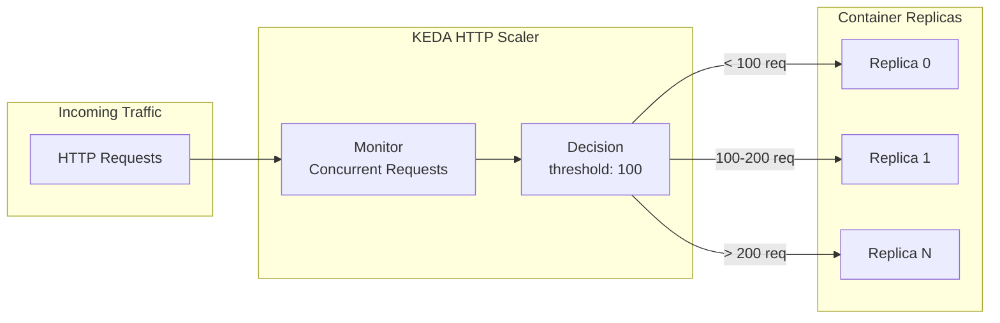
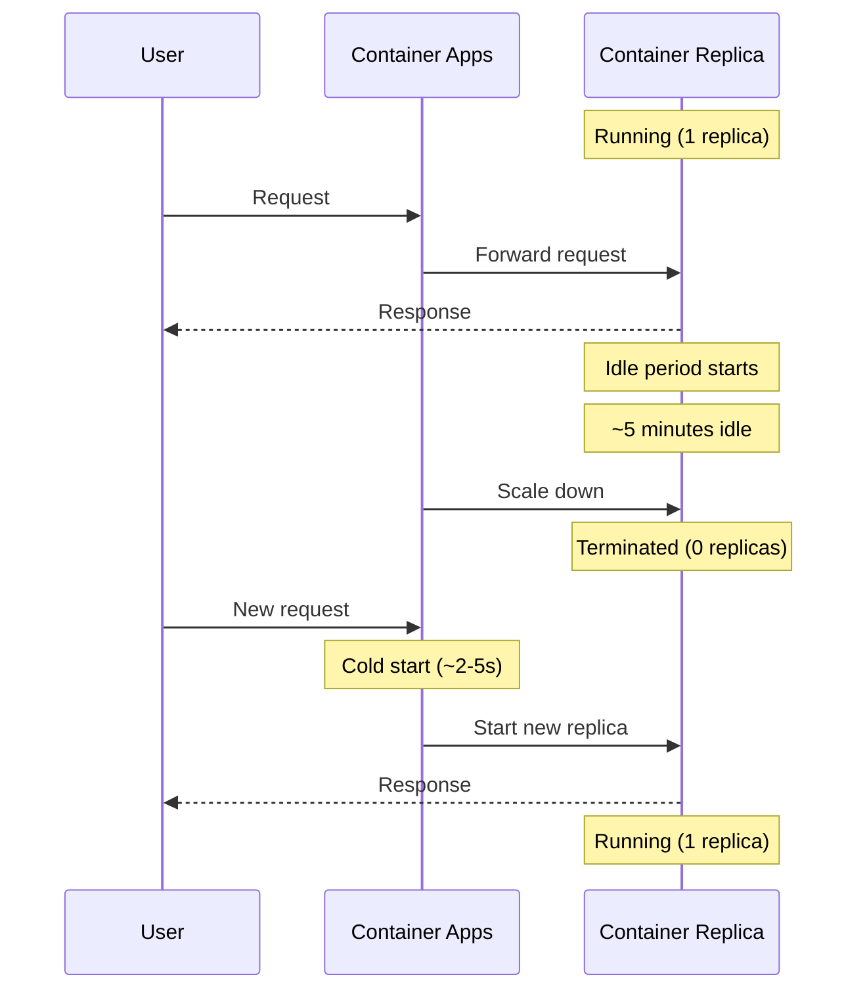

# Auto-Scaling Guide

<div align="center">


**HTTP-based Auto-Scaling with KEDA**

</div>

This guide explains how to configure HTTP-based auto-scaling for the DOT Transportation Data Portal using Azure Container Apps.

> **Key Feature:** Scale to zero when idle = $0 compute costs during inactivity

---

## Table of Contents

- [Overview](#overview)
- [Default Configuration](#default-configuration)
- [How Scale-to-Zero Works](#how-scale-to-zero-works)
- [Configuration Options](#configuration-options)
- [Configuring via Scripts](#configuring-via-scripts)
- [Configuring via Azure Portal](#configuring-via-azure-portal)
- [Configuring via Azure CLI](#configuring-via-azure-cli)
- [Monitoring Scaling](#monitoring-scaling)
- [Production Recommendations](#production-recommendations)
- [Troubleshooting](#troubleshooting)

---

## Overview

Azure Container Apps provides serverless auto-scaling powered by KEDA (Kubernetes Event-Driven Autoscaler). The DOT Transportation Data Portal uses HTTP-based scaling, which adjusts the number of container replicas based on concurrent HTTP requests.

### Key Benefits

| Feature | Benefit |
|---------|---------|
| **Scale-to-Zero** | No cost when idle (min replicas = 0) |
| **Automatic Scale-Out** | Handle traffic spikes automatically |
| **Per-Request Billing** | Pay only for actual usage |
| **Fast Scale-Out** | New replicas ready in seconds |

---

## Default Configuration

The deployment uses these default scaling parameters:

| Parameter | Default Value | Description |
|-----------|---------------|-------------|
| `minReplicas` | 0 | Minimum replicas (0 enables scale-to-zero) |
| `maxReplicas` | 10 | Maximum replicas |
| `httpScaleThreshold` | 100 | Concurrent requests per replica to trigger scale-out |

### How It Works



**Example:** With a threshold of 100 concurrent requests:
- 0-100 requests → 1 replica
- 100-200 requests → 2 replicas
- 200-300 requests → 3 replicas
- Up to max 10 replicas

---

## How Scale-to-Zero Works

When `minReplicas = 0`, Container Apps will scale to zero when there's no traffic.

### Scale-to-Zero Timeline



### Cold Start Behavior

| Stage | Duration | Description |
|-------|----------|-------------|
| Request received | 0ms | Request enters Container Apps |
| Container pull | 1-3s | If image not cached |
| Container start | 1-2s | Application initialization |
| Request processed | Variable | Normal request time |

**Total cold start:** ~2-5 seconds for first request after scale-to-zero

---

## Configuration Options

### Parameters

| Parameter | Range | Default | Description |
|-----------|-------|---------|-------------|
| `minReplicas` | 0-10 | 0 | Minimum running replicas |
| `maxReplicas` | 1-10 | 10 | Maximum replicas |
| `httpScaleThreshold` | 1-1000 | 100 | Concurrent requests to trigger scale |

### Environment Recommendations

| Environment | Min Replicas | Max Replicas | Threshold | Reasoning |
|-------------|--------------|--------------|-----------|-----------|
| **Development** | 0 | 3 | 100 | Cost savings, infrequent use |
| **Staging** | 0 | 5 | 50 | Test scaling behavior |
| **Production** | 1 | 10 | 50 | Always-on, fast response |

---

## Configuring via Scripts

### Deployment Parameters

```powershell
# Development (scale-to-zero, low max)
./deploy.ps1 -ResourceGroupName "rg-dab-demo" `
             -Environment "dev" `
             -MinReplicas 0 `
             -MaxReplicas 3 `
             -HttpScaleThreshold 100

# Production (always-on, higher capacity)
./deploy.ps1 -ResourceGroupName "rg-dab-prod" `
             -Environment "prod" `
             -MinReplicas 1 `
             -MaxReplicas 10 `
             -HttpScaleThreshold 50
```

---

## Configuring via Azure Portal

### Step 1: Navigate to Container App

1. Go to [Azure Portal](https://portal.azure.com)
2. Navigate to **Resource groups** → Your resource group
3. Click on the Container App (e.g., `dabdemo-dev-ca-dab`)

### Step 2: Access Scale Settings

1. In the left menu, click **Scale and replicas**
2. Click **Edit and deploy** button

### Step 3: Configure Scaling

1. Go to the **Scale** tab
2. Set **Min replicas** (0-10)
3. Set **Max replicas** (1-10)

### Step 4: Configure Scale Rule

1. Under **Scale rule**, click **Add**
2. Configure:

| Field | Value |
|-------|-------|
| Rule name | `http-rule` |
| Type | **HTTP scaling** |
| Concurrent requests | `100` (or your threshold) |

3. Click **Add**

### Step 5: Deploy

1. Click **Create**
2. Wait for new revision to deploy

---

## Configuring via Azure CLI

### Update Scale Settings

```bash
# Update DAB Container App scaling
az containerapp update \
  --name dabdemo-dev-ca-dab \
  --resource-group rg-dab-demo \
  --min-replicas 0 \
  --max-replicas 10

# Update with scale rule
az containerapp update \
  --name dabdemo-dev-ca-dab \
  --resource-group rg-dab-demo \
  --min-replicas 1 \
  --max-replicas 10 \
  --scale-rule-name http-rule \
  --scale-rule-type http \
  --scale-rule-http-concurrency 50
```

### View Current Configuration

```bash
# Get scaling configuration
az containerapp show \
  --name dabdemo-dev-ca-dab \
  --resource-group rg-dab-demo \
  --query "properties.template.scale"
```

---

## Monitoring Scaling

### View Active Replicas

```bash
# List current replicas
az containerapp replica list \
  --name dabdemo-dev-ca-dab \
  --resource-group rg-dab-demo \
  -o table

# Watch replica count (refresh every 5 seconds)
watch -n 5 "az containerapp replica list --name dabdemo-dev-ca-dab --resource-group rg-dab-demo -o table"
```

### View Scaling Events

```bash
# View system logs for scaling events
az containerapp logs show \
  --name dabdemo-dev-ca-dab \
  --resource-group rg-dab-demo \
  --type system \
  --follow
```

### Azure Portal Monitoring

1. Navigate to your Container App
2. Go to **Metrics**
3. Select metrics:
   - **Replica Count** - Current number of replicas
   - **Requests** - Request rate
   - **CPU Usage** - Per replica CPU

### Log Analytics Queries

```kusto
// Replica count over time
ContainerAppSystemLogs_CL
| where ContainerAppName_s == "dabdemo-dev-ca-dab"
| where Reason_s in ("ScaledUp", "ScaledDown")
| project TimeGenerated, Reason_s, Count_d
| order by TimeGenerated desc

// Scale events in last 24 hours
ContainerAppSystemLogs_CL
| where TimeGenerated > ago(24h)
| where Reason_s contains "Scale"
| summarize count() by bin(TimeGenerated, 1h), Reason_s
| render timechart
```

---

## Production Recommendations

### Always-On Configuration

For production workloads requiring immediate response:

```powershell
./deploy.ps1 -ResourceGroupName "rg-dab-prod" `
             -Environment "prod" `
             -MinReplicas 1 `
             -MaxReplicas 10 `
             -HttpScaleThreshold 50
```

### Cost-Performance Tradeoffs

| Configuration | Monthly Cost* | Cold Start | Use Case |
|---------------|--------------|------------|----------|
| min=0, max=3 | $0-20 | Yes | Dev/Test |
| min=1, max=5 | $20-60 | No | Staging |
| min=1, max=10 | $40-150 | No | Production |
| min=2, max=10 | $80-200 | No | High-traffic |

*Estimated costs vary by region and actual usage

### High-Availability Configuration

```bash
# Production with zone redundancy
az containerapp update \
  --name dabdemo-prod-ca-dab \
  --resource-group rg-dab-prod \
  --min-replicas 2 \
  --max-replicas 10 \
  --scale-rule-name http-rule \
  --scale-rule-type http \
  --scale-rule-http-concurrency 50
```

---

## Troubleshooting

### Cold Starts Taking Too Long

**Symptoms:** First request after idle takes 10+ seconds

**Solutions:**
1. Set `minReplicas=1` to avoid cold starts
2. Optimize container image size
3. Pre-warm with health checks

### Scaling Not Triggering

**Symptoms:** High request rate but replicas not increasing

**Check:**
1. Verify scale rule exists
2. Check max replicas limit
3. Review system logs for errors

```bash
az containerapp show \
  --name dabdemo-dev-ca-dab \
  --resource-group rg-dab-demo \
  --query "properties.template.scale.rules"
```

### Replicas Stuck at Minimum

**Symptoms:** Traffic has stopped but replicas don't scale down

**Note:** Container Apps wait ~5 minutes of idle before scaling to zero. This is expected behavior.

### High Costs Despite Low Traffic

**Solutions:**
1. Set `minReplicas=0` for dev/test
2. Review max replicas setting
3. Check for stuck revisions

```bash
# List all revisions
az containerapp revision list \
  --name dabdemo-dev-ca-dab \
  --resource-group rg-dab-demo \
  -o table
```

---

## Related Documentation

- [Azure Container Apps Scaling Documentation](https://learn.microsoft.com/azure/container-apps/scale-app)
- [KEDA HTTP Scaler](https://keda.sh/docs/scalers/http/)
- [Container Apps Pricing](https://azure.microsoft.com/pricing/details/container-apps/)
