# 📈 Auto-Scaling Guide

<div align="center">


### ⚡ HTTP-based Auto-Scaling with KEDA

[📖 Overview](#-overview) • [⚙️ Configuration](#-configuration-options) • [🖥️ Portal](#-configuring-via-azure-portal) • [📊 Monitoring](#-monitoring-scaling)

---

[]()
[](https://learn.microsoft.com/azure/container-apps/scale-app)
[](https://keda.sh/docs/scalers/http/)

</div>

---

## 📑 Table of Contents

| # | 📍 Section | 📝 Description |
|:-:|:----------|:--------------|
| 1 | [📖 Overview](#-overview) | How auto-scaling works |
| 2 | [⚙️ Default Configuration](#-default-configuration) | Out-of-box settings |
| 3 | [❄️ Scale-to-Zero](#-how-scale-to-zero-works) | Cold start behavior |
| 4 | [🔧 Configuration Options](#-configuration-options) | Customization parameters |
| 5 | [📜 Via Scripts](#-configuring-via-scripts) | PowerShell deployment |
| 6 | [🖥️ Via Portal](#-configuring-via-azure-portal) | Azure Portal steps |
| 7 | [⌨️ Via CLI](#-configuring-via-azure-cli) | Azure CLI commands |
| 8 | [📊 Monitoring](#-monitoring-scaling) | Track scaling events |
| 9 | [🏭 Production](#-production-recommendations) | Best practices |
| 10 | [🔧 Troubleshooting](#-troubleshooting) | Common issues |

---

## 📖 Overview

Azure Container Apps provides serverless auto-scaling powered by **KEDA** (Kubernetes Event-Driven Autoscaler). The DOT Transportation Data Portal uses HTTP-based scaling, which adjusts the number of container replicas based on concurrent HTTP requests.

### ✨ Key Benefits

| ✨ Feature | 💡 Benefit |
|:----------|:----------|
| 📉 **Scale-to-Zero** | No cost when idle (min replicas = 0) |
| 📈 **Automatic Scale-Out** | Handle traffic spikes automatically |
| 💰 **Per-Request Billing** | Pay only for actual usage |
| ⚡ **Fast Scale-Out** | New replicas ready in seconds |

---

## ⚙️ Default Configuration

The deployment uses these default scaling parameters:

| 📋 Parameter | 💡 Default Value | 📝 Description |
|:------------|:----------------|:--------------|
| `minReplicas` | 0 | Minimum replicas (0 enables scale-to-zero) |
| `maxReplicas` | 10 | Maximum replicas |
| `httpScaleThreshold` | 100 | Concurrent requests per replica to trigger scale-out |

### 🔄 How It Works


> 💡 **Example:** With a threshold of 100 concurrent requests:
> - 0-100 requests → 1 replica
> - 100-200 requests → 2 replicas
> - 200-300 requests → 3 replicas
> - Up to max 10 replicas

---

## ❄️ How Scale-to-Zero Works

When `minReplicas = 0`, Container Apps will scale to zero when there's no traffic.

### ⏱️ Scale-to-Zero Timeline

```mermaid
sequenceDiagram
    participant User
    participant CAE as Container Apps
    participant Pod as Container Replica

    Note over Pod: ✅ Running (1 replica)
    User->>CAE: Request
    CAE->>Pod: Forward request
    Pod-->>User: Response

    Note over Pod: ⏳ Idle period starts
    Note over Pod: ~5 minutes idle
    CAE->>Pod: Scale down
    Note over Pod: ❄️ Terminated (0 replicas)

    User->>CAE: New request
    Note over CAE: ⚡ Cold start (~2-5s)
    CAE->>Pod: Start new replica
    Pod-->>User: Response
    Note over Pod: ✅ Running (1 replica)
```



### ⚡ Cold Start Behavior

| 📍 Stage | ⏱️ Duration | 📝 Description |
|:---------|:-----------|:--------------|
| 📥 Request received | 0ms | Request enters Container Apps |
| 📦 Container pull | 1-3s | If image not cached |
| 🚀 Container start | 1-2s | Application initialization |
| ⚙️ Request processed | Variable | Normal request time |

> ⏱️ **Total cold start:** ~2-5 seconds for first request after scale-to-zero

---

## 🔧 Configuration Options

### 📋 Parameters

| 📋 Parameter | 📊 Range | 🎯 Default | 📝 Description |
|:------------|:--------|:----------|:--------------|
| `minReplicas` | 0-10 | 0 | Minimum running replicas |
| `maxReplicas` | 1-10 | 10 | Maximum replicas |
| `httpScaleThreshold` | 1-1000 | 100 | Concurrent requests to trigger scale |

### 🌍 Environment Recommendations

| 🌍 Environment | 📉 Min | 📈 Max | 🎯 Threshold | 📝 Reasoning |
|:--------------|:------|:------|:------------|:------------|
| 🧪 **Development** | 0 | 3 | 100 | Cost savings, infrequent use |
| 🔬 **Staging** | 0 | 5 | 50 | Test scaling behavior |
| 🏭 **Production** | 1 | 10 | 50 | Always-on, fast response |

---

## 📜 Configuring via Scripts

### 🔧 Deployment Parameters

```powershell
# 🧪 Development (scale-to-zero, low max)
./deploy.ps1 -ResourceGroupName "rg-dab-demo" `
             -Environment "dev" `
             -MinReplicas 0 `
             -MaxReplicas 3 `
             -HttpScaleThreshold 100

# 🏭 Production (always-on, higher capacity)
./deploy.ps1 -ResourceGroupName "rg-dab-prod" `
             -Environment "prod" `
             -MinReplicas 1 `
             -MaxReplicas 10 `
             -HttpScaleThreshold 50
```

---

## 🖥️ Configuring via Azure Portal

### 📍 Step 1: Navigate to Container App

1. Go to [Azure Portal](https://portal.azure.com)
2. Navigate to **Resource groups** → Your resource group
3. Click on the Container App (e.g., `dabdemo-dev-ca-dab`)

### 📍 Step 2: Access Scale Settings

1. In the left menu, click **Scale and replicas**
2. Click **Edit and deploy** button

### 📍 Step 3: Configure Scaling

1. Go to the **Scale** tab
2. Set **Min replicas** (0-10)
3. Set **Max replicas** (1-10)

### 📍 Step 4: Configure Scale Rule

1. Under **Scale rule**, click **Add**
2. Configure:

| 📋 Field | 💡 Value |
|:---------|:--------|
| Rule name | `http-rule` |
| Type | **HTTP scaling** |
| Concurrent requests | `100` (or your threshold) |

3. Click **Add**

### 📍 Step 5: Deploy

1. Click **Create**
2. ⏳ Wait for new revision to deploy

---

## ⌨️ Configuring via Azure CLI

### 🔄 Update Scale Settings

```bash
# 📈 Update DAB Container App scaling
az containerapp update \
  --name dabdemo-dev-ca-dab \
  --resource-group rg-dab-demo \
  --min-replicas 0 \
  --max-replicas 10

# 📈 Update with scale rule
az containerapp update \
  --name dabdemo-dev-ca-dab \
  --resource-group rg-dab-demo \
  --min-replicas 1 \
  --max-replicas 10 \
  --scale-rule-name http-rule \
  --scale-rule-type http \
  --scale-rule-http-concurrency 50
```

### 👀 View Current Configuration

```bash
# 🔍 Get scaling configuration
az containerapp show \
  --name dabdemo-dev-ca-dab \
  --resource-group rg-dab-demo \
  --query "properties.template.scale"
```

---

## 📊 Monitoring Scaling

### 📋 View Active Replicas

```bash
# 📋 List current replicas
az containerapp replica list \
  --name dabdemo-dev-ca-dab \
  --resource-group rg-dab-demo \
  -o table

# 🔄 Watch replica count (refresh every 5 seconds)
watch -n 5 "az containerapp replica list --name dabdemo-dev-ca-dab --resource-group rg-dab-demo -o table"
```

### 📊 View Scaling Events

```bash
# 📋 View system logs for scaling events
az containerapp logs show \
  --name dabdemo-dev-ca-dab \
  --resource-group rg-dab-demo \
  --type system \
  --follow
```

### 🖥️ Azure Portal Monitoring

1. Navigate to your Container App
2. Go to **Metrics**
3. Select metrics:
   | 📊 Metric | 📝 Description |
   |:---------|:--------------|
   | **Replica Count** | Current number of replicas |
   | **Requests** | Request rate |
   | **CPU Usage** | Per replica CPU |

### 📊 Log Analytics Queries

<details>
<summary>📈 <b>Replica count over time</b></summary>

```kusto
ContainerAppSystemLogs_CL
| where ContainerAppName_s == "dabdemo-dev-ca-dab"
| where Reason_s in ("ScaledUp", "ScaledDown")
| project TimeGenerated, Reason_s, Count_d
| order by TimeGenerated desc
```

</details>

<details>
<summary>📊 <b>Scale events in last 24 hours</b></summary>

```kusto
ContainerAppSystemLogs_CL
| where TimeGenerated > ago(24h)
| where Reason_s contains "Scale"
| summarize count() by bin(TimeGenerated, 1h), Reason_s
| render timechart
```

</details>

---

## 🏭 Production Recommendations

### 🔒 Always-On Configuration

For production workloads requiring immediate response:

```powershell
./deploy.ps1 -ResourceGroupName "rg-dab-prod" `
             -Environment "prod" `
             -MinReplicas 1 `
             -MaxReplicas 10 `
             -HttpScaleThreshold 50
```

### 💰 Cost-Performance Tradeoffs

| ⚙️ Configuration | 💵 Monthly Cost* | ❄️ Cold Start | 🎯 Use Case |
|:----------------|:---------------|:-------------|:----------|
| min=0, max=3 | $0-20 | ✅ Yes | 🧪 Dev/Test |
| min=1, max=5 | $20-60 | ❌ No | 🔬 Staging |
| min=1, max=10 | $40-150 | ❌ No | 🏭 Production |
| min=2, max=10 | $80-200 | ❌ No | 🚀 High-traffic |

> ⚠️ *Estimated costs vary by region and actual usage

### 🔒 High-Availability Configuration

```bash
# 🏭 Production with zone redundancy
az containerapp update \
  --name dabdemo-prod-ca-dab \
  --resource-group rg-dab-prod \
  --min-replicas 2 \
  --max-replicas 10 \
  --scale-rule-name http-rule \
  --scale-rule-type http \
  --scale-rule-http-concurrency 50
```

---

## 🔧 Troubleshooting

### ❌ Cold Starts Taking Too Long

**Symptoms:** First request after idle takes 10+ seconds

**Solutions:**
| # | ✅ Solution |
|:-:|:----------|
| 1 | Set `minReplicas=1` to avoid cold starts |
| 2 | Optimize container image size |
| 3 | Pre-warm with health checks |

### ❌ Scaling Not Triggering

**Symptoms:** High request rate but replicas not increasing

**Check:**
1. ✅ Verify scale rule exists
2. ✅ Check max replicas limit
3. ✅ Review system logs for errors

```bash
az containerapp show \
  --name dabdemo-dev-ca-dab \
  --resource-group rg-dab-demo \
  --query "properties.template.scale.rules"
```

### ❌ Replicas Stuck at Minimum

**Symptoms:** Traffic has stopped but replicas don't scale down

> 💡 **Note:** Container Apps wait ~5 minutes of idle before scaling to zero. This is expected behavior.

### ❌ High Costs Despite Low Traffic

**Solutions:**
| # | ✅ Solution |
|:-:|:----------|
| 1 | Set `minReplicas=0` for dev/test |
| 2 | Review max replicas setting |
| 3 | Check for stuck revisions |

```bash
# 📋 List all revisions
az containerapp revision list \
  --name dabdemo-dev-ca-dab \
  --resource-group rg-dab-demo \
  -o table
```

---

## 📚 Related Documentation

| 📘 Resource | 🔗 Link |
|:-----------|:--------|
| 📖 Azure Container Apps Scaling | [Microsoft Learn](https://learn.microsoft.com/azure/container-apps/scale-app) |
| ⚡ KEDA HTTP Scaler | [KEDA Docs](https://keda.sh/docs/scalers/http/) |
| 💰 Container Apps Pricing | [Azure Pricing](https://azure.microsoft.com/pricing/details/container-apps/) |

---

<div align="center">

### 📚 Continue Learning

[](./ci-cd-guide.md)
[](./monitoring-guide.md)
[](./index.md)

---

**Made with ❤️ for the Azure community**

</div>
