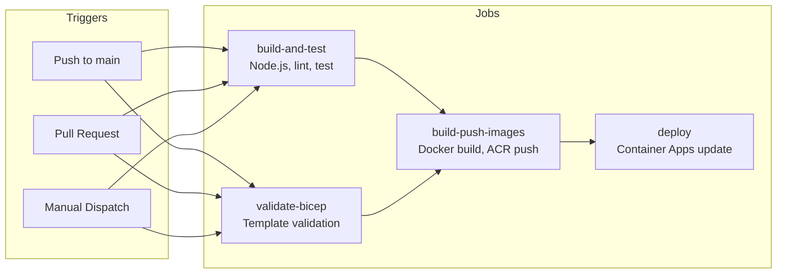

# CI/CD Guide

<div align="center">


**Automated CI/CD Pipeline with GitHub Actions**

</div>

This guide explains how to set up and use the GitHub Actions workflow for automated deployment of the DOT Transportation Data Portal.

> **Estimated Setup Time:** 30 minutes
> **Prerequisites:** GitHub repository, Azure subscription, completed infrastructure deployment

---

## Table of Contents

- [Overview](#overview)
- [Workflow Structure](#workflow-structure)
- [Setting Up GitHub Secrets](#setting-up-github-secrets)
- [OIDC Authentication Setup](#oidc-authentication-setup)
- [Triggering Deployments](#triggering-deployments)
- [Monitoring Deployments](#monitoring-deployments)
- [Troubleshooting](#troubleshooting)

---

## Overview

The GitHub Actions workflow automates:

1. **Building and testing** the React frontend
2. **Validating** Bicep infrastructure templates
3. **Building and pushing** container images to ACR
4. **Deploying** to Azure Container Apps
5. **Verifying** deployment health

### Workflow Triggers

| Trigger | Behavior |
|---------|----------|
| Push to `main` | Full build and deploy |
| Pull request to `main` | Build, test, and validate (no deploy) |
| Manual dispatch | On-demand deployment with environment selection |

---

## Workflow Structure



### Jobs

| Job | Runs On | Purpose |
|-----|---------|---------|
| `build-and-test` | All triggers | Build frontend, run tests |
| `validate-bicep` | All triggers | Validate infrastructure |
| `build-push-images` | Push to main only | Build and push Docker images |
| `deploy` | Push to main only | Update Container Apps |

---

## Setting Up GitHub Secrets

Navigate to your repository **Settings** → **Secrets and variables** → **Actions** → **New repository secret**.

### Required Secrets

| Secret Name | Description | Example |
|-------------|-------------|---------|
| `AZURE_CLIENT_ID` | Service principal or managed identity client ID | `12345678-1234-...` |
| `AZURE_TENANT_ID` | Azure AD tenant ID | `87654321-4321-...` |
| `AZURE_SUBSCRIPTION_ID` | Azure subscription ID | `abcdefgh-abcd-...` |
| `RESOURCE_GROUP` | Target resource group name | `rg-dab-demo` |
| `ACR_NAME` | Azure Container Registry name | `acrdabdemodev` |
| `DAB_CONTAINER_APP_NAME` | DAB Container App name | `dabdemo-dev-ca-dab` |
| `FRONTEND_CONTAINER_APP_NAME` | Frontend Container App name | `dabdemo-dev-ca-frontend` |
| `DAB_CLIENT_ID` | DAB app registration client ID | `aaaaaaaa-aaaa-...` |
| `FRONTEND_CLIENT_ID` | Frontend app registration client ID | `bbbbbbbb-bbbb-...` |
| `SQL_ADMIN_PASSWORD` | SQL Server admin password | `SecureP@ssword!` |
| `LOG_ANALYTICS_WORKSPACE_ID` | Full resource ID of Log Analytics workspace | `/subscriptions/.../workspaces/...` |

### Optional Secrets

| Secret Name | Description | Default |
|-------------|-------------|---------|
| `AZURE_CREDENTIALS` | Full service principal JSON (legacy) | Use OIDC instead |

---

## OIDC Authentication Setup

GitHub Actions supports OIDC (OpenID Connect) for passwordless authentication to Azure. This is more secure than storing credentials.

### Step 1: Create App Registration

```bash
# Create app registration for GitHub Actions
az ad app create --display-name "GitHub-Actions-OIDC"

# Get the app ID
$appId = az ad app list --display-name "GitHub-Actions-OIDC" --query "[0].appId" -o tsv

# Create service principal
az ad sp create --id $appId
```

### Step 2: Configure Federated Credentials

1. Go to **Azure Portal** → **Microsoft Entra ID** → **App registrations**
2. Select **GitHub-Actions-OIDC**
3. Go to **Certificates & secrets** → **Federated credentials**
4. Click **+ Add credential**

| Field | Value |
|-------|-------|
| Federated credential scenario | **GitHub Actions deploying Azure resources** |
| Organization | Your GitHub organization/username |
| Repository | `azure-dab-fullstack-demo` |
| Entity type | **Branch** |
| Branch name | `main` |
| Credential name | `main-branch` |

5. Click **Add**

### Step 3: Assign Azure Roles

```bash
# Get the service principal object ID
$spId = az ad sp list --display-name "GitHub-Actions-OIDC" --query "[0].id" -o tsv

# Assign Contributor role on resource group
az role assignment create \
  --assignee $spId \
  --role "Contributor" \
  --scope "/subscriptions/<subscription-id>/resourceGroups/rg-dab-demo"

# Assign AcrPush role on ACR
az role assignment create \
  --assignee $spId \
  --role "AcrPush" \
  --scope "/subscriptions/<subscription-id>/resourceGroups/rg-dab-demo/providers/Microsoft.ContainerRegistry/registries/acrdabdemodev"
```

### Step 4: Configure GitHub Secrets

Set these secrets in your repository:

- `AZURE_CLIENT_ID`: The app registration client ID
- `AZURE_TENANT_ID`: Your Azure AD tenant ID
- `AZURE_SUBSCRIPTION_ID`: Your Azure subscription ID

---

## Triggering Deployments

### Automatic (Push to Main)

Any push to the `main` branch triggers a full deployment:

```bash
git checkout main
git pull origin main
# Make changes
git add .
git commit -m "feat: update feature X"
git push origin main
```

### Manual Dispatch

1. Go to **Actions** tab in GitHub
2. Select **Build and Deploy to Azure Container Apps**
3. Click **Run workflow**
4. Select options:
   - **Branch:** `main`
   - **Environment:** `dev`, `staging`, or `prod`
   - **Skip infrastructure:** Check to skip Bicep deployment

### Pull Request (Validation Only)

Pull requests trigger:
- Frontend build and tests
- Bicep template validation
- What-if analysis (preview changes)

No actual deployment occurs on PRs.

---

## Monitoring Deployments

### GitHub Actions UI

1. Go to **Actions** tab
2. Click on the running/completed workflow
3. View logs for each job

### Workflow Run Summary

After deployment, the workflow outputs:
- Container Apps URLs
- Image tag deployed
- Health check results

### Azure Portal

1. Go to **Container Apps** → Your app
2. Check **Revisions and replicas** for deployment status
3. View **Log stream** for application logs

### CLI Monitoring

```bash
# Watch deployment status
az containerapp revision list \
  --name dabdemo-dev-ca-dab \
  --resource-group rg-dab-demo \
  -o table

# View recent logs
az containerapp logs show \
  --name dabdemo-dev-ca-dab \
  --resource-group rg-dab-demo \
  --follow
```

---

## Workflow File Reference

The workflow file is located at `.github/workflows/deploy.yml`.

### Key Sections

#### Environment Variables

```yaml
env:
  AZURE_RESOURCE_GROUP: ${{ secrets.RESOURCE_GROUP }}
  ACR_NAME: ${{ secrets.ACR_NAME }}
  DAB_CONTAINER_APP_NAME: ${{ secrets.DAB_CONTAINER_APP_NAME }}
  FRONTEND_CONTAINER_APP_NAME: ${{ secrets.FRONTEND_CONTAINER_APP_NAME }}
```

#### Azure Login (OIDC)

```yaml
- name: Azure Login
  uses: azure/login@v2
  with:
    client-id: ${{ secrets.AZURE_CLIENT_ID }}
    tenant-id: ${{ secrets.AZURE_TENANT_ID }}
    subscription-id: ${{ secrets.AZURE_SUBSCRIPTION_ID }}
```

#### Image Tagging

```yaml
- name: Set image tag
  id: set-tag
  run: |
    if [[ "${{ github.event_name }}" == "pull_request" ]]; then
      echo "image_tag=pr-${{ github.event.pull_request.number }}" >> $GITHUB_OUTPUT
    else
      echo "image_tag=${{ github.sha }}" >> $GITHUB_OUTPUT
    fi
```

#### Container App Update

```yaml
- name: Update DAB Container App
  run: |
    az containerapp update \
      --name ${{ env.DAB_CONTAINER_APP_NAME }} \
      --resource-group ${{ env.AZURE_RESOURCE_GROUP }} \
      --image ${{ env.ACR_NAME }}.azurecr.io/dab:${{ needs.build-and-test.outputs.image_tag }}
```

---

## Troubleshooting

### OIDC Authentication Fails

**Error:** `AADSTS70021: No matching federated identity record found`

**Solutions:**
1. Verify federated credential configuration matches exactly
2. Check organization, repository, and branch names
3. Ensure the entity type matches (branch vs. environment)

### ACR Push Permission Denied

**Error:** `unauthorized: authentication required`

**Solutions:**
1. Verify `AcrPush` role is assigned
2. Check ACR name in secrets
3. Ensure admin user is enabled on ACR

### Container App Update Fails

**Error:** `Container app not found`

**Solutions:**
1. Verify container app name in secrets
2. Check resource group is correct
3. Ensure initial deployment completed successfully

### Health Check Fails

**Error:** `Health check failed (HTTP 5xx)`

**Solutions:**
1. Check container app logs for startup errors
2. Verify environment variables are correct
3. Check database connectivity

```bash
# View recent logs
az containerapp logs show \
  --name dabdemo-dev-ca-dab \
  --resource-group rg-dab-demo \
  --tail 100
```

### Build Fails

**Error:** `npm test failed`

**Solutions:**
1. Check test output in Actions logs
2. Run tests locally: `cd src/frontend && npm test`
3. Fix failing tests before pushing

---

## Best Practices

### Branch Protection

Enable branch protection on `main`:
1. Go to **Settings** → **Branches**
2. Add rule for `main`
3. Enable:
   - Require pull request reviews
   - Require status checks (build-and-test, validate-bicep)
   - Require branches to be up to date

### Deployment Environments

For production deployments, use GitHub Environments:

1. Go to **Settings** → **Environments**
2. Create `production` environment
3. Add required reviewers
4. Configure protection rules

### Rollback

To rollback to a previous version:

```bash
# List previous revisions
az containerapp revision list \
  --name dabdemo-dev-ca-dab \
  --resource-group rg-dab-demo \
  -o table

# Activate previous revision
az containerapp revision activate \
  --name dabdemo-dev-ca-dab \
  --resource-group rg-dab-demo \
  --revision <previous-revision-name>
```

---

## Related Documentation

- [GitHub Actions Documentation](https://docs.github.com/en/actions)
- [Azure Login Action](https://github.com/Azure/login)
- [OIDC Authentication](https://docs.github.com/en/actions/deployment/security-hardening-your-deployments/configuring-openid-connect-in-azure)
- [Container Apps CLI](https://learn.microsoft.com/cli/azure/containerapp)
