# ⚙️ CI/CD Guide

<div align="center">


### 🚀 Automated CI/CD Pipeline with GitHub Actions

[📖 Overview](#-overview) • [🔐 Secrets](#-setting-up-github-secrets) • [🔑 OIDC](#-oidc-authentication-setup) • [🚀 Triggers](#-triggering-deployments)

---

[]()
[]()
[]()

</div>

---

## 📑 Table of Contents

| # | 📍 Section | 📝 Description |
|:-:|:----------|:--------------|
| 1 | [📖 Overview](#-overview) | Pipeline architecture |
| 2 | [🔄 Workflow Structure](#-workflow-structure) | Jobs and triggers |
| 3 | [🔐 GitHub Secrets](#-setting-up-github-secrets) | Required secrets |
| 4 | [🔑 OIDC Setup](#-oidc-authentication-setup) | Passwordless auth |
| 5 | [🚀 Triggering](#-triggering-deployments) | Deploy methods |
| 6 | [📊 Monitoring](#-monitoring-deployments) | Track deployments |
| 7 | [🔧 Troubleshooting](#-troubleshooting) | Common issues |
| 8 | [✨ Best Practices](#-best-practices) | Production tips |

---

## 📖 Overview

The GitHub Actions workflow automates:

| # | 🔄 Step | 📝 Description |
|:-:|:--------|:--------------|
| 1 | 🧪 **Build & Test** | Build React frontend, run tests |
| 2 | ✅ **Validate** | Validate Bicep infrastructure templates |
| 3 | 📦 **Build Images** | Build and push container images to ACR |
| 4 | 🚀 **Deploy** | Deploy to Azure Container Apps |
| 5 | ✔️ **Verify** | Verify deployment health |

### 🎯 Workflow Triggers

| 🎯 Trigger | 📝 Behavior |
|:----------|:-----------|
| 📤 Push to `main` | Full build and deploy |
| 🔀 Pull request to `main` | Build, test, and validate (no deploy) |
| 🖱️ Manual dispatch | On-demand deployment with environment selection |

---

## 🔄 Workflow Structure

```mermaid
flowchart LR
    subgraph Triggers["🎯 Triggers"]
        Push["📤 Push to main"]
        PR["🔀 Pull Request"]
        Manual["🖱️ Manual Dispatch"]
    end

    subgraph Jobs["⚙️ Jobs"]
        Build["🧪 build-and-test<br/>Node.js, lint, test"]
        Validate["✅ validate-bicep<br/>Template validation"]
        Push2["📦 build-push-images<br/>Docker build, ACR push"]
        Deploy["🚀 deploy<br/>Container Apps update"]
    end

    Push --> Build
    Push --> Validate
    PR --> Build
    PR --> Validate
    Manual --> Build
    Manual --> Validate

    Build --> Push2
    Validate --> Push2
    Push2 --> Deploy
```



### 📋 Jobs

| ⚙️ Job | 🎯 Runs On | 📝 Purpose |
|:------|:----------|:----------|
| `build-and-test` | All triggers | Build frontend, run tests |
| `validate-bicep` | All triggers | Validate infrastructure |
| `build-push-images` | Push to main only | Build and push Docker images |
| `deploy` | Push to main only | Update Container Apps |

---

## 🔐 Setting Up GitHub Secrets

Navigate to your repository **Settings** → **Secrets and variables** → **Actions** → **New repository secret**.

### 🔑 Required Secrets

| 🔐 Secret Name | 📝 Description | 💡 Example |
|:--------------|:--------------|:----------|
| `AZURE_CLIENT_ID` | Service principal or managed identity client ID | `12345678-1234-...` |
| `AZURE_TENANT_ID` | Azure AD tenant ID | `87654321-4321-...` |
| `AZURE_SUBSCRIPTION_ID` | Azure subscription ID | `abcdefgh-abcd-...` |
| `RESOURCE_GROUP` | Target resource group name | `rg-dab-demo` |
| `ACR_NAME` | Azure Container Registry name | `acrdabdemodev` |
| `DAB_CONTAINER_APP_NAME` | DAB Container App name | `dabdemo-dev-ca-dab` |
| `FRONTEND_CONTAINER_APP_NAME` | Frontend Container App name | `dabdemo-dev-ca-frontend` |
| `DAB_CLIENT_ID` | DAB app registration client ID | `aaaaaaaa-aaaa-...` |
| `FRONTEND_CLIENT_ID` | Frontend app registration client ID | `bbbbbbbb-bbbb-...` |
| `SQL_ADMIN_PASSWORD` | SQL Server admin password | `SecureP@ssword!` |
| `LOG_ANALYTICS_WORKSPACE_ID` | Full resource ID of Log Analytics workspace | `/subscriptions/.../workspaces/...` |

### 🔧 Optional Secrets

| 🔐 Secret Name | 📝 Description | 💡 Default |
|:--------------|:--------------|:----------|
| `AZURE_CREDENTIALS` | Full service principal JSON (legacy) | Use OIDC instead |

---

## 🔑 OIDC Authentication Setup

> 🔒 GitHub Actions supports **OIDC** (OpenID Connect) for passwordless authentication to Azure. This is more secure than storing credentials.

### 1️⃣ Create App Registration

```bash
# ➕ Create app registration for GitHub Actions
az ad app create --display-name "GitHub-Actions-OIDC"

# 🔍 Get the app ID
$appId = az ad app list --display-name "GitHub-Actions-OIDC" --query "[0].appId" -o tsv

# ➕ Create service principal
az ad sp create --id $appId
```

### 2️⃣ Configure Federated Credentials

1. Go to **Azure Portal** → **Microsoft Entra ID** → **App registrations**
2. Select **GitHub-Actions-OIDC**
3. Go to **Certificates & secrets** → **Federated credentials**
4. Click **+ Add credential**

| 📋 Field | 💡 Value |
|:---------|:--------|
| Federated credential scenario | **GitHub Actions deploying Azure resources** |
| Organization | Your GitHub organization/username |
| Repository | `azure-dab-fullstack-demo` |
| Entity type | **Branch** |
| Branch name | `main` |
| Credential name | `main-branch` |

5. Click **Add**

### 3️⃣ Assign Azure Roles

```bash
# 🔍 Get the service principal object ID
$spId = az ad sp list --display-name "GitHub-Actions-OIDC" --query "[0].id" -o tsv

# 🔐 Assign Contributor role on resource group
az role assignment create \
  --assignee $spId \
  --role "Contributor" \
  --scope "/subscriptions/<subscription-id>/resourceGroups/rg-dab-demo"

# 📦 Assign AcrPush role on ACR
az role assignment create \
  --assignee $spId \
  --role "AcrPush" \
  --scope "/subscriptions/<subscription-id>/resourceGroups/rg-dab-demo/providers/Microsoft.ContainerRegistry/registries/acrdabdemodev"
```

### 4️⃣ Configure GitHub Secrets

Set these secrets in your repository:

| 🔐 Secret | 📝 Value |
|:---------|:--------|
| `AZURE_CLIENT_ID` | The app registration client ID |
| `AZURE_TENANT_ID` | Your Azure AD tenant ID |
| `AZURE_SUBSCRIPTION_ID` | Your Azure subscription ID |

---

## 🚀 Triggering Deployments

### 📤 Automatic (Push to Main)

Any push to the `main` branch triggers a full deployment:

```bash
git checkout main
git pull origin main
# Make changes
git add .
git commit -m "feat: update feature X"
git push origin main
```

### 🖱️ Manual Dispatch

1. Go to **Actions** tab in GitHub
2. Select **Build and Deploy to Azure Container Apps**
3. Click **Run workflow**
4. Select options:
   | 📋 Option | 💡 Value |
   |:---------|:--------|
   | **Branch** | `main` |
   | **Environment** | `dev`, `staging`, or `prod` |
   | **Skip infrastructure** | Check to skip Bicep deployment |

### 🔀 Pull Request (Validation Only)

Pull requests trigger:
- ✅ Frontend build and tests
- ✅ Bicep template validation
- ✅ What-if analysis (preview changes)

> ⚠️ **No actual deployment occurs on PRs.**

---

## 📊 Monitoring Deployments

### 🖥️ GitHub Actions UI

1. Go to **Actions** tab
2. Click on the running/completed workflow
3. View logs for each job

### 📋 Workflow Run Summary

After deployment, the workflow outputs:
- 🔗 Container Apps URLs
- 🏷️ Image tag deployed
- ✅ Health check results

### 🌐 Azure Portal

1. Go to **Container Apps** → Your app
2. Check **Revisions and replicas** for deployment status
3. View **Log stream** for application logs

### ⌨️ CLI Monitoring

```bash
# 📋 Watch deployment status
az containerapp revision list \
  --name dabdemo-dev-ca-dab \
  --resource-group rg-dab-demo \
  -o table

# 📊 View recent logs
az containerapp logs show \
  --name dabdemo-dev-ca-dab \
  --resource-group rg-dab-demo \
  --follow
```

---

## 📜 Workflow File Reference

The workflow file is located at `.github/workflows/deploy.yml`.

### 🔧 Key Sections

<details>
<summary>🌍 <b>Environment Variables</b></summary>

```yaml
env:
  AZURE_RESOURCE_GROUP: ${{ secrets.RESOURCE_GROUP }}
  ACR_NAME: ${{ secrets.ACR_NAME }}
  DAB_CONTAINER_APP_NAME: ${{ secrets.DAB_CONTAINER_APP_NAME }}
  FRONTEND_CONTAINER_APP_NAME: ${{ secrets.FRONTEND_CONTAINER_APP_NAME }}
```

</details>

<details>
<summary>🔐 <b>Azure Login (OIDC)</b></summary>

```yaml
- name: Azure Login
  uses: azure/login@v2
  with:
    client-id: ${{ secrets.AZURE_CLIENT_ID }}
    tenant-id: ${{ secrets.AZURE_TENANT_ID }}
    subscription-id: ${{ secrets.AZURE_SUBSCRIPTION_ID }}
```

</details>

<details>
<summary>🏷️ <b>Image Tagging</b></summary>

```yaml
- name: Set image tag
  id: set-tag
  run: |
    if [[ "${{ github.event_name }}" == "pull_request" ]]; then
      echo "image_tag=pr-${{ github.event.pull_request.number }}" >> $GITHUB_OUTPUT
    else
      echo "image_tag=${{ github.sha }}" >> $GITHUB_OUTPUT
    fi
```

</details>

<details>
<summary>🚀 <b>Container App Update</b></summary>

```yaml
- name: Update DAB Container App
  run: |
    az containerapp update \
      --name ${{ env.DAB_CONTAINER_APP_NAME }} \
      --resource-group ${{ env.AZURE_RESOURCE_GROUP }} \
      --image ${{ env.ACR_NAME }}.azurecr.io/dab:${{ needs.build-and-test.outputs.image_tag }}
```

</details>

---

## 🔧 Troubleshooting

### ❌ OIDC Authentication Fails

**Error:** `AADSTS70021: No matching federated identity record found`

**Solutions:**
| # | ✅ Solution |
|:-:|:----------|
| 1 | Verify federated credential configuration matches exactly |
| 2 | Check organization, repository, and branch names |
| 3 | Ensure the entity type matches (branch vs. environment) |

### ❌ ACR Push Permission Denied

**Error:** `unauthorized: authentication required`

**Solutions:**
| # | ✅ Solution |
|:-:|:----------|
| 1 | Verify `AcrPush` role is assigned |
| 2 | Check ACR name in secrets |
| 3 | Ensure admin user is enabled on ACR |

### ❌ Container App Update Fails

**Error:** `Container app not found`

**Solutions:**
| # | ✅ Solution |
|:-:|:----------|
| 1 | Verify container app name in secrets |
| 2 | Check resource group is correct |
| 3 | Ensure initial deployment completed successfully |

### ❌ Health Check Fails

**Error:** `Health check failed (HTTP 5xx)`

**Solutions:**
1. 📋 Check container app logs for startup errors
2. ✅ Verify environment variables are correct
3. 🔗 Check database connectivity

```bash
# 📋 View recent logs
az containerapp logs show \
  --name dabdemo-dev-ca-dab \
  --resource-group rg-dab-demo \
  --tail 100
```

### ❌ Build Fails

**Error:** `npm test failed`

**Solutions:**
| # | ✅ Solution |
|:-:|:----------|
| 1 | Check test output in Actions logs |
| 2 | Run tests locally: `cd src/frontend && npm test` |
| 3 | Fix failing tests before pushing |

---

## ✨ Best Practices

### 🔒 Branch Protection

Enable branch protection on `main`:

1. Go to **Settings** → **Branches**
2. Add rule for `main`
3. Enable:
   - ✅ Require pull request reviews
   - ✅ Require status checks (build-and-test, validate-bicep)
   - ✅ Require branches to be up to date

### 🌍 Deployment Environments

For production deployments, use GitHub Environments:

1. Go to **Settings** → **Environments**
2. Create `production` environment
3. Add required reviewers
4. Configure protection rules

### 🔄 Rollback

To rollback to a previous version:

```bash
# 📋 List previous revisions
az containerapp revision list \
  --name dabdemo-dev-ca-dab \
  --resource-group rg-dab-demo \
  -o table

# 🔄 Activate previous revision
az containerapp revision activate \
  --name dabdemo-dev-ca-dab \
  --resource-group rg-dab-demo \
  --revision <previous-revision-name>
```

---

## 📚 Related Documentation

| 📘 Resource | 🔗 Link |
|:-----------|:--------|
| 📖 GitHub Actions Documentation | [GitHub Docs](https://docs.github.com/en/actions) |
| 🔐 Azure Login Action | [GitHub Marketplace](https://github.com/Azure/login) |
| 🔑 OIDC Authentication | [GitHub Security Docs](https://docs.github.com/en/actions/deployment/security-hardening-your-deployments/configuring-openid-connect-in-azure) |
| 📦 Container Apps CLI | [Microsoft Learn](https://learn.microsoft.com/cli/azure/containerapp) |

---

<div align="center">

### 📚 Continue Learning

[](./monitoring-guide.md)
[](./auto-scaling-guide.md)
[](./index.md)

---

**Made with ❤️ for the Azure community**

</div>
