# 🔌 Data API Builder Configuration Guide

<div align="center">


### 🚀 Zero-code REST & GraphQL APIs from your database

[📖 Overview](#-overview) • [📁 Config Structure](#-configuration-file-structure) • [🔧 Entities](#-entity-configuration) • [🔒 Permissions](#-permissions-and-security)

---

[](https://learn.microsoft.com/azure/data-api-builder/)
[](https://github.com/Azure/data-api-builder)
[]()

</div>

---

> 💡 **What is DAB?** Azure Data API Builder automatically generates secure REST and GraphQL APIs directly from your database schema - no code required.

---

## 📑 Table of Contents

| # | 📍 Section | 📝 Description |
|:-:|:----------|:--------------|
| 1 | [📖 Overview](#-overview) | What DAB does |
| 2 | [📁 Config Structure](#-configuration-file-structure) | File layout |
| 3 | [🗄️ Data Source](#-data-source-configuration) | Database connection |
| 4 | [⚙️ Runtime](#-runtime-configuration) | API settings |
| 5 | [🔧 Entities](#-entity-configuration) | Table mappings |
| 6 | [🔗 Relationships](#-relationships) | Joins and navigation |
| 7 | [🔒 Permissions](#-permissions-and-security) | Access control |
| 8 | [✨ Advanced](#-advanced-features) | Extra features |
| 9 | [➕ Adding Entities](#-adding-new-entities) | Step-by-step |
| 10 | [📋 Patterns](#-common-patterns) | Query examples |
| 11 | [🔧 Troubleshooting](#-troubleshooting) | Common issues |

---

## 📖 Overview

Azure Data API Builder (DAB) automatically generates REST and GraphQL APIs from your database schema. This project uses DAB to expose DOT transportation data with minimal configuration.

### ✨ Key Benefits

```mermaid
graph LR
    subgraph Database
        SQL[(🗄️ Azure SQL<br/>Database)]
    end

    subgraph DAB["🔌 Data API Builder"]
        Config[📄 dab-config.json]
        REST[🌐 REST API<br/>/api/*]
        GraphQL[💎 GraphQL API<br/>/graphql]
    end

    subgraph Clients
        Web[🖥️ Web App]
        Mobile[📱 Mobile App]
        BI[📊 BI Tools]
    end

    SQL --> Config
    Config --> REST
    Config --> GraphQL
    REST --> Web
    REST --> Mobile
    GraphQL --> Web
    GraphQL --> BI

    style DAB fill:#e8f5e9
```



| ✨ Benefit | 📝 Description |
|:----------|:--------------|
| ✨ **Zero Code** | APIs generated from configuration |
| 🔄 **Dual Protocols** | REST and GraphQL from same config |
| 🔐 **Built-in Auth** | Azure AD/Entra ID integration |
| 📊 **OData Support** | Filtering, sorting, pagination |
| 🔗 **Relationships** | Automatic join handling |

---

## 📁 Configuration File Structure

The DAB configuration file (`dab-config.json`) has this structure:

```json
{
  "$schema": "https://github.com/Azure/data-api-builder/releases/latest/download/dab.draft.schema.json",
  "data-source": { /* 🗄️ Database connection */ },
  "runtime": { /* ⚙️ API behavior settings */ },
  "entities": { /* 🔧 Table/view mappings */ }
}
```

### 📊 Current Configuration Overview

```mermaid
graph TB
    subgraph Config["📄 dab-config.json"]
        DS[🗄️ Data Source<br/>Azure SQL]
        RT[⚙️ Runtime<br/>REST + GraphQL]

        subgraph Entities["📦 Entities"]
            Cat[Category]
            State[State]
            RA[RailroadAccident]
            Bridge[Bridge]
            TA[TransitAgency]
            VF[VehicleFatality]
        end

        subgraph Views["👁️ Views"]
            CS[CategorySummary]
            RAS[RailroadAccidentsByState]
            BCS[BridgeConditionByState]
            TSS[TransitSummaryByState]
            VFS[VehicleFatalitiesByState]
        end
    end

    DS --> Entities
    DS --> Views
    RT --> Entities
    RT --> Views
```



---

## 🗄️ Data Source Configuration

### 🔌 Basic SQL Server Configuration

```json
{
  "data-source": {
    "database-type": "mssql",
    "connection-string": "@env('DATABASE_CONNECTION_STRING')"
  }
}
```

### 🔐 Environment Variable Reference

Using `@env('VAR_NAME')` allows secure credential management:

```json
{
  "connection-string": "@env('DATABASE_CONNECTION_STRING')"
}
```

### 🗄️ Supported Database Types

| 🗄️ Type | 💡 Value | 📝 Example |
|:--------|:--------|:----------|
| Azure SQL / SQL Server | `mssql` | Production databases |
| PostgreSQL | `postgresql` | Open-source option |
| MySQL | `mysql` | Alternative RDBMS |
| Cosmos DB | `cosmosdb_nosql` | NoSQL scenarios |

### 🔗 Example Connection Strings

```bash
# 🔷 Azure SQL
DATABASE_CONNECTION_STRING="Server=myserver.database.windows.net;Database=mydb;User Id=admin;Password=secret;Encrypt=True;"

# 🐘 PostgreSQL
DATABASE_CONNECTION_STRING="Host=myserver;Database=mydb;Username=admin;Password=secret;"

# 🖥️ Local SQL Server
DATABASE_CONNECTION_STRING="Server=localhost;Database=mydb;Trusted_Connection=True;"
```

---

## ⚙️ Runtime Configuration

### 🌐 REST API Configuration

```json
{
  "runtime": {
    "rest": {
      "enabled": true,
      "path": "/api",
      "request-body-strict": true
    }
  }
}
```

| ⚙️ Option | 📝 Description | 🎯 Default |
|:---------|:--------------|:----------|
| `enabled` | Enable REST endpoints | `true` |
| `path` | Base path for REST API | `/api` |
| `request-body-strict` | Reject unknown properties | `true` |

### 💎 GraphQL Configuration

```json
{
  "runtime": {
    "graphql": {
      "enabled": true,
      "path": "/graphql",
      "allow-introspection": true
    }
  }
}
```

| ⚙️ Option | 📝 Description | 🎯 Default |
|:---------|:--------------|:----------|
| `enabled` | Enable GraphQL endpoint | `true` |
| `path` | GraphQL endpoint path | `/graphql` |
| `allow-introspection` | Enable schema introspection | `true` (dev) |

### 🌍 CORS Configuration

```json
{
  "runtime": {
    "host": {
      "cors": {
        "origins": ["https://myapp.com", "http://localhost:3000"],
        "allow-credentials": false
      }
    }
  }
}
```

### 🔐 Authentication Configuration

```json
{
  "runtime": {
    "host": {
      "authentication": {
        "provider": "AzureAD",
        "jwt": {
          "audience": "@env('AZURE_AD_CLIENT_ID')",
          "issuer": "https://login.microsoftonline.com/@env('AZURE_AD_TENANT_ID')/v2.0"
        }
      },
      "mode": "production"
    }
  }
}
```

| 🔐 Provider | 🎯 Use Case |
|:-----------|:----------|
| `AzureAD` | Microsoft Entra ID (recommended) |
| `StaticWebApps` | Azure Static Web Apps auth |
| `Simulator` | Development/testing |

---

## 🔧 Entity Configuration

### 📦 Basic Entity (Table)

```json
{
  "entities": {
    "Bridge": {
      "source": {
        "object": "Bridges",
        "type": "table"
      },
      "graphql": {
        "enabled": true,
        "type": {
          "singular": "Bridge",
          "plural": "Bridges"
        }
      },
      "rest": {
        "enabled": true,
        "path": "/Bridge"
      },
      "permissions": [
        {
          "role": "authenticated",
          "actions": [{ "action": "read" }]
        }
      ]
    }
  }
}
```

### 👁️ View Entity

```json
{
  "entities": {
    "CategorySummary": {
      "source": {
        "object": "vw_CategorySummary",
        "type": "view",
        "key-fields": ["CategoryId"]
      },
      "graphql": {
        "enabled": true,
        "type": {
          "singular": "CategorySummary",
          "plural": "CategorySummaries"
        }
      },
      "rest": {
        "enabled": true,
        "path": "/CategorySummary"
      },
      "permissions": [
        {
          "role": "authenticated",
          "actions": [{ "action": "read" }]
        }
      ]
    }
  }
}
```

### ⚙️ Stored Procedure Entity

```json
{
  "entities": {
    "GetBridgesByState": {
      "source": {
        "object": "sp_GetBridgesByState",
        "type": "stored-procedure",
        "parameters": {
          "StateCode": "stateCode"
        }
      },
      "graphql": {
        "enabled": true,
        "operation": "query"
      },
      "rest": {
        "enabled": true,
        "path": "/BridgesByState",
        "methods": ["GET", "POST"]
      },
      "permissions": [
        {
          "role": "authenticated",
          "actions": [{ "action": "execute" }]
        }
      ]
    }
  }
}
```

---

## 🔗 Relationships

### ➡️ One-to-Many Relationship

```json
{
  "entities": {
    "Category": {
      "source": { "object": "Categories", "type": "table" },
      "relationships": {
        "bridges": {
          "cardinality": "many",
          "target.entity": "Bridge",
          "source.fields": ["Id"],
          "target.fields": ["CategoryId"]
        }
      }
    },
    "Bridge": {
      "source": { "object": "Bridges", "type": "table" },
      "relationships": {
        "category": {
          "cardinality": "one",
          "target.entity": "Category",
          "source.fields": ["CategoryId"],
          "target.fields": ["Id"]
        }
      }
    }
  }
}
```

### 💎 GraphQL Query with Relationships

```graphql
{
  categories {
    items {
      id
      name
      bridges {
        items {
          id
          structureNumber
          overallCondition
        }
      }
    }
  }
}
```

### 🌐 REST Navigation

```
GET /api/Category/Id/1/bridges
```

---

## 🔒 Permissions and Security

### 👥 Role-Based Access Control

```json
{
  "permissions": [
    {
      "role": "anonymous",
      "actions": [{ "action": "read" }]
    },
    {
      "role": "authenticated",
      "actions": [{ "action": "read" }]
    },
    {
      "role": "admin",
      "actions": [{ "action": "*" }]
    }
  ]
}
```

### ⚡ Available Actions

| ⚡ Action | 🌐 REST Methods | 📝 Description |
|:---------|:---------------|:--------------|
| `read` | GET | Read records |
| `create` | POST | Create records |
| `update` | PUT, PATCH | Update records |
| `delete` | DELETE | Delete records |
| `*` | All | Full CRUD access |
| `execute` | GET, POST | Execute stored procedures |

### 📋 Field-Level Permissions

```json
{
  "permissions": [
    {
      "role": "authenticated",
      "actions": [
        {
          "action": "read",
          "fields": {
            "include": ["id", "name", "publicInfo"],
            "exclude": ["internalNotes", "adminComments"]
          }
        }
      ]
    }
  ]
}
```

### 🔐 Row-Level Security (Database Policy)

```json
{
  "permissions": [
    {
      "role": "authenticated",
      "actions": [
        {
          "action": "read",
          "policy": {
            "database": "@item.IsPublic eq true or @item.OwnerId eq @claims.sub"
          }
        }
      ]
    }
  ]
}
```

---

## ✨ Advanced Features

<details>
<summary>🔗 <b>Custom REST Paths</b></summary>

```json
{
  "rest": {
    "enabled": true,
    "path": "/infrastructure/bridge"
  }
}
```

</details>

<details>
<summary>🚫 <b>Disable Specific Protocols</b></summary>

```json
{
  "graphql": { "enabled": false },
  "rest": { "enabled": true }
}
```

</details>

<details>
<summary>🔑 <b>Multiple Key Fields</b></summary>

```json
{
  "source": {
    "object": "CompositeKeyTable",
    "type": "table",
    "key-fields": ["Key1", "Key2"]
  }
}
```

</details>

---

## ➕ Adding New Entities

### 📝 Step-by-Step: Adding a New Table

#### 1️⃣ Create Database Table

```sql
CREATE TABLE dbo.Airports (
    Id INT IDENTITY(1,1) PRIMARY KEY,
    Code CHAR(3) NOT NULL UNIQUE,
    Name NVARCHAR(200) NOT NULL,
    City NVARCHAR(100) NOT NULL,
    StateId INT NOT NULL,
    Latitude DECIMAL(10,6),
    Longitude DECIMAL(10,6),
    AnnualPassengers BIGINT,
    CreatedAt DATETIME2 DEFAULT GETUTCDATE(),

    CONSTRAINT FK_Airports_State FOREIGN KEY (StateId) REFERENCES States(Id)
);
```

#### 2️⃣ Add Entity Configuration

```json
{
  "entities": {
    "Airport": {
      "source": {
        "object": "Airports",
        "type": "table"
      },
      "graphql": {
        "enabled": true,
        "type": {
          "singular": "Airport",
          "plural": "Airports"
        }
      },
      "rest": {
        "enabled": true,
        "path": "/Airport"
      },
      "permissions": [
        {
          "role": "authenticated",
          "actions": [{ "action": "read" }]
        },
        {
          "role": "admin",
          "actions": [{ "action": "*" }]
        }
      ],
      "relationships": {
        "state": {
          "cardinality": "one",
          "target.entity": "State",
          "source.fields": ["StateId"],
          "target.fields": ["Id"]
        }
      }
    }
  }
}
```

#### 3️⃣ Add Reverse Relationship to State

```json
{
  "entities": {
    "State": {
      "relationships": {
        "airports": {
          "cardinality": "many",
          "target.entity": "Airport",
          "source.fields": ["Id"],
          "target.fields": ["StateId"]
        }
      }
    }
  }
}
```

#### 4️⃣ Test the New Entity

**🌐 REST:**
```bash
curl -H "Authorization: Bearer $TOKEN" \
     "http://localhost:5000/api/Airport?$top=10"
```

**💎 GraphQL:**
```graphql
{
  airports(first: 10) {
    items {
      code
      name
      state { name }
    }
  }
}
```

---

## 📋 Common Patterns

### 📄 Pagination

**🌐 REST (OData):**
```
GET /api/Bridge?$top=25&$skip=50&$count=true
```

**💎 GraphQL:**
```graphql
{
  bridges(first: 25, after: "cursor") {
    items { id name }
    hasNextPage
    endCursor
  }
}
```

### 🔍 Filtering

**🌐 REST (OData):**
```
GET /api/Bridge?$filter=overallCondition eq 'Poor' and stateId eq 6
```

**💎 GraphQL:**
```graphql
{
  bridges(filter: {
    overallCondition: { eq: "Poor" }
    stateId: { eq: 6 }
  }) {
    items { id structureNumber }
  }
}
```

### 🔢 Sorting

**🌐 REST (OData):**
```
GET /api/Bridge?$orderby=yearBuilt desc, name asc
```

**💎 GraphQL:**
```graphql
{
  bridges(orderBy: { yearBuilt: DESC }) {
    items { id yearBuilt }
  }
}
```

### 📋 Selecting Fields

**🌐 REST (OData):**
```
GET /api/Bridge?$select=id,structureNumber,overallCondition
```

**💎 GraphQL:**
```graphql
{
  bridges {
    items {
      id
      structureNumber
      overallCondition
    }
  }
}
```

---

## 🔧 Troubleshooting

### ❌ Entity Not Found

```
Error: Entity 'NewEntity' not found
```

**Solution:** Verify the entity is defined in `dab-config.json` and the database object exists.

### ❌ Permission Denied

```
Error: 403 Forbidden
```

**Solutions:**
| # | ✅ Solution |
|:-:|:----------|
| 1 | Check role in JWT token matches configured permissions |
| 2 | Verify action is allowed for the role |
| 3 | Check database policy conditions |

### ❌ Relationship Error

```
Error: Unable to resolve relationship 'category'
```

**Solution:** Verify foreign key fields match in both source and target entity configurations.

### 🔧 Validation Commands

```bash
# ✅ Validate configuration
dab validate

# 📊 Start with verbose logging
dab start --verbose

# 📋 Check specific entity
dab export --entity Bridge
```

### 📋 Logs

```bash
# 🐳 Docker logs
docker logs <container-id>

# ☁️ Azure Container Instances
az container logs --name dot-demo-dab --resource-group rg-dot-demo
```

---

## 📚 Reference

### 📖 Official Documentation

| 📘 Resource | 🔗 Link |
|:-----------|:--------|
| 📖 DAB Documentation | [Microsoft Learn](https://learn.microsoft.com/azure/data-api-builder/) |
| 📋 Configuration Reference | [Microsoft Learn](https://learn.microsoft.com/azure/data-api-builder/configuration-file) |
| 🐙 GitHub Repository | [GitHub](https://github.com/Azure/data-api-builder) |

### 📄 JSON Schema

Include the schema for IntelliSense support:

```json
{
  "$schema": "https://github.com/Azure/data-api-builder/releases/latest/download/dab.draft.schema.json"
}
```

### 💻 CLI Commands

```bash
# 🆕 Initialize new config
dab init --database-type mssql --connection-string "..."

# ➕ Add entity
dab add Bridge --source Bridges --permissions "anonymous:read"

# ▶️ Start local server
dab start

# ✅ Validate configuration
dab validate

# 📤 Export OpenAPI spec
dab export --format openapi
```

---

<div align="center">

### 📚 Continue Learning

[](./api-reference.md)
[](./setup-guide.md)
[](./index.md)

---

**Made with ❤️ for the Azure community**

</div>
