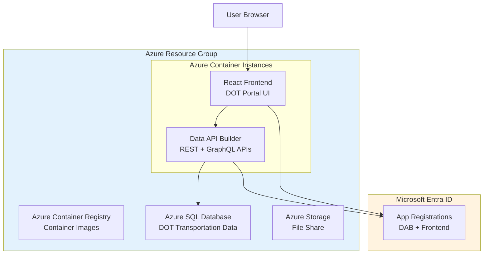

# Deployment Guide: Azure Portal

This guide walks you through deploying the DOT Transportation Data Portal manually using the Azure Portal. This approach is ideal for learning, demonstrations, or when script-based deployment isn't preferred.

---

## Table of Contents

- [Overview](#overview)
- [Step 1: Create Resource Group](#step-1-create-resource-group)
- [Step 2: Create Azure Container Registry](#step-2-create-azure-container-registry)
- [Step 3: Create Azure SQL Database](#step-3-create-azure-sql-database)
- [Step 4: Create Azure Storage Account](#step-4-create-azure-storage-account)
- [Step 5: Register Azure AD Applications](#step-5-register-azure-ad-applications)
- [Step 6: Build and Push Container Images](#step-6-build-and-push-container-images)
- [Step 7: Create Container Instances](#step-7-create-container-instances)
- [Step 8: Initialize Database](#step-8-initialize-database)
- [Step 9: Test the Deployment](#step-9-test-the-deployment)
- [Cleanup](#cleanup)

---

## Overview

### Architecture Components



### Estimated Time
- **First-time setup:** 45-60 minutes
- **Repeat deployment:** 20-30 minutes

### Cost Estimate (Development)
- **Azure SQL:** ~$5/month (Basic tier)
- **Container Instances:** ~$20/month (2 containers)
- **Container Registry:** ~$5/month (Basic tier)
- **Storage:** ~$1/month

---

## Step 1: Create Resource Group

1. Navigate to [Azure Portal](https://portal.azure.com)
2. Click **+ Create a resource**
3. Search for **Resource group**
4. Click **Create**

### Configuration

| Field | Value |
|-------|-------|
| Subscription | Your subscription |
| Resource group | `rg-dot-demo` |
| Region | `East US` (or preferred region) |

5. Click **Review + create** → **Create**

---

## Step 2: Create Azure Container Registry

1. Navigate to **Resource groups** → `rg-dot-demo`
2. Click **+ Create**
3. Search for **Container Registry**
4. Click **Create**

### Basics Tab

| Field | Value |
|-------|-------|
| Registry name | `acrdotdemo` (must be globally unique) |
| Location | Same as resource group |
| SKU | **Basic** |

### Access Keys (After Creation)

1. Navigate to your ACR
2. Go to **Settings** → **Access keys**
3. Enable **Admin user**
4. Note the **Login server**, **Username**, and **Password**

```
Login server: acrdotdemo.azurecr.io
Username:     acrdotdemo
Password:     xxxxxxxxxxxxxxxxxxxxxxxxxxxxxxxx
```

---

## Step 3: Create Azure SQL Database

### 3.1 Create SQL Server

1. Navigate to **Resource groups** → `rg-dot-demo`
2. Click **+ Create**
3. Search for **SQL Database**
4. Click **Create**

### Server Configuration

Click **Create new** under Server:

| Field | Value |
|-------|-------|
| Server name | `sql-dot-demo` (globally unique) |
| Location | Same as resource group |
| Authentication | **Use SQL authentication** |
| Server admin login | `sqladmin` |
| Password | `<strong-password>` |

### Database Configuration

| Field | Value |
|-------|-------|
| Database name | `dotdemo-db` |
| Want to use SQL elastic pool? | **No** |
| Workload environment | **Development** |
| Compute + storage | **Basic** (5 DTUs, 2GB) |

### Networking Tab

| Field | Value |
|-------|-------|
| Connectivity method | **Public endpoint** |
| Allow Azure services | **Yes** |
| Add current client IP | **Yes** |

5. Click **Review + create** → **Create**

### 3.2 Note Connection Details

After creation, navigate to your database:

1. Go to **Overview** → **Show database connection strings**
2. Copy the **ADO.NET** connection string
3. Replace `{your_password}` with actual password

```
Server=sql-dot-demo.database.windows.net;Database=dotdemo-db;User Id=sqladmin;Password=<your-password>;Encrypt=True;TrustServerCertificate=False;
```

---

## Step 4: Create Azure Storage Account

1. Navigate to **Resource groups** → `rg-dot-demo`
2. Click **+ Create**
3. Search for **Storage account**
4. Click **Create**

### Configuration

| Field | Value |
|-------|-------|
| Storage account name | `stdotdemo` (globally unique) |
| Region | Same as resource group |
| Performance | **Standard** |
| Redundancy | **LRS** |

### Create File Share

After storage account is created:

1. Navigate to your storage account
2. Go to **Data storage** → **File shares**
3. Click **+ File share**
4. Name: `dab-config`
5. Quota: `1 GB`
6. Click **Create**

---

## Step 5: Register Azure AD Applications

### 5.1 Create DAB (Backend) App Registration

1. Navigate to **Microsoft Entra ID** (Azure Active Directory)
2. Go to **App registrations** → **+ New registration**

| Field | Value |
|-------|-------|
| Name | `DOT-Demo-DAB-API` |
| Supported account types | **Single tenant** |
| Redirect URI | (leave blank) |

3. Click **Register**

#### Configure API Scope

1. Go to **Expose an API**
2. Click **Set** next to Application ID URI
3. Accept default (`api://<client-id>`) or customize
4. Click **+ Add a scope**

| Field | Value |
|-------|-------|
| Scope name | `access_as_user` |
| Who can consent? | **Admins and users** |
| Admin consent display name | `Access DOT API` |
| Admin consent description | `Allows the app to access DOT API on behalf of the user` |
| State | **Enabled** |

5. Note the **Application (client) ID**:
   ```
   DAB Client ID: xxxxxxxx-xxxx-xxxx-xxxx-xxxxxxxxxxxx
   ```

### 5.2 Create Frontend App Registration

1. Navigate to **App registrations** → **+ New registration**

| Field | Value |
|-------|-------|
| Name | `DOT-Demo-Frontend` |
| Supported account types | **Single tenant** |
| Redirect URI | **Single-page application (SPA)** |
| URI | `http://localhost:3000` |

2. Click **Register**

#### Add Redirect URIs

1. Go to **Authentication**
2. Under **Single-page application** → **Redirect URIs**
3. Click **Add URI** and add your production URLs:
   - `http://localhost:3000`
   - `http://<frontend-aci-url>`
   - `https://<custom-domain>` (if applicable)

#### Add API Permissions

1. Go to **API permissions**
2. Click **+ Add a permission**
3. Select **My APIs** → `DOT-Demo-DAB-API`
4. Select **Delegated permissions**
5. Check `access_as_user`
6. Click **Add permissions**
7. Click **Grant admin consent for [Your Org]**

5. Note the **Application (client) ID**:
   ```
   Frontend Client ID: xxxxxxxx-xxxx-xxxx-xxxx-xxxxxxxxxxxx
   ```

### 5.3 Get Tenant ID

1. Navigate to **Microsoft Entra ID** → **Overview**
2. Note the **Tenant ID**:
   ```
   Tenant ID: xxxxxxxx-xxxx-xxxx-xxxx-xxxxxxxxxxxx
   ```

---

## Step 6: Build and Push Container Images

This step requires Docker Desktop and Azure CLI on your local machine.

### 6.1 Login to Azure and ACR

```powershell
# Login to Azure
az login

# Login to ACR
az acr login --name acrdotdemo
```

### 6.2 Build and Push DAB Image

```powershell
# Navigate to DAB config directory
cd src/dab-config

# Build image
docker build -t acrdotdemo.azurecr.io/dab:latest .

# Push to ACR
docker push acrdotdemo.azurecr.io/dab:latest
```

### 6.3 Build and Push Frontend Image

```powershell
# Navigate to frontend directory
cd ../frontend

# Build with environment variables
docker build -t acrdotdemo.azurecr.io/frontend:latest `
  --build-arg VITE_API_BASE_URL="http://<dab-url>:5000/api" `
  --build-arg VITE_AZURE_AD_CLIENT_ID="<frontend-client-id>" `
  --build-arg VITE_AZURE_AD_TENANT_ID="<tenant-id>" `
  .

# Push to ACR
docker push acrdotdemo.azurecr.io/frontend:latest
```

---

## Step 7: Create Container Instances

### 7.1 Create DAB Container Instance

1. Navigate to **Resource groups** → `rg-dot-demo`
2. Click **+ Create**
3. Search for **Container Instances**
4. Click **Create**

#### Basics Tab

| Field | Value |
|-------|-------|
| Container name | `dot-demo-dab` |
| Region | Same as resource group |
| Image source | **Azure Container Registry** |
| Registry | `acrdotdemo` |
| Image | `dab` |
| Image tag | `latest` |
| OS type | **Linux** |
| Size | **1 vCPU, 1.5 GB memory** |

#### Networking Tab

| Field | Value |
|-------|-------|
| Networking type | **Public** |
| DNS name label | `dot-demo-dab` |
| Ports | `5000` (TCP) |

#### Advanced Tab

Add environment variables:

| Name | Value |
|------|-------|
| `DATABASE_CONNECTION_STRING` | Your SQL connection string |
| `AZURE_AD_CLIENT_ID` | DAB app client ID |
| `AZURE_AD_TENANT_ID` | Your tenant ID |
| `ASPNETCORE_ENVIRONMENT` | `Production` |

5. Click **Review + create** → **Create**

### 7.2 Create Frontend Container Instance

1. Click **+ Create** → **Container Instances**

#### Basics Tab

| Field | Value |
|-------|-------|
| Container name | `dot-demo-frontend` |
| Image source | **Azure Container Registry** |
| Registry | `acrdotdemo` |
| Image | `frontend` |
| Image tag | `latest` |
| OS type | **Linux** |
| Size | **0.5 vCPU, 0.5 GB memory** |

#### Networking Tab

| Field | Value |
|-------|-------|
| Networking type | **Public** |
| DNS name label | `dot-demo-frontend` |
| Ports | `80` (TCP) |

5. Click **Review + create** → **Create**

---

## Step 8: Initialize Database

### 8.1 Connect to Azure SQL

Using **Azure Data Studio** or **SSMS**:

1. Server: `sql-dot-demo.database.windows.net`
2. Authentication: SQL Login
3. Username: `sqladmin`
4. Password: Your password
5. Database: `dotdemo-db`

### 8.2 Run Schema Script

1. Open `src/database/001-schema.sql`
2. Execute in Azure Data Studio/SSMS

### 8.3 Run Seed Data Script

1. Open `src/database/002-seed-data.sql`
2. Execute in Azure Data Studio/SSMS

### 8.4 Verify Data

```sql
SELECT 'Categories' AS TableName, COUNT(*) AS Records FROM Categories
UNION ALL SELECT 'States', COUNT(*) FROM States
UNION ALL SELECT 'RailroadAccidents', COUNT(*) FROM RailroadAccidents
UNION ALL SELECT 'Bridges', COUNT(*) FROM Bridges
UNION ALL SELECT 'TransitAgencies', COUNT(*) FROM TransitAgencies
UNION ALL SELECT 'VehicleFatalities', COUNT(*) FROM VehicleFatalities;
```

---

## Step 9: Test the Deployment

### 9.1 Test DAB Health

```
http://dot-demo-dab.<region>.azurecontainer.io:5000/health
```

Expected response: `Healthy`

### 9.2 Test API Endpoint

```
http://dot-demo-dab.<region>.azurecontainer.io:5000/api/Category
```

(Requires authentication token)

### 9.3 Access Frontend

```
http://dot-demo-frontend.<region>.azurecontainer.io
```

1. Click **Sign in with Microsoft**
2. Authenticate with your organization account
3. Explore the DOT Transportation Data Portal

---

## Cleanup

To delete all resources:

1. Navigate to **Resource groups**
2. Select `rg-dot-demo`
3. Click **Delete resource group**
4. Type the resource group name to confirm
5. Click **Delete**

To delete app registrations:

1. Navigate to **Microsoft Entra ID** → **App registrations**
2. Delete `DOT-Demo-DAB-API`
3. Delete `DOT-Demo-Frontend`

---

## Troubleshooting

### Container Won't Start

1. Go to **Container Instances** → Your container
2. Check **Containers** → **Events** for error messages
3. Check **Containers** → **Logs** for application errors

### SQL Connection Failed

1. Verify firewall rules allow Azure services
2. Check connection string format
3. Verify SQL Server is not paused

### Authentication Issues

1. Verify redirect URIs match exactly
2. Check API permissions are granted
3. Verify tenant ID is correct

---

## Next Steps

- [Configure Custom Domain](./custom-domain.md)
- [Enable HTTPS with SSL](./ssl-setup.md)
- [Set Up Monitoring](./monitoring.md)
- [Security Hardening](./security-guide.md)
