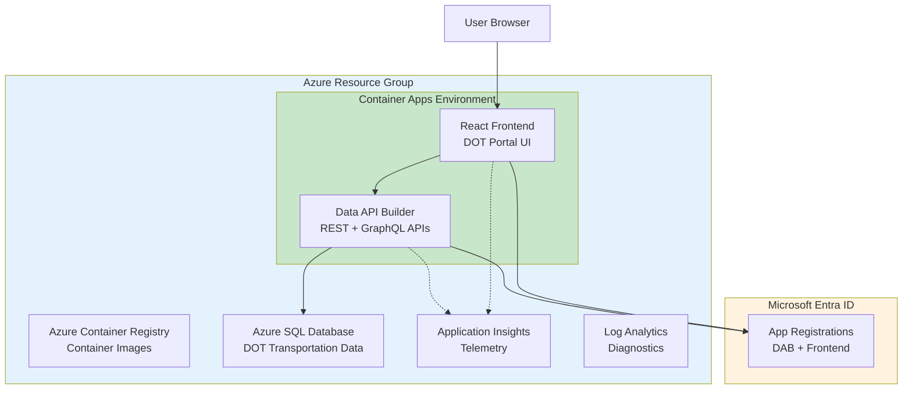

# Deployment Guide: Azure Portal

<div align="center">


</div>

This guide walks you through deploying the DOT Transportation Data Portal manually using the Azure Portal with Azure Container Apps. This approach is ideal for learning, demonstrations, or when script-based deployment isn't preferred.

> **Estimated Time:** 60-90 minutes
> **Difficulty:** Intermediate
> **Prerequisites:** Azure subscription with Contributor access

---

## Table of Contents

- [Overview](#overview)
- [Step 1: Create Resource Group](#step-1-create-resource-group)
- [Step 2: Create Azure Container Registry](#step-2-create-azure-container-registry)
- [Step 3: Create Azure SQL Database](#step-3-create-azure-sql-database)
- [Step 4: Create Log Analytics Workspace](#step-4-create-log-analytics-workspace)
- [Step 5: Register Azure AD Applications](#step-5-register-azure-ad-applications)
- [Step 6: Build and Push Container Images](#step-6-build-and-push-container-images)
- [Step 7: Create Container Apps Environment](#step-7-create-container-apps-environment)
- [Step 8: Create Container Apps](#step-8-create-container-apps)
- [Step 9: Initialize Database](#step-9-initialize-database)
- [Step 10: Test the Deployment](#step-10-test-the-deployment)
- [Cleanup](#cleanup)

---

## Overview

### Architecture Components



### Cost Estimate (Development)
- **Azure SQL:** ~$5/month (Basic tier)
- **Container Apps:** ~$0-20/month (scale-to-zero)
- **Container Registry:** ~$5/month (Basic tier)
- **Log Analytics:** ~$5/month (based on ingestion)

---

## Step 1: Create Resource Group


1. Navigate to [Azure Portal](https://portal.azure.com)
2. Click **+ Create a resource**
3. Search for **Resource group**
4. Click **Create**


### Configuration

| Field | Value |
|-------|-------|
| Subscription | Your subscription |
| Resource group | `rg-dab-demo` |
| Region | `East US 2` (or preferred region) |

5. Click **Review + create** → **Create**

> **Tip:** Use a consistent naming convention. The `rg-` prefix indicates this is a Resource Group.

---

## Step 2: Create Azure Container Registry


1. Navigate to **Resource groups** → `rg-dab-demo`
2. Click **+ Create**
3. Search for **Container Registry**
4. Click **Create**


### Basics Tab

| Field | Value |
|-------|-------|
| Registry name | `acrdabdemo` (must be globally unique) |
| Location | Same as resource group |
| SKU | **Basic** |

> **Note:** Registry names must be globally unique, 5-50 alphanumeric characters, no hyphens.

### Access Keys (After Creation)

1. Navigate to your ACR
2. Go to **Settings** → **Access keys**
3. Enable **Admin user**
4. Note the **Login server**, **Username**, and **Password**

> **Portal Path:** Container Registry → Settings → Access keys → Enable Admin user toggle

```
Login server: acrdabdemo.azurecr.io
Username:     acrdabdemo
Password:     xxxxxxxxxxxxxxxxxxxxxxxxxxxxxxxx
```

> **Important:** Store these credentials securely. You'll need them for pushing container images.

---

## Step 3: Create Azure SQL Database


### 3.1 Create SQL Server

1. Navigate to **Resource groups** → `rg-dab-demo`
2. Click **+ Create**
3. Search for **SQL Database**
4. Click **Create**

### Server Configuration

Click **Create new** under Server:


| Field | Value |
|-------|-------|
| Server name | `sql-dab-demo` (globally unique) |
| Location | Same as resource group |
| Authentication | **Use SQL authentication** |
| Server admin login | `sqladmin` |
| Password | `<strong-password>` |

### Database Configuration

| Field | Value |
|-------|-------|
| Database name | `dabdemo-db` |
| Want to use SQL elastic pool? | **No** |
| Workload environment | **Development** |
| Compute + storage | **Basic** (5 DTUs, 2GB) |

### Networking Tab

| Field | Value |
|-------|-------|
| Connectivity method | **Public endpoint** |
| Allow Azure services | **Yes** |
| Add current client IP | **Yes** |


> **Security:** "Allow Azure services" enables Container Apps to connect. For production, consider using Private Endpoints.

5. Click **Review + create** → **Create**

### 3.2 Note Connection Details

After creation, navigate to your database:

1. Go to **Overview** → **Show database connection strings**
2. Copy the **ADO.NET** connection string
3. Replace `{your_password}` with actual password

```
Server=sql-dab-demo.database.windows.net;Database=dabdemo-db;User Id=sqladmin;Password=<your-password>;Encrypt=True;TrustServerCertificate=False;
```

---

## Step 4: Create Log Analytics Workspace

1. Navigate to **Resource groups** → `rg-dab-demo`
2. Click **+ Create**
3. Search for **Log Analytics workspace**
4. Click **Create**

### Configuration

| Field | Value |
|-------|-------|
| Name | `law-dab-demo` |
| Region | Same as resource group |
| Pricing tier | **Pay-as-you-go** |

5. Click **Review + create** → **Create**

---

## Step 5: Register Azure AD Applications


### 5.1 Create DAB (Backend) App Registration

1. Navigate to **Microsoft Entra ID** (Azure Active Directory)
2. Go to **App registrations** → **+ New registration**


| Field | Value |
|-------|-------|
| Name | `DOT-Demo-DAB-API` |
| Supported account types | **Single tenant** |
| Redirect URI | (leave blank) |

3. Click **Register**

> **Tip:** The DAB API registration doesn't need redirect URIs - it validates tokens, not interactive login.

#### Configure API Scope

1. Go to **Expose an API**
2. Click **Set** next to Application ID URI
3. Accept default (`api://<client-id>`) or customize
4. Click **+ Add a scope**

| Field | Value |
|-------|-------|
| Scope name | `access_as_user` |
| Who can consent? | **Admins and users** |
| Admin consent display name | `Access DOT API` |
| Admin consent description | `Allows the app to access DOT API on behalf of the user` |
| State | **Enabled** |

5. Note the **Application (client) ID**:
   ```
   DAB Client ID: xxxxxxxx-xxxx-xxxx-xxxx-xxxxxxxxxxxx
   ```

### 5.2 Create Frontend App Registration

1. Navigate to **App registrations** → **+ New registration**

| Field | Value |
|-------|-------|
| Name | `DOT-Demo-Frontend` |
| Supported account types | **Single tenant** |
| Redirect URI | **Single-page application (SPA)** |
| URI | `http://localhost:3000` |

2. Click **Register**

#### Add Redirect URIs

1. Go to **Authentication**
2. Under **Single-page application** → **Redirect URIs**
3. Click **Add URI** and add your production URLs:
   - `http://localhost:3000`
   - `https://<container-app-url>` (add after deployment)
   - `https://<front-door-url>` (if using Front Door)

#### Add API Permissions

1. Go to **API permissions**
2. Click **+ Add a permission**
3. Select **My APIs** → `DOT-Demo-DAB-API`
4. Select **Delegated permissions**
5. Check `access_as_user`
6. Click **Add permissions**
7. Click **Grant admin consent for [Your Org]**

5. Note the **Application (client) ID**:
   ```
   Frontend Client ID: xxxxxxxx-xxxx-xxxx-xxxx-xxxxxxxxxxxx
   ```

### 5.3 Get Tenant ID

1. Navigate to **Microsoft Entra ID** → **Overview**
2. Note the **Tenant ID**:
   ```
   Tenant ID: xxxxxxxx-xxxx-xxxx-xxxx-xxxxxxxxxxxx
   ```

---

## Step 6: Build and Push Container Images

This step requires Docker Desktop and Azure CLI on your local machine.

### 6.1 Login to Azure and ACR

```powershell
# Login to Azure
az login

# Login to ACR
az acr login --name acrdabdemo
```

### 6.2 Build and Push DAB Image

```powershell
# Navigate to DAB config directory
cd src/dab-config

# Build image
docker build -t acrdabdemo.azurecr.io/dab:latest .

# Push to ACR
docker push acrdabdemo.azurecr.io/dab:latest
```

### 6.3 Build and Push Frontend Image

```powershell
# Navigate to frontend directory
cd ../frontend

# Build with environment variables (use relative URLs for routing)
docker build -t acrdabdemo.azurecr.io/frontend:latest `
  --build-arg VITE_API_BASE_URL="/api" `
  --build-arg VITE_GRAPHQL_URL="/graphql" `
  --build-arg VITE_AZURE_AD_CLIENT_ID="<frontend-client-id>" `
  --build-arg VITE_AZURE_AD_TENANT_ID="<tenant-id>" `
  .

# Push to ACR
docker push acrdabdemo.azurecr.io/frontend:latest
```

---

## Step 7: Create Container Apps Environment


1. Navigate to **Resource groups** → `rg-dab-demo`
2. Click **+ Create**
3. Search for **Container Apps Environment**
4. Click **Create**


### Basics Tab

| Field | Value |
|-------|-------|
| Environment name | `cae-dab-demo` |
| Region | Same as resource group |
| Zone redundancy | **Disabled** (for dev) |

### Monitoring Tab

| Field | Value |
|-------|-------|
| Log Analytics workspace | Select `law-dab-demo` |

> **Note:** The Container Apps Environment is a shared boundary for your apps. Apps in the same environment can communicate internally.

5. Click **Review + create** → **Create**

---

## Step 8: Create Container Apps

### 8.1 Create DAB Container App

1. Navigate to **Resource groups** → `rg-dab-demo`
2. Click **+ Create**
3. Search for **Container App**
4. Click **Create**

> **Portal Steps:** Search for "Container App" → Create → Configure basics, container, and ingress settings.

#### Basics Tab

| Field | Value |
|-------|-------|
| Container app name | `ca-dab` |
| Region | Same as resource group |
| Container Apps Environment | Select `cae-dab-demo` |

#### Container Tab

| Field | Value |
|-------|-------|
| Use quickstart image | **Unchecked** |
| Image source | **Azure Container Registry** |
| Registry | `acrdabdemo` |
| Image | `dab` |
| Image tag | `latest` |
| CPU and Memory | **1 vCPU, 2 Gi memory** |

**Environment variables:**

| Name | Source | Value |
|------|--------|-------|
| `DATABASE_CONNECTION_STRING` | Secret | Your SQL connection string |
| `AZURE_AD_CLIENT_ID` | Manual | DAB app client ID |
| `AZURE_AD_TENANT_ID` | Manual | Your tenant ID |
| `ASPNETCORE_ENVIRONMENT` | Manual | `Production` |

#### Ingress Tab

| Field | Value |
|-------|-------|
| Ingress | **Enabled** |
| Ingress traffic | **Accepting traffic from anywhere** |
| Ingress type | **HTTP** |
| Target port | `5000` |

5. Click **Review + create** → **Create**

#### Configure Auto-Scaling (After Creation)

1. Navigate to your Container App `ca-dab`
2. Go to **Scale and replicas**
3. Click **Edit and deploy new revision**
4. Go to **Scale** tab
5. Configure:

| Field | Value |
|-------|-------|
| Min replicas | `0` |
| Max replicas | `10` |

6. Click **Add** under Scale rules:
   - **Name:** `http-rule`
   - **Type:** `HTTP scaling`
   - **Concurrent requests:** `100`

7. Click **Create**

### 8.2 Create Frontend Container App

1. Click **+ Create** → **Container App**

#### Basics Tab

| Field | Value |
|-------|-------|
| Container app name | `ca-frontend` |
| Container Apps Environment | Select `cae-dab-demo` |

#### Container Tab

| Field | Value |
|-------|-------|
| Image source | **Azure Container Registry** |
| Registry | `acrdabdemo` |
| Image | `frontend` |
| Image tag | `latest` |
| CPU and Memory | **0.5 vCPU, 1 Gi memory** |

#### Ingress Tab

| Field | Value |
|-------|-------|
| Ingress | **Enabled** |
| Ingress traffic | **Accepting traffic from anywhere** |
| Ingress type | **HTTP** |
| Target port | `80` |

5. Click **Review + create** → **Create**

#### Configure Auto-Scaling

Same as DAB:
- Min replicas: `0`
- Max replicas: `10`
- HTTP scaling rule with `100` concurrent requests

---

## Step 9: Initialize Database

### 9.1 Connect to Azure SQL

Using **Azure Data Studio** or **SSMS**:

1. Server: `sql-dab-demo.database.windows.net`
2. Authentication: SQL Login
3. Username: `sqladmin`
4. Password: Your password
5. Database: `dabdemo-db`

### 9.2 Run Schema Script

1. Open `src/database/001-schema.sql`
2. Execute in Azure Data Studio/SSMS

### 9.3 Run Seed Data Script

1. Open `src/database/002-seed-data.sql`
2. Execute in Azure Data Studio/SSMS

### 9.4 Verify Data

```sql
SELECT 'Categories' AS TableName, COUNT(*) AS Records FROM Categories
UNION ALL SELECT 'States', COUNT(*) FROM States
UNION ALL SELECT 'RailroadAccidents', COUNT(*) FROM RailroadAccidents
UNION ALL SELECT 'Bridges', COUNT(*) FROM Bridges
UNION ALL SELECT 'TransitAgencies', COUNT(*) FROM TransitAgencies
UNION ALL SELECT 'VehicleFatalities', COUNT(*) FROM VehicleFatalities;
```

---

## Step 10: Test the Deployment

### 10.1 Get Container App URLs

1. Navigate to **Resource groups** → `rg-dab-demo`
2. Click on **ca-dab** Container App
3. Copy the **Application URL** from Overview

```
https://ca-dab.<random>.eastus2.azurecontainerapps.io
```

4. Do the same for **ca-frontend**

### 10.2 Test API Endpoints

**DAB Health Check:**
```
https://ca-dab.<random>.eastus2.azurecontainerapps.io/
```

**API Endpoint (requires auth):**
```
https://ca-dab.<random>.eastus2.azurecontainerapps.io/api/Category
```

### 10.3 Update App Registration Redirect URIs

1. Navigate to **Microsoft Entra ID** → **App registrations** → `DOT-Demo-Frontend`
2. Go to **Authentication**
3. Add the Frontend Container App URL to Redirect URIs:
   ```
   https://ca-frontend.<random>.eastus2.azurecontainerapps.io
   ```
4. Click **Save**

### 10.4 Access Frontend

1. Open `https://ca-frontend.<random>.eastus2.azurecontainerapps.io`
2. Click **Sign in with Microsoft**
3. Authenticate with your organization account
4. Explore the DOT Transportation Data Portal

---

## Cleanup

To delete all resources:

1. Navigate to **Resource groups**
2. Select `rg-dab-demo`
3. Click **Delete resource group**
4. Type the resource group name to confirm
5. Click **Delete**

To delete app registrations:

1. Navigate to **Microsoft Entra ID** → **App registrations**
2. Delete `DOT-Demo-DAB-API`
3. Delete `DOT-Demo-Frontend`

---

## Troubleshooting

> **Need more help?** See the [Complete Troubleshooting Guide](./troubleshooting-guide.md) for 100+ solutions.

### Container App Won't Start

1. Go to **Container Apps** → Your container app
2. Check **Revisions and replicas** for failed revisions
3. Check **Log stream** for application errors

> **Check Revision Status:** In the Container App → Revisions panel, verify the revision shows "Running" status with active replicas.

### Scale-to-Zero Cold Starts

With `minReplicas=0`, the first request after idle will experience a cold start (~2-5 seconds).

**Solution:** Set `minReplicas=1` for production workloads.

### SQL Connection Failed

1. Verify firewall rules allow Azure services
2. Check connection string format
3. Verify SQL Server is not paused

### Authentication Issues

1. Verify redirect URIs match exactly
2. Check API permissions are granted
3. Verify tenant ID is correct

---

## Next Steps

- [Auto-Scaling Guide](./auto-scaling-guide.md) - Configure scaling rules
- [CI/CD Guide](./ci-cd-guide.md) - Set up GitHub Actions
- [Container Apps Portal Guide](./container-apps-portal-guide.md) - Detailed portal walkthrough
