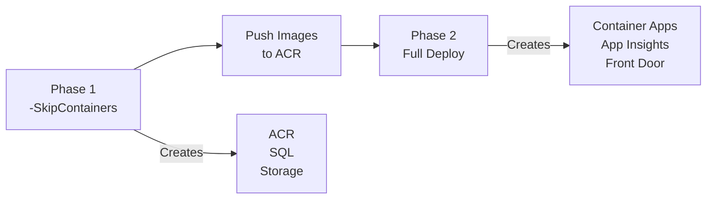

# Deployment Guide: PowerShell Scripts

<div align="center">


**Automated deployment with infrastructure as code**

</div>

This guide walks you through deploying the DOT Transportation Data Portal using the provided PowerShell automation scripts with Azure Container Apps.

> **Estimated Time:** 30-45 minutes
> **Best For:** Developers comfortable with command-line interfaces

---

## Table of Contents

- [Prerequisites](#prerequisites)
- [Quick Start](#quick-start)
- [Step-by-Step Deployment](#step-by-step-deployment)
  - [1. Azure AD App Registrations](#1-azure-ad-app-registrations)
  - [2. Deploy Infrastructure (Phase 1)](#2-deploy-infrastructure-phase-1)
  - [3. Initialize Database](#3-initialize-database)
  - [4. Build and Push Containers](#4-build-and-push-containers)
  - [5. Deploy Container Apps (Phase 2)](#5-deploy-container-apps-phase-2)
  - [6. Verify Deployment](#6-verify-deployment)
- [Script Reference](#script-reference)
- [Auto-Scaling Configuration](#auto-scaling-configuration)
- [Troubleshooting](#troubleshooting)

---

## Prerequisites

Before you begin, ensure you have the following installed and configured:

### Required Tools

| Tool | Version | Installation |
|------|---------|--------------|
| **Azure CLI** | 2.50+ | [Install Azure CLI](https://docs.microsoft.com/cli/azure/install-azure-cli) |
| **PowerShell** | 7.0+ | [Install PowerShell](https://docs.microsoft.com/powershell/scripting/install/installing-powershell) |
| **Docker Desktop** | Latest | [Install Docker](https://www.docker.com/products/docker-desktop) |
| **Node.js** | 18 LTS | [Install Node.js](https://nodejs.org/) |
| **SQL Server Tools** | Latest | `sqlcmd` or [SSMS](https://docs.microsoft.com/sql/ssms/download-sql-server-management-studio-ssms) |

### Azure Requirements

- Azure subscription with Owner or Contributor access
- Permissions to create App Registrations in Azure AD
- Sufficient quota for:
  - Azure Container Apps (2 apps)
  - Azure SQL Database (Basic tier)
  - Azure Container Registry (Basic tier)
  - Azure Storage Account

### Verify Prerequisites

```powershell
# Check Azure CLI
az version

# Check PowerShell
$PSVersionTable.PSVersion

# Check Docker
docker --version

# Check Node.js
node --version

# Check SQL tools
sqlcmd -?
```

---

## Quick Start

For experienced users, here's the condensed deployment flow:

```powershell
# 1. Clone and navigate
git clone https://github.com/your-org/azure-dab-fullstack-demo.git
cd azure-dab-fullstack-demo

# 2. Login to Azure
az login

# 3. Deploy infrastructure ONLY (Phase 1 - skips Container Apps)
./infrastructure/scripts/deploy.ps1 -ResourceGroupName "rg-dab-demo" -Location "eastus2" -SkipContainers

# 4. Initialize database
cd src/database
./Initialize-Database.ps1 -ServerName "<sql-server>.database.windows.net" `
                          -DatabaseName "<database-name>" `
                          -Username "sqladmin" `
                          -Password "<your-password>"

# 5. Build and push containers
cd ../../infrastructure/scripts
./build-push-dab.ps1 -AcrName "<acr-name>"
./build-push-frontend.ps1 -AcrName "<acr-name>"

# 6. Deploy Container Apps (Phase 2)
./deploy.ps1 -ResourceGroupName "rg-dab-demo" -Location "eastus2"
```

> **Why two phases?** Container Apps require images to exist in ACR before deployment. The two-phase approach deploys infrastructure first, then Container Apps after images are pushed.

---

## Step-by-Step Deployment

### 1. Azure AD App Registrations

Before deploying infrastructure, you need two Azure AD app registrations:

#### 1.1 Create DAB (Backend) App Registration

```powershell
# Create the app registration
az ad app create --display-name "DOT-Demo-DAB-API" `
                 --sign-in-audience AzureADMyOrg

# Get the Application (client) ID
$dabAppId = az ad app list --display-name "DOT-Demo-DAB-API" --query "[0].appId" -o tsv
Write-Host "DAB Client ID: $dabAppId"

# Create a service principal
az ad sp create --id $dabAppId

# Add API scope
az ad app update --id $dabAppId --identifier-uris "api://$dabAppId"

# Create access_as_user scope (via Azure Portal or Graph API)
```

#### 1.2 Create Frontend App Registration

```powershell
# Create the app registration
az ad app create --display-name "DOT-Demo-Frontend" `
                 --sign-in-audience AzureADMyOrg `
                 --web-redirect-uris "http://localhost:3000" "https://<your-frontend-url>"

# Get the Application (client) ID
$frontendAppId = az ad app list --display-name "DOT-Demo-Frontend" --query "[0].appId" -o tsv
Write-Host "Frontend Client ID: $frontendAppId"

# Add API permissions (to DAB API)
az ad app permission add --id $frontendAppId `
                         --api $dabAppId `
                         --api-permissions "<scope-id>=Scope"
```

#### 1.3 Record Your IDs

Save these values for later:

```
Tenant ID:        xxxxxxxx-xxxx-xxxx-xxxx-xxxxxxxxxxxx
DAB Client ID:    xxxxxxxx-xxxx-xxxx-xxxx-xxxxxxxxxxxx
Frontend Client ID: xxxxxxxx-xxxx-xxxx-xxxx-xxxxxxxxxxxx
```

---

### 2. Deploy Infrastructure (Phase 1)

The `deploy.ps1` script creates all Azure resources using Bicep templates. Use `-SkipContainers` to deploy infrastructure first without Container Apps.

#### 2.1 Navigate to Scripts Directory

```powershell
cd infrastructure/scripts
```

#### 2.2 Run Deployment Script (Infrastructure Only)

```powershell
./deploy.ps1 -ResourceGroupName "rg-dab-demo" `
             -Location "eastus2" `
             -BaseName "dabdemo" `
             -Environment "dev" `
             -SkipContainers
```

> **Important:** The `-SkipContainers` flag deploys only ACR, SQL Database, and Storage. This allows you to push container images to ACR before creating the Container Apps.

#### 2.3 Script Prompts

The script will prompt for:

| Prompt | Description | Example |
|--------|-------------|---------|
| SQL Admin Password | Password for Azure SQL Server | `MySecureP@ss123!` |
| DAB Client ID | From step 1.1 | `xxxxxxxx-xxxx-xxxx-xxxx-xxxxxxxxxxxx` |
| Frontend Client ID | From step 1.2 | `xxxxxxxx-xxxx-xxxx-xxxx-xxxxxxxxxxxx` |

#### 2.4 Deployment Output (Phase 1)

After successful Phase 1 deployment, the script outputs:

```
============================================
Deployment completed successfully!
============================================

Resource Group:    rg-dab-demo
ACR Name:          acrdabdemodev
ACR Login Server:  acrdabdemodev.azurecr.io
SQL Server:        dabdemo-dev-sql.database.windows.net
Database:          dabdemo-dev-db

Container Apps:    Not deployed (push images to ACR and run again without -SkipContainers)

NEXT STEPS:
1. Build and push the DAB container
2. Build and push the frontend container
3. Initialize the database schema
4. Deploy Container Apps (run again without -SkipContainers)
```

These values are also saved to `deployment-outputs.json`.

---

### 3. Initialize Database

#### 3.1 Navigate to Database Directory

```powershell
cd ../../src/database
```

#### 3.2 Run Initialization Script

```powershell
./Initialize-Database.ps1 -ServerName "dabdemo-dev-sql.database.windows.net" `
                          -DatabaseName "dabdemo-dev-db" `
                          -Username "sqladmin" `
                          -Password "<your-sql-password>"
```

#### 3.3 Verify Database

```powershell
# Connect and check record counts
sqlcmd -S "dabdemo-dev-sql.database.windows.net" `
       -d "dabdemo-dev-db" `
       -U "sqladmin" `
       -P "<password>" `
       -Q "SELECT 'Categories' AS TableName, COUNT(*) AS Records FROM Categories UNION ALL SELECT 'States', COUNT(*) FROM States UNION ALL SELECT 'RailroadAccidents', COUNT(*) FROM RailroadAccidents UNION ALL SELECT 'Bridges', COUNT(*) FROM Bridges;"
```

Expected output:
```
TableName            Records
-------------------- -------
Categories           4
States               51
RailroadAccidents    300
Bridges              400
```

---

### 4. Build and Push Containers

#### 4.1 Build DAB Container

```powershell
cd ../../infrastructure/scripts

./build-push-dab.ps1 -AcrName "acrdabdemodev"
```

**Script actions:**
1. Validates Docker is running
2. Builds the DAB image from `src/dab-config/Dockerfile`
3. Tags with ACR login server
4. Logs in to ACR
5. Pushes the image

#### 4.2 Build Frontend Container

```powershell
./build-push-frontend.ps1 -AcrName "acrdabdemodev" `
                          -ApiBaseUrl "/api" `  # Uses relative URL for Front Door routing
                          -AzureAdClientId "<frontend-client-id>" `
                          -AzureAdTenantId "<tenant-id>"
```

**Script actions:**
1. Validates Docker is running
2. Builds the React app with environment variables
3. Creates nginx-based production image
4. Pushes to ACR

#### 4.3 Tag with Version (Optional)

```powershell
# Tag with version number
./build-push-dab.ps1 -AcrName "acrdabdemodev" -ImageTag "v1.0.0"
./build-push-frontend.ps1 -AcrName "acrdabdemodev" -ImageTag "v1.0.0"
```

---

### 5. Deploy Container Apps (Phase 2)

After pushing images to ACR, deploy the Container Apps.

#### 5.1 Run Container Apps Deployment

```powershell
./deploy.ps1 -ResourceGroupName "rg-dab-demo" `
             -Location "eastus2"
```

The script will prompt for the same credentials as Phase 1. After successful deployment:

```
============================================
Deployment completed successfully!
============================================

Container Apps Environment:
   Name: dabdemo-dev-cae

Data API Builder Container App:
   Name: dabdemo-dev-ca-dab
   URL: https://dabdemo-dev-ca-dab.nicebeach-xxxxxx.eastus2.azurecontainerapps.io

Frontend Container App:
   Name: dabdemo-dev-ca-frontend
   URL: https://dabdemo-dev-ca-frontend.nicebeach-xxxxxx.eastus2.azurecontainerapps.io

Auto-Scaling Configuration:
   Min Replicas: 0
   Max Replicas: 10
   Scale Threshold: 100 concurrent requests

Application Insights:
   Name: dabdemo-dev-appinsights

Azure Front Door (HTTPS):
   Hostname: dabdemodev.xxxxxx.azurefd.net
   Frontend URL: https://dabdemodev.xxxxxx.azurefd.net    <-- USE THIS
   REST API: https://dabdemodev.xxxxxx.azurefd.net/api
   GraphQL: https://dabdemodev.xxxxxx.azurefd.net/graphql

   ** Use the Front Door URL for HTTPS access with MSAL authentication **
```

> **Note:** Container Apps also provide native HTTPS URLs. You can use either the Container App URLs directly or the Front Door URL.

---

### 6. Verify Deployment

#### 6.1 Check Container App Status

```powershell
# Check DAB Container App
az containerapp show --name "dabdemo-dev-ca-dab" --resource-group "rg-dab-demo" --query "properties.runningStatus"

# Check Frontend Container App
az containerapp show --name "dabdemo-dev-ca-frontend" --resource-group "rg-dab-demo" --query "properties.runningStatus"

# List replicas (may be 0 if scaled to zero)
az containerapp replica list --name "dabdemo-dev-ca-dab" --resource-group "rg-dab-demo"
```

#### 6.2 Check Container Logs

```powershell
# DAB logs
az containerapp logs show --name "dabdemo-dev-ca-dab" --resource-group "rg-dab-demo" --follow

# Frontend logs
az containerapp logs show --name "dabdemo-dev-ca-frontend" --resource-group "rg-dab-demo" --follow
```

#### 6.3 Test API Endpoints

```powershell
# Get Container App FQDN
$dabFqdn = az containerapp show --name "dabdemo-dev-ca-dab" --resource-group "rg-dab-demo" --query "properties.configuration.ingress.fqdn" -o tsv

# Health check via Container App (HTTPS)
Invoke-RestMethod -Uri "https://$dabFqdn/"

# Or via Front Door
$frontDoorUrl = (Get-Content ..\..\deployment-outputs.json | ConvertFrom-Json).frontDoorUrl.value
Invoke-RestMethod -Uri "$frontDoorUrl/api/Category"
```

#### 6.4 Access Frontend

Open your browser and navigate to the **Front Door URL (HTTPS)**:
```
https://<your-front-door-endpoint>.azurefd.net
```

Or use the Container App URL directly:
```
https://dabdemo-dev-ca-frontend.nicebeach-xxxxxx.eastus2.azurecontainerapps.io
```

---

## Script Reference

### deploy.ps1

| Parameter | Required | Default | Description |
|-----------|----------|---------|-------------|
| `-ResourceGroupName` | Yes | - | Azure resource group name |
| `-Location` | No | `eastus` | Azure region |
| `-BaseName` | No | `dabdemo` | Base name for all resources |
| `-Environment` | No | `dev` | Environment (dev, staging, prod) |
| `-SkipContainers` | No | `false` | Deploy infrastructure only (Phase 1) |
| `-LogAnalyticsWorkspaceId` | No | See below | Full resource ID of Log Analytics workspace |
| `-DisableDiagnostics` | No | `false` | Disable diagnostic settings for all resources |
| `-MinReplicas` | No | `0` | Minimum container replicas (0 = scale-to-zero) |
| `-MaxReplicas` | No | `10` | Maximum container replicas |
| `-HttpScaleThreshold` | No | `100` | Concurrent requests to trigger scaling |

**Default Log Analytics Workspace:**
```
/subscriptions/a60a2fdd-c133-4845-9beb-31f470bf3ef5/resourceGroups/rg-alz-dev-logging/providers/Microsoft.OperationalInsights/workspaces/alz-dev-dataObservability-logAnalyticsWorkspace
```

**Deployment Phases:**



### build-push-dab.ps1

| Parameter | Required | Default | Description |
|-----------|----------|---------|-------------|
| `-AcrName` | Yes | - | Azure Container Registry name |
| `-ImageTag` | No | `latest` | Docker image tag |
| `-SubscriptionId` | No | Current | Azure subscription ID |
| `-NoPush` | No | `false` | Build only, don't push |

### build-push-frontend.ps1

| Parameter | Required | Default | Description |
|-----------|----------|---------|-------------|
| `-AcrName` | Yes | - | Azure Container Registry name |
| `-ImageTag` | No | `latest` | Docker image tag |
| `-ApiBaseUrl` | No | `/api` | DAB API base URL |
| `-AzureAdClientId` | No | - | Frontend app client ID |
| `-AzureAdTenantId` | No | - | Azure AD tenant ID |
| `-NoPush` | No | `false` | Build only, don't push |

### Initialize-Database.ps1

| Parameter | Required | Default | Description |
|-----------|----------|---------|-------------|
| `-ServerName` | Yes | - | SQL Server hostname |
| `-DatabaseName` | Yes | - | Database name |
| `-Username` | No | - | SQL username (omit for Windows auth) |
| `-Password` | No | - | SQL password |
| `-SkipSchema` | No | `false` | Skip schema creation |
| `-SkipSeedData` | No | `false` | Skip data seeding |
| `-Force` | No | `false` | Skip confirmation prompts |

---

## Auto-Scaling Configuration

Container Apps use HTTP-based auto-scaling with KEDA.

### Default Configuration

| Parameter | Value | Description |
|-----------|-------|-------------|
| Min Replicas | 0 | Scale to zero when idle |
| Max Replicas | 10 | Maximum concurrent instances |
| Scale Threshold | 100 | Concurrent requests per instance |

### Custom Scaling

```powershell
# Production: Always keep at least 1 replica running
./deploy.ps1 -ResourceGroupName "rg-dab-prod" `
             -Environment "prod" `
             -MinReplicas 1 `
             -MaxReplicas 10 `
             -HttpScaleThreshold 50

# Cost-optimized: Aggressive scale-to-zero
./deploy.ps1 -ResourceGroupName "rg-dab-dev" `
             -MinReplicas 0 `
             -MaxReplicas 3 `
             -HttpScaleThreshold 100
```

### Monitor Scaling

```powershell
# Check current replica count
az containerapp replica list --name "dabdemo-dev-ca-dab" --resource-group "rg-dab-demo" -o table

# Watch scaling events
az containerapp logs show --name "dabdemo-dev-ca-dab" --resource-group "rg-dab-demo" --type system
```

---

## Troubleshooting

### Common Issues

#### Azure CLI Not Logged In

```
ERROR: Please run 'az login' to set up account
```

**Solution:** Run `az login` and complete browser authentication.

#### Docker Not Running

```
ERROR: Docker is not running. Please start Docker Desktop.
```

**Solution:** Start Docker Desktop and wait for it to be ready.

#### ACR Login Failed

```
ERROR: ACR login failed
```

**Solutions:**
1. Ensure you have the ACR Pull and Push role
2. Try `az acr login --name <acr-name>` manually
3. Check if admin user is enabled on ACR

#### SQL Connection Failed

```
ERROR: A network-related or instance-specific error occurred
```

**Solutions:**
1. Verify your IP is allowed in SQL Server firewall
2. Check SQL Server name is correct (include `.database.windows.net`)
3. Verify username and password

#### Image Not Found in Container App

```
ERROR: The container 'dab' in the pod failed to start
```

**Cause:** Trying to deploy Container Apps before images exist in ACR.

**Solution:** Use two-phase deployment:
1. Deploy with `-SkipContainers` first
2. Build and push images to ACR
3. Deploy again without `-SkipContainers`

#### Container App Cold Start

Container Apps with `minReplicas=0` will have a cold start delay (~2-5 seconds) on first request.

**Solutions:**
- Set `minReplicas=1` for production
- Use health probes to pre-warm containers
- Accept cold start for cost savings in dev/test

---

## Diagnostics & Monitoring

The deployment automatically configures diagnostic settings for all resources, including Application Insights for APM.

### Resources with Diagnostics Enabled

| Resource | Logs | Metrics |
|----------|------|---------|
| Azure Container Registry | All logs | All metrics |
| Azure SQL Database | SQLInsights, Errors, Deadlocks, Timeouts, Blocks | Basic, Advanced |
| Container Apps | Console logs via environment | Via App Insights |
| Application Insights | Requests, Dependencies, Exceptions | Performance |

### Custom Log Analytics Workspace

To use a different Log Analytics workspace:

```powershell
./deploy.ps1 -ResourceGroupName "rg-dab-demo" `
             -Location "eastus2" `
             -LogAnalyticsWorkspaceId "/subscriptions/{sub-id}/resourceGroups/{rg}/providers/Microsoft.OperationalInsights/workspaces/{workspace-name}"
```

### Disable Diagnostics

To deploy without diagnostic settings:

```powershell
./deploy.ps1 -ResourceGroupName "rg-dab-demo" `
             -Location "eastus2" `
             -DisableDiagnostics
```

### Query Logs

Example KQL queries for the Log Analytics workspace:

```kusto
// Container App console logs (DAB)
ContainerAppConsoleLogs_CL
| where ContainerAppName_s contains "dab"
| order by TimeGenerated desc
| take 100

// Application Insights - Failed requests
requests
| where success == false
| summarize count() by name, resultCode
| order by count_ desc

// SQL Database errors
AzureDiagnostics
| where ResourceType == "DATABASES" and Category == "Errors"
| project TimeGenerated, Resource, Message
| order by TimeGenerated desc

// Container Registry operations
ContainerRegistryRepositoryEvents
| order by TimeGenerated desc
| take 50
```

---

## Database Migration Strategy

When your application evolves, you'll need to manage database schema changes in production. This section outlines recommended approaches.

### Migration Philosophy

```
┌─────────────────────────────────────────────────────────────┐
│                    MIGRATION WORKFLOW                        │
├─────────────────────────────────────────────────────────────┤
│                                                              │
│   1. DEVELOP      2. TEST         3. DEPLOY      4. VERIFY  │
│   ┌──────────┐   ┌──────────┐   ┌──────────┐   ┌──────────┐ │
│   │ Write    │   │ Local    │   │ Run in   │   │ Validate │ │
│   │ migration│ → │ test     │ → │ staging  │ → │ in prod  │ │
│   │ script   │   │ database │   │ then prod│   │          │ │
│   └──────────┘   └──────────┘   └──────────┘   └──────────┘ │
│                                                              │
└─────────────────────────────────────────────────────────────┘
```

### Recommended Tools

| Tool | Language | Pros | Cons |
|------|----------|------|------|
| **DbUp** | C#/.NET | Simple, CI/CD friendly | .NET only |
| **Flyway** | Java/CLI | Multi-database, versioned | JRE required |
| **Liquibase** | Java/CLI | XML/YAML changesets | Complex |
| **sqlcmd scripts** | T-SQL | Native, no dependencies | Manual tracking |

For this project, we recommend **DbUp** for .NET projects or **versioned SQL scripts** for simplicity.

### Versioned SQL Script Approach

1. **Create a migrations folder:**
   ```
   src/database/
   ├── 001-schema.sql          # Initial schema
   ├── 002-seed-data.sql       # Initial data
   ├── 003-add-audit-columns.sql
   ├── 004-add-composite-indexes.sql
   └── migrations.json         # Track applied migrations
   ```

2. **Naming convention:** `NNN-description.sql`
   - Always use sequential numbers
   - Be descriptive: `003-add-user-preferences-table.sql`
   - Never modify already-applied migrations

3. **Create a migration tracking table:**
   ```sql
   CREATE TABLE [dbo].[__MigrationHistory] (
       Id INT IDENTITY(1,1) PRIMARY KEY,
       MigrationName NVARCHAR(255) NOT NULL,
       AppliedAt DATETIME2 NOT NULL DEFAULT GETUTCDATE(),
       AppliedBy NVARCHAR(128) NOT NULL DEFAULT SUSER_NAME()
   );
   ```

### Safe Migration Patterns

**Adding a column (safe):**
```sql
-- 003-add-audit-columns.sql
ALTER TABLE dbo.RailroadAccidents
ADD CreatedBy NVARCHAR(128) NULL;

ALTER TABLE dbo.RailroadAccidents
ADD ModifiedBy NVARCHAR(128) NULL;
```

**Adding an index (safe, but can be slow):**
```sql
-- 004-add-composite-indexes.sql
-- Use ONLINE = ON in production to avoid blocking
CREATE INDEX IX_RailroadAccidents_StateDate
ON dbo.RailroadAccidents(StateId, AccidentDate)
WITH (ONLINE = ON);
```

**Renaming a column (requires care):**
```sql
-- 005-rename-column.sql
-- Step 1: Add new column
ALTER TABLE dbo.Bridges ADD ConditionRating INT NULL;

-- Step 2: Copy data
UPDATE dbo.Bridges SET ConditionRating = OldCondition;

-- Step 3: (After app update) Drop old column
-- ALTER TABLE dbo.Bridges DROP COLUMN OldCondition;
```

### Rollback Strategy

1. **Before migration:** Take a backup
   ```powershell
   # Export database
   az sql db export \
     --resource-group $RG \
     --server $SERVER \
     --name $DB \
     --admin-user $USER \
     --admin-password $PASS \
     --storage-key $KEY \
     --storage-key-type StorageAccessKey \
     --storage-uri "https://account.blob.core.windows.net/backups/pre-migration.bacpac"
   ```

2. **Write reversible migrations when possible:**
   ```sql
   -- Forward migration
   ALTER TABLE dbo.States ADD Population INT NULL;

   -- Rollback script (keep separate)
   ALTER TABLE dbo.States DROP COLUMN Population;
   ```

3. **For irreversible changes:** Test thoroughly in staging first

### CI/CD Integration

Add migration step to GitHub Actions:

```yaml
# In .github/workflows/deploy.yml
- name: Run Database Migrations
  env:
    SQL_SERVER: ${{ secrets.SQL_SERVER }}
    SQL_DATABASE: ${{ secrets.SQL_DATABASE }}
    SQL_USER: ${{ secrets.SQL_USER }}
    SQL_PASSWORD: ${{ secrets.SQL_PASSWORD }}
  run: |
    # Run all pending migrations
    for migration in src/database/migrations/*.sql; do
      echo "Applying $migration..."
      sqlcmd -S $SQL_SERVER -d $SQL_DATABASE \
             -U $SQL_USER -P $SQL_PASSWORD \
             -i "$migration"
    done
```

### Testing Migrations Locally

```powershell
# 1. Start local SQL Server with Docker
docker run -e "ACCEPT_EULA=Y" -e "SA_PASSWORD=YourStrong@Passw0rd" \
  -p 1433:1433 -d mcr.microsoft.com/mssql/server:2022-latest

# 2. Apply migrations
sqlcmd -S localhost -U sa -P YourStrong@Passw0rd \
  -i src/database/001-schema.sql

# 3. Run your migration
sqlcmd -S localhost -U sa -P YourStrong@Passw0rd \
  -i src/database/migrations/003-new-migration.sql

# 4. Verify
sqlcmd -S localhost -U sa -P YourStrong@Passw0rd \
  -Q "SELECT * FROM INFORMATION_SCHEMA.COLUMNS WHERE TABLE_NAME = 'YourTable'"
```

### Best Practices Summary

| Practice | Why |
|----------|-----|
| Version all migrations | Track what's applied where |
| Never modify applied migrations | Prevents state drift |
| Test in staging first | Catch issues before production |
| Take backups before major changes | Enable rollback |
| Use online operations | Minimize downtime |
| Make migrations idempotent | Safe to re-run |
| Document breaking changes | Coordinate with app updates |

---

## Next Steps

After successful deployment:

1. **Configure DNS** - Set up custom domain names
2. **Review monitoring dashboards** - Check Application Insights and Log Analytics
3. **Set up alerts** - Configure Azure Monitor alerts for errors and performance
4. **Review security** - Audit CORS, authentication, and network rules
5. **Set up CI/CD** - Configure GitHub Actions for automated deployments

See [CI/CD Guide](./ci-cd-guide.md) for setting up GitHub Actions.
