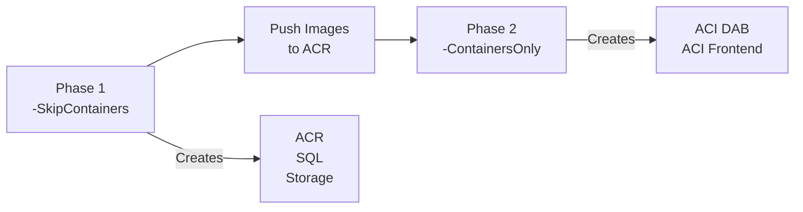

# Deployment Guide: PowerShell Scripts

This guide walks you through deploying the DOT Transportation Data Portal using the provided PowerShell automation scripts.

---

## Table of Contents

- [Prerequisites](#prerequisites)
- [Quick Start](#quick-start)
- [Step-by-Step Deployment](#step-by-step-deployment)
  - [1. Azure AD App Registrations](#1-azure-ad-app-registrations)
  - [2. Deploy Infrastructure (Phase 1)](#2-deploy-infrastructure-phase-1)
  - [3. Initialize Database](#3-initialize-database)
  - [4. Build and Push Containers](#4-build-and-push-containers)
  - [5. Deploy Containers (Phase 2)](#5-deploy-containers-phase-2)
  - [6. Verify Deployment](#6-verify-deployment)
- [Script Reference](#script-reference)
- [Troubleshooting](#troubleshooting)

---

## Prerequisites

Before you begin, ensure you have the following installed and configured:

### Required Tools

| Tool | Version | Installation |
|------|---------|--------------|
| **Azure CLI** | 2.50+ | [Install Azure CLI](https://docs.microsoft.com/cli/azure/install-azure-cli) |
| **PowerShell** | 7.0+ | [Install PowerShell](https://docs.microsoft.com/powershell/scripting/install/installing-powershell) |
| **Docker Desktop** | Latest | [Install Docker](https://www.docker.com/products/docker-desktop) |
| **Node.js** | 18 LTS | [Install Node.js](https://nodejs.org/) |
| **SQL Server Tools** | Latest | `sqlcmd` or [SSMS](https://docs.microsoft.com/sql/ssms/download-sql-server-management-studio-ssms) |

### Azure Requirements

- Azure subscription with Owner or Contributor access
- Permissions to create App Registrations in Azure AD
- Sufficient quota for:
  - Azure Container Instances (2 instances)
  - Azure SQL Database (Basic tier)
  - Azure Container Registry (Basic tier)
  - Azure Storage Account

### Verify Prerequisites

```powershell
# Check Azure CLI
az version

# Check PowerShell
$PSVersionTable.PSVersion

# Check Docker
docker --version

# Check Node.js
node --version

# Check SQL tools
sqlcmd -?
```

---

## Quick Start

For experienced users, here's the condensed deployment flow using **two-phase deployment**:

```powershell
# 1. Clone and navigate
git clone https://github.com/your-org/azure-dab-fullstack-demo.git
cd azure-dab-fullstack-demo

# 2. Login to Azure
az login

# 3. Deploy infrastructure ONLY (Phase 1 - skips containers)
./infrastructure/scripts/deploy.ps1 -ResourceGroupName "rg-dot-demo" -Location "eastus" -SkipContainers

# 4. Initialize database
cd src/database
./Initialize-Database.ps1 -ServerName "<sql-server>.database.windows.net" `
                          -DatabaseName "<database-name>" `
                          -Username "sqladmin" `
                          -Password "<your-password>"

# 5. Build and push containers
cd ../../infrastructure/scripts
./build-push-dab.ps1 -AcrName "<acr-name>"
./build-push-frontend.ps1 -AcrName "<acr-name>"

# 6. Deploy containers (Phase 2 - after images are in ACR)
./deploy.ps1 -ResourceGroupName "rg-dot-demo" -Location "eastus" -ContainersOnly
```

> **Why two phases?** Container instances require images to exist in ACR before deployment. The two-phase approach deploys infrastructure first, then containers after images are pushed.

---

## Step-by-Step Deployment

### 1. Azure AD App Registrations

Before deploying infrastructure, you need two Azure AD app registrations:

#### 1.1 Create DAB (Backend) App Registration

```powershell
# Create the app registration
az ad app create --display-name "DOT-Demo-DAB-API" `
                 --sign-in-audience AzureADMyOrg

# Get the Application (client) ID
$dabAppId = az ad app list --display-name "DOT-Demo-DAB-API" --query "[0].appId" -o tsv
Write-Host "DAB Client ID: $dabAppId"

# Create a service principal
az ad sp create --id $dabAppId

# Add API scope
az ad app update --id $dabAppId --identifier-uris "api://$dabAppId"

# Create access_as_user scope (via Azure Portal or Graph API)
```

#### 1.2 Create Frontend App Registration

```powershell
# Create the app registration
az ad app create --display-name "DOT-Demo-Frontend" `
                 --sign-in-audience AzureADMyOrg `
                 --web-redirect-uris "http://localhost:3000" "https://<your-frontend-url>"

# Get the Application (client) ID
$frontendAppId = az ad app list --display-name "DOT-Demo-Frontend" --query "[0].appId" -o tsv
Write-Host "Frontend Client ID: $frontendAppId"

# Add API permissions (to DAB API)
az ad app permission add --id $frontendAppId `
                         --api $dabAppId `
                         --api-permissions "<scope-id>=Scope"
```

#### 1.3 Record Your IDs

Save these values for later:

```
Tenant ID:        xxxxxxxx-xxxx-xxxx-xxxx-xxxxxxxxxxxx
DAB Client ID:    xxxxxxxx-xxxx-xxxx-xxxx-xxxxxxxxxxxx
Frontend Client ID: xxxxxxxx-xxxx-xxxx-xxxx-xxxxxxxxxxxx
```

---

### 2. Deploy Infrastructure (Phase 1)

The `deploy.ps1` script creates all Azure resources using Bicep templates. Use `-SkipContainers` to deploy infrastructure first without containers.

#### 2.1 Navigate to Scripts Directory

```powershell
cd infrastructure/scripts
```

#### 2.2 Run Deployment Script (Infrastructure Only)

```powershell
./deploy.ps1 -ResourceGroupName "rg-dot-demo" `
             -Location "eastus" `
             -BaseName "dotdemo" `
             -Environment "dev" `
             -SkipContainers
```

> **Important:** The `-SkipContainers` flag deploys only ACR, SQL Database, and Storage. This allows you to push container images to ACR before creating the container instances.

#### 2.3 Script Prompts

The script will prompt for:

| Prompt | Description | Example |
|--------|-------------|---------|
| SQL Admin Password | Password for Azure SQL Server | `MySecureP@ss123!` |
| DAB Client ID | From step 1.1 | `xxxxxxxx-xxxx-xxxx-xxxx-xxxxxxxxxxxx` |
| Frontend Client ID | From step 1.2 | `xxxxxxxx-xxxx-xxxx-xxxx-xxxxxxxxxxxx` |

#### 2.4 Deployment Output (Phase 1)

After successful Phase 1 deployment, the script outputs:

```
============================================
Deployment completed successfully!
============================================

Resource Group:    rg-dot-demo
ACR Name:          acrdotdemodev
ACR Login Server:  acrdotdemodev.azurecr.io
SQL Server:        dotdemo-dev-sql.database.windows.net
Database:          dotdemo-dev-db

Containers:        Not deployed (use -ContainersOnly after pushing images)

NEXT STEPS:
1. Build and push the DAB container
2. Build and push the frontend container
3. Initialize the database schema
4. Deploy containers with -ContainersOnly flag
```

These values are also saved to `deployment-outputs.json`.

---

### 3. Initialize Database

#### 3.1 Navigate to Database Directory

```powershell
cd ../../src/database
```

#### 3.2 Run Initialization Script

```powershell
./Initialize-Database.ps1 -ServerName "dotdemo-dev-sql.database.windows.net" `
                          -DatabaseName "dotdemo-dev-db" `
                          -Username "sqladmin" `
                          -Password "<your-sql-password>"
```

#### 3.3 Verify Database

```powershell
# Connect and check record counts
sqlcmd -S "dotdemo-dev-sql.database.windows.net" `
       -d "dotdemo-dev-db" `
       -U "sqladmin" `
       -P "<password>" `
       -Q "SELECT 'Categories' AS TableName, COUNT(*) AS Records FROM Categories UNION ALL SELECT 'States', COUNT(*) FROM States UNION ALL SELECT 'RailroadAccidents', COUNT(*) FROM RailroadAccidents UNION ALL SELECT 'Bridges', COUNT(*) FROM Bridges;"
```

Expected output:
```
TableName            Records
-------------------- -------
Categories           4
States               51
RailroadAccidents    300
Bridges              400
```

---

### 4. Build and Push Containers

#### 4.1 Build DAB Container

```powershell
cd ../../infrastructure/scripts

./build-push-dab.ps1 -AcrName "acrdotdemodev"
```

**Script actions:**
1. Validates Docker is running
2. Builds the DAB image from `src/dab-config/Dockerfile`
3. Tags with ACR login server
4. Logs in to ACR
5. Pushes the image

#### 4.2 Build Frontend Container

```powershell
./build-push-frontend.ps1 -AcrName "acrdotdemodev" `
                          -ApiBaseUrl "http://dotdemo-dev-dab.eastus.azurecontainer.io:5000/api" `
                          -AzureAdClientId "<frontend-client-id>" `
                          -AzureAdTenantId "<tenant-id>"
```

**Script actions:**
1. Validates Docker is running
2. Builds the React app with environment variables
3. Creates nginx-based production image
4. Pushes to ACR

#### 4.3 Tag with Version (Optional)

```powershell
# Tag with version number
./build-push-dab.ps1 -AcrName "acrdotdemodev" -ImageTag "v1.0.0"
./build-push-frontend.ps1 -AcrName "acrdotdemodev" -ImageTag "v1.0.0"
```

---

### 5. Deploy Containers (Phase 2)

After pushing images to ACR, deploy the container instances.

#### 5.1 Run Container Deployment

```powershell
./deploy.ps1 -ResourceGroupName "rg-dot-demo" `
             -Location "eastus" `
             -ContainersOnly
```

The script will prompt for the same credentials as Phase 1. After successful deployment:

```
============================================
Deployment completed successfully!
============================================

DAB URL:           http://dotdemo-dev-dab.eastus.azurecontainer.io:5000
Frontend URL:      http://dotdemo-dev-frontend.eastus.azurecontainer.io
```

#### 5.2 Verify Container Status

```powershell
# Check container states
az container show --name "dotdemo-dev-dab" --resource-group "rg-dot-demo" --query "instanceView.state"
az container show --name "dotdemo-dev-frontend" --resource-group "rg-dot-demo" --query "instanceView.state"
```

---

### 6. Verify Deployment

#### 6.1 Restart Containers (if updating images)

If you need to update container images after initial deployment:

```powershell
# Push updated images first, then restart
az container restart --name "dotdemo-dev-dab" --resource-group "rg-dot-demo"
az container restart --name "dotdemo-dev-frontend" --resource-group "rg-dot-demo"
```

#### 5.2 Check Container Logs

```powershell
# DAB logs
az container logs --name "dotdemo-dev-dab" --resource-group "rg-dot-demo"

# Frontend logs
az container logs --name "dotdemo-dev-frontend" --resource-group "rg-dot-demo"
```

#### 5.3 Test API Endpoints

```powershell
# Health check (no auth required)
Invoke-RestMethod -Uri "http://dotdemo-dev-dab.eastus.azurecontainer.io:5000/health"

# Test with token (requires authentication)
# Use Postman or curl with Bearer token
```

#### 5.4 Access Frontend

Open your browser and navigate to:
```
http://dotdemo-dev-frontend.eastus.azurecontainer.io
```

---

## Script Reference

### deploy.ps1

| Parameter | Required | Default | Description |
|-----------|----------|---------|-------------|
| `-ResourceGroupName` | Yes | - | Azure resource group name |
| `-Location` | No | `eastus` | Azure region |
| `-BaseName` | No | `dabdemo` | Base name for all resources |
| `-Environment` | No | `dev` | Environment (dev, staging, prod) |
| `-SkipContainers` | No | `false` | Deploy infrastructure only (Phase 1) |
| `-ContainersOnly` | No | `false` | Deploy containers only (Phase 2) |

**Deployment Phases:**



### build-push-dab.ps1

| Parameter | Required | Default | Description |
|-----------|----------|---------|-------------|
| `-AcrName` | Yes | - | Azure Container Registry name |
| `-ImageTag` | No | `latest` | Docker image tag |
| `-SubscriptionId` | No | Current | Azure subscription ID |
| `-NoPush` | No | `false` | Build only, don't push |

### build-push-frontend.ps1

| Parameter | Required | Default | Description |
|-----------|----------|---------|-------------|
| `-AcrName` | Yes | - | Azure Container Registry name |
| `-ImageTag` | No | `latest` | Docker image tag |
| `-ApiBaseUrl` | No | `/api` | DAB API base URL |
| `-AzureAdClientId` | No | - | Frontend app client ID |
| `-AzureAdTenantId` | No | - | Azure AD tenant ID |
| `-NoPush` | No | `false` | Build only, don't push |

### Initialize-Database.ps1

| Parameter | Required | Default | Description |
|-----------|----------|---------|-------------|
| `-ServerName` | Yes | - | SQL Server hostname |
| `-DatabaseName` | Yes | - | Database name |
| `-Username` | No | - | SQL username (omit for Windows auth) |
| `-Password` | No | - | SQL password |
| `-SkipSchema` | No | `false` | Skip schema creation |
| `-SkipSeedData` | No | `false` | Skip data seeding |
| `-Force` | No | `false` | Skip confirmation prompts |

---

## Troubleshooting

### Common Issues

#### Azure CLI Not Logged In

```
ERROR: Please run 'az login' to set up account
```

**Solution:** Run `az login` and complete browser authentication.

#### Docker Not Running

```
ERROR: Docker is not running. Please start Docker Desktop.
```

**Solution:** Start Docker Desktop and wait for it to be ready.

#### ACR Login Failed

```
ERROR: ACR login failed
```

**Solutions:**
1. Ensure you have the ACR Pull and Push role
2. Try `az acr login --name <acr-name>` manually
3. Check if admin user is enabled on ACR

#### SQL Connection Failed

```
ERROR: A network-related or instance-specific error occurred
```

**Solutions:**
1. Verify your IP is allowed in SQL Server firewall
2. Check SQL Server name is correct (include `.database.windows.net`)
3. Verify username and password

#### Image Not Accessible Error

```
ERROR: The image 'acr.azurecr.io/dab:latest' in container group is not accessible
```

**Cause:** Trying to deploy containers before images exist in ACR.

**Solution:** Use two-phase deployment:
1. Deploy with `-SkipContainers` first
2. Build and push images to ACR
3. Deploy with `-ContainersOnly`

#### Container Won't Start

```powershell
# Check container events
az container show --name "<container-name>" --resource-group "<rg>" --query "containers[0].instanceView.events"
```

**Common causes:**
- Image not found (check ACR name and image tag)
- Environment variables missing
- Port already in use

---

## Next Steps

After successful deployment:

1. **Configure DNS** - Set up custom domain names
2. **Enable HTTPS** - Add SSL certificates
3. **Set up monitoring** - Configure Azure Monitor and alerts
4. **Review security** - Audit CORS, authentication, and network rules

See [Security Hardening Guide](./security-guide.md) for production recommendations.
