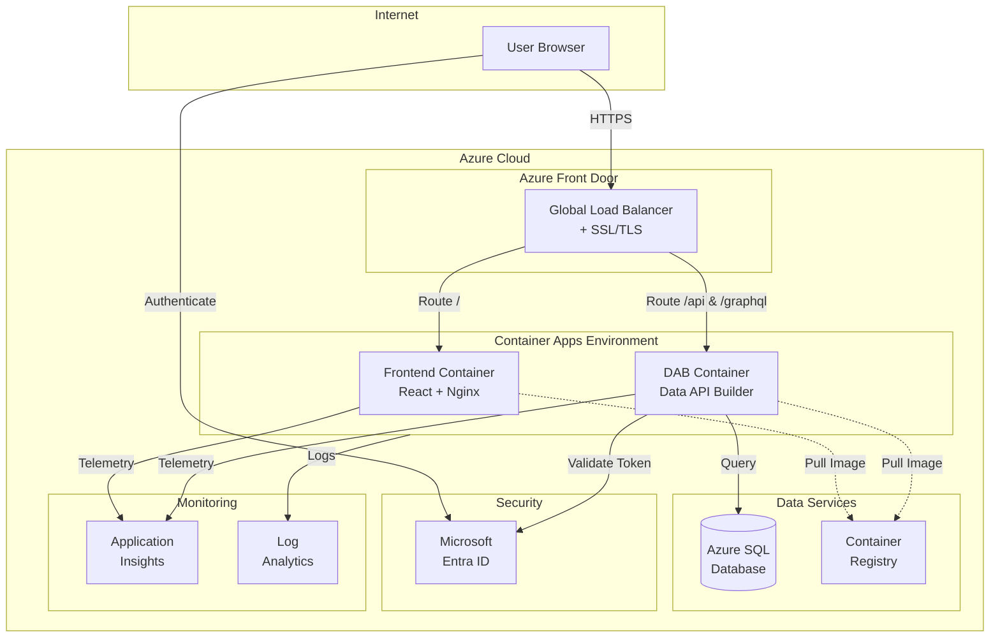

# DOT Transportation Data Portal - Documentation Hub

**Complete guides for deploying and managing the DOT Transportation Data Portal**

[Quick Start](#quick-start) | [Guides](#documentation-guides) | [Architecture](#architecture-overview) | [Troubleshooting](#troubleshooting)

> **Visual Diagrams:** Interactive Excalidraw architecture diagrams with Azure icons are available in the [`assets/`](../assets/) folder.

---

## Welcome!

This documentation will guide you through deploying and managing the DOT Transportation Data Portal, even if you've never used Azure, containers, or cloud services before. Each guide is written for **complete beginners** with step-by-step instructions, screenshots, and helpful tips.

### What You'll Learn

| Topic | Description | Time |
|-------|-------------|------|
| Azure Basics | Understand cloud computing fundamentals | 15 min |
| DAB Configuration | Set up Data API Builder for your database | 30 min |
| Container Registry | Store your application images in Azure | 20 min |
| Container Apps | Deploy and run your application | 45 min |
| Troubleshooting | Fix common issues | As needed |

---

## Quick Start

### Choose Your Deployment Method

<table>
<tr>
<td width="50%" valign="top">

### Option A: Azure Portal (Recommended for Beginners)

Best if you prefer a visual, click-based approach.

**You'll use:**
- Web browser
- Azure Portal interface
- Azure Cloud Shell (built into Azure)

**No local software required!**

[Start Portal Guide](./beginners-guide-portal.md)

</td>
<td width="50%" valign="top">

### Option B: Azure Cloud Shell

Best if you're comfortable with command-line interfaces.

**You'll use:**
- Azure Cloud Shell (browser-based)
- Azure CLI commands
- Built-in code editor

**No local software required!**

[Start Cloud Shell Guide](./cloud-shell-deployment-guide.md)

</td>
</tr>
</table>

---

## Documentation Guides

### For Complete Beginners

| Guide | Description | Difficulty |
|-------|-------------|------------|
| [Azure Fundamentals for Beginners](./azure-fundamentals-beginners.md) | Learn what Azure is, key concepts, and how to get started | Beginner |
| [Understanding Containers](./azure-fundamentals-beginners.md#-what-are-containers) | What containers are and why we use them | Beginner |
| [Azure Portal Tour](./azure-fundamentals-beginners.md#-navigating-the-azure-portal) | Navigate the Azure Portal like a pro | Beginner |

### Setup & Configuration

| Guide | Description | Difficulty |
|-------|-------------|------------|
| [DAB Configuration Guide](./dab-configuration-guide.md) | Configure Data API Builder step-by-step | Intermediate |
| [Authentication Setup](./setup-guide.md) | Set up Microsoft Entra ID authentication | Intermediate |
| [Database Setup](./setup-guide.md#database-setup) | Create and configure Azure SQL Database | Intermediate |

### Deployment Guides

| Guide | Description | Difficulty |
|-------|-------------|------------|
| [Complete Portal Deployment](./beginners-guide-portal.md) | Deploy everything using Azure Portal (no coding) | Beginner |
| [Cloud Shell Deployment](./cloud-shell-deployment-guide.md) | Deploy using Azure Cloud Shell commands | Intermediate |
| [ACR Setup Guide](./acr-setup-guide.md) | Set up Azure Container Registry | Intermediate |
| [Container Apps Deployment](./container-apps-portal-guide.md) | Deploy to Azure Container Apps | Intermediate |

### Operations & Maintenance

| Guide | Description | Difficulty |
|-------|-------------|------------|
| [Auto-Scaling Guide](./auto-scaling-guide.md) | Configure automatic scaling | Intermediate |
| [CI/CD Pipeline](./ci-cd-guide.md) | Set up automated deployments | Advanced |
| [Architecture Overview](./architecture.md) | Understand the system architecture | Intermediate |

---

## Troubleshooting

Having issues? Check our comprehensive troubleshooting guide:

[Complete Troubleshooting Guide](./troubleshooting-guide.md)

### Quick Links to Common Issues

| Issue | Solution |
|-------|----------|
| "Container won't start" | [Container Startup Issues](./troubleshooting-guide.md#container-startup-issues) |
| "Authentication errors" | [Authentication Problems](./troubleshooting-guide.md#authentication-issues) |
| "Database connection failed" | [Database Connectivity](./troubleshooting-guide.md#database-connectivity) |
| "Image push failed" | [ACR Issues](./troubleshooting-guide.md#acr-issues) |
| "502 Bad Gateway" | [Networking Issues](./troubleshooting-guide.md#networking-issues) |

---

## Best Practices

Follow these guides to ensure your deployment is secure, efficient, and maintainable:

[Complete Best Practices Guide](./best-practices-guide.md)

### Quick Tips

| Category | Key Recommendation |
|----------|-------------------|
| **Security** | Never commit secrets to source control |
| **Cost** | Use scale-to-zero for development environments |
| **Performance** | Enable caching in DAB configuration |
| **Reliability** | Always configure health probes |
| **Maintenance** | Tag container images with version numbers |

---

## Video Tutorials

Learn visually with these Microsoft Learn videos:

| Topic | Video Link | Duration |
|-------|------------|----------|
| Azure Fundamentals | [Introduction to Azure](https://learn.microsoft.com/en-us/training/modules/intro-to-azure-fundamentals/) | 30 min |
| Container Basics | [Introduction to Containers](https://learn.microsoft.com/en-us/training/modules/intro-to-containers/) | 45 min |
| Azure Container Apps | [Deploy Container Apps](https://learn.microsoft.com/en-us/training/modules/implement-azure-container-apps/) | 60 min |
| Azure SQL Database | [Azure SQL Fundamentals](https://learn.microsoft.com/en-us/training/paths/azure-sql-fundamentals/) | 2 hrs |

---

## Architecture Overview

---

## Getting Help

### Community Resources

- [Azure Data API Builder GitHub](https://github.com/Azure/data-api-builder)
- [Azure Container Apps Documentation](https://learn.microsoft.com/en-us/azure/container-apps/)
- [Stack Overflow - Azure](https://stackoverflow.com/questions/tagged/azure)

### Official Documentation

- [Data API Builder Docs](https://learn.microsoft.com/en-us/azure/data-api-builder/)
- [Container Apps Docs](https://learn.microsoft.com/en-us/azure/container-apps/)
- [Azure SQL Docs](https://learn.microsoft.com/en-us/azure/azure-sql/)

---

## Document Versions

| Document | Last Updated | Version |
|----------|--------------|---------|
| This Index | 2026-02-06 | 1.0.0 |
| Azure Fundamentals | 2026-02-06 | 1.0.0 |
| Portal Deployment | 2026-02-06 | 1.0.0 |
| Cloud Shell Guide | 2026-02-06 | 1.0.0 |
| Troubleshooting | 2026-02-06 | 1.0.0 |
| Best Practices | 2026-02-06 | 1.0.0 |

---

**Built with Azure Data API Builder**

[Report an Issue](https://github.com/your-repo/issues) | [Contribute](https://github.com/your-repo/pulls)

