# 🚗 DOT Transportation Data Portal - Documentation Hub

### 📚 Complete guides for deploying and managing the DOT Transportation Data Portal

[🚀 Quick Start](#-quick-start) • [📖 Guides](#-documentation-guides) • [🏗️ Architecture](#-architecture-overview) • [🔧 Troubleshooting](#-troubleshooting)

---

---

## 👋 Welcome!

This documentation will guide you through deploying and managing the DOT Transportation Data Portal, even if you've never used Azure, containers, or cloud services before. Each guide is written for **complete beginners** with step-by-step instructions, screenshots, and helpful tips.

> 💡 **Visual Diagrams:** Interactive Excalidraw architecture diagrams with Azure icons are available in the [`assets/`](../assets/) folder.

### 🎯 What You'll Learn

| 📘 Topic | 📝 Description | ⏱️ Time |
|:---------|:---------------|:--------|
| ☁️ Azure Basics | Understand cloud computing fundamentals | 15 min |
| ⚙️ DAB Configuration | Set up Data API Builder for your database | 30 min |
| 📦 Container Registry | Store your application images in Azure | 20 min |
| 🚀 Container Apps | Deploy and run your application | 45 min |
| 🔧 Troubleshooting | Fix common issues | As needed |

---

## 🚀 Quick Start

### Choose Your Deployment Method

<table>
<tr>
<td width="50%" valign="top">

### 🖱️ Option A: Azure Portal
**Recommended for Beginners**

Best if you prefer a visual, click-based approach.

**You'll use:**
- 🌐 Web browser
- 🖥️ Azure Portal interface
- ☁️ Azure Cloud Shell (built into Azure)

> ✅ **No local software required!**

</td>
<td width="50%" valign="top">

### ⌨️ Option B: Azure Cloud Shell
**For CLI Enthusiasts**

Best if you're comfortable with command-line interfaces.

**You'll use:**
- ☁️ Azure Cloud Shell (browser-based)
- 💻 Azure CLI commands
- 📝 Built-in code editor

> ✅ **No local software required!**

</td>
</tr>
</table>

---

## 📖 Documentation Guides

### 🌟 For Complete Beginners

| 📚 Guide | 📝 Description | 📊 Level |
|:---------|:---------------|:---------|
| [☁️ Azure Fundamentals for Beginners](./azure-fundamentals-beginners.md) | Learn what Azure is, key concepts, and how to get started | 🟢 Beginner |
| [📦 Understanding Containers](./azure-fundamentals-beginners.md#-what-are-containers) | What containers are and why we use them | 🟢 Beginner |
| [🖥️ Azure Portal Tour](./azure-fundamentals-beginners.md#-navigating-the-azure-portal) | Navigate the Azure Portal like a pro | 🟢 Beginner |

### ⚙️ Setup & Configuration

| 📚 Guide | 📝 Description | 📊 Level |
|:---------|:---------------|:---------|
| [🔧 DAB Configuration Guide](./dab-configuration-guide.md) | Configure Data API Builder step-by-step | 🟡 Intermediate |
| [🔐 Authentication Setup](./setup-guide.md) | Set up Microsoft Entra ID authentication | 🟡 Intermediate |
| [🗄️ Database Setup](./setup-guide.md#database-setup) | Create and configure Azure SQL Database | 🟡 Intermediate |

### 🚀 Deployment Guides

| 📚 Guide | 📝 Description | 📊 Level |
|:---------|:---------------|:---------|
| [🖱️ Complete Portal Deployment](./beginners-guide-portal.md) | Deploy everything using Azure Portal (no coding) | 🟢 Beginner |
| [☁️ Cloud Shell Deployment](./cloud-shell-deployment-guide.md) | Deploy using Azure Cloud Shell commands | 🟡 Intermediate |
| [📦 ACR Setup Guide](./acr-setup-guide.md) | Set up Azure Container Registry | 🟡 Intermediate |
| [🚀 Container Apps Deployment](./container-apps-portal-guide.md) | Deploy to Azure Container Apps | 🟡 Intermediate |

### 🔄 Operations & Maintenance

| 📚 Guide | 📝 Description | 📊 Level |
|:---------|:---------------|:---------|
| [📈 Auto-Scaling Guide](./auto-scaling-guide.md) | Configure automatic scaling | 🟡 Intermediate |
| [⚡ CI/CD Pipeline](./ci-cd-guide.md) | Set up automated deployments | 🔴 Advanced |
| [🏗️ Architecture Overview](./architecture.md) | Understand the system architecture | 🟡 Intermediate |
| [📊 Monitoring Guide](./monitoring-guide.md) | Set up monitoring and alerting | 🟡 Intermediate |
| [📋 API Reference](./api-reference.md) | REST and GraphQL API documentation | 🟡 Intermediate |

---

## 🔧 Troubleshooting

Having issues? Check our comprehensive troubleshooting guide:

### 🔥 Quick Links to Common Issues

| ❌ Issue | ✅ Solution |
|:---------|:-----------|
| 🐳 "Container won't start" | [Container Startup Issues](./troubleshooting-guide.md#container-startup-issues) |
| 🔐 "Authentication errors" | [Authentication Problems](./troubleshooting-guide.md#authentication-issues) |
| 🗄️ "Database connection failed" | [Database Connectivity](./troubleshooting-guide.md#database-connectivity) |
| 📦 "Image push failed" | [ACR Issues](./troubleshooting-guide.md#acr-issues) |
| 🌐 "502 Bad Gateway" | [Networking Issues](./troubleshooting-guide.md#networking-issues) |

---

## ✨ Best Practices

Follow these guides to ensure your deployment is secure, efficient, and maintainable:

### 💡 Quick Tips

| 🏷️ Category | 💡 Key Recommendation |
|:------------|:---------------------|
| 🔒 **Security** | Never commit secrets to source control |
| 💰 **Cost** | Use scale-to-zero for development environments |
| ⚡ **Performance** | Enable caching in DAB configuration |
| 🛡️ **Reliability** | Always configure health probes |
| 🔄 **Maintenance** | Tag container images with version numbers |

---

## 🎬 Video Tutorials

Learn visually with these Microsoft Learn videos:

| 📺 Topic | 🔗 Video Link | ⏱️ Duration |
|:---------|:-------------|:------------|
| ☁️ Azure Fundamentals | [Introduction to Azure](https://learn.microsoft.com/en-us/training/modules/intro-to-azure-fundamentals/) | 30 min |
| 📦 Container Basics | [Introduction to Containers](https://learn.microsoft.com/en-us/training/modules/intro-to-containers/) | 45 min |
| 🚀 Azure Container Apps | [Deploy Container Apps](https://learn.microsoft.com/en-us/training/modules/implement-azure-container-apps/) | 60 min |
| 🗄️ Azure SQL Database | [Azure SQL Fundamentals](https://learn.microsoft.com/en-us/training/paths/azure-sql-fundamentals/) | 2 hrs |

---

## 🏗️ Architecture Overview

```mermaid
flowchart TB
    subgraph Internet["🌐 Internet"]
        User["👤 User Browser"]
    end

    subgraph Azure["☁️ Azure Cloud"]
        subgraph FrontDoor["🚪 Azure Front Door"]
            FD["Global Load Balancer<br/>+ SSL/TLS"]
        end

        subgraph ContainerApps["📦 Container Apps Environment"]
            Frontend["⚛️ Frontend Container<br/>React + Nginx"]
            DAB["🔌 DAB Container<br/>Data API Builder"]
        end

        subgraph Data["💾 Data Services"]
            SQL[("🗄️ Azure SQL<br/>Database")]
            ACR["📦 Container<br/>Registry"]
        end

        subgraph Security["🔒 Security"]
            EntraID["🔐 Microsoft<br/>Entra ID"]
        end

        subgraph Monitoring["📊 Monitoring"]
            AppInsights["📈 Application<br/>Insights"]
            LogAnalytics["📋 Log<br/>Analytics"]
        end
    end

    User -->|HTTPS| FD
    FD -->|Route /| Frontend
    FD -->|Route /api & /graphql| DAB
    DAB -->|Query| SQL
    Frontend -.->|Pull Image| ACR
    DAB -.->|Pull Image| ACR
    User -->|Authenticate| EntraID
    DAB -->|Validate Token| EntraID
    Frontend -->|Telemetry| AppInsights
    DAB -->|Telemetry| AppInsights
    ContainerApps -->|Logs| LogAnalytics
```

---

## 🆘 Getting Help

### 🌐 Community Resources

| 🔗 Resource | 📝 Description |
|:------------|:---------------|
| [📦 Azure Data API Builder GitHub](https://github.com/Azure/data-api-builder) | Official DAB repository |
| [🚀 Azure Container Apps Docs](https://learn.microsoft.com/en-us/azure/container-apps/) | Microsoft documentation |
| [💬 Stack Overflow - Azure](https://stackoverflow.com/questions/tagged/azure) | Community Q&A |

### 📚 Official Documentation

| 🔗 Resource | 📝 Description |
|:------------|:---------------|
| [📖 Data API Builder Docs](https://learn.microsoft.com/en-us/azure/data-api-builder/) | Complete DAB documentation |
| [📖 Container Apps Docs](https://learn.microsoft.com/en-us/azure/container-apps/) | Container Apps reference |
| [📖 Azure SQL Docs](https://learn.microsoft.com/en-us/azure/azure-sql/) | Database documentation |

---

## 📅 Document Versions

| 📄 Document | 📅 Last Updated | 🏷️ Version |
|:------------|:----------------|:-----------|
| 📚 This Index | 2026-02-09 | 1.1.0 |
| ☁️ Azure Fundamentals | 2026-02-06 | 1.0.0 |
| 🖱️ Portal Deployment | 2026-02-09 | 1.1.0 |
| ☁️ Cloud Shell Guide | 2026-02-06 | 1.0.0 |
| 🔧 Troubleshooting | 2026-02-09 | 1.1.0 |
| ✨ Best Practices | 2026-02-09 | 1.1.0 |

---

### 🚀 Built with Azure Data API Builder

---

**Made with ❤️ for the Azure community**

